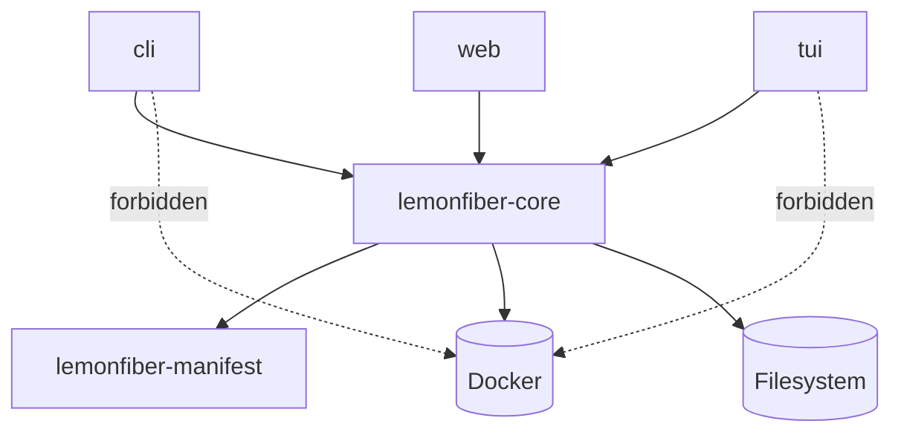
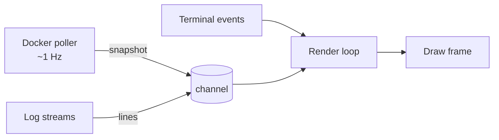

# Component model

**Status:** Accepted

Inside the lemonfiber box: what the components are, and which boundaries are
load-bearing.

**Satisfies:** [G1-R2](../10-functional/features/g-ux/g1-interface-tiers.md),
[F1-R6](../10-functional/features/f-extensibility/f1-customisation.md),
[ADR-0003](../00-overview/decisions/0003-rust-ratatui-for-cli.md),
[ADR-0008](../00-overview/decisions/0008-hybrid-docker-access.md)

---

## Crate layout

```
crates/
├── lemonfiber/              bin — the only crate that knows about UI
│   ├── cli/                 clap definitions, non-interactive paths
│   ├── tui/                 ratatui: dashboard, wizard, logs, doctor views
│   ├── web/                 JSON API + embedded assets
│   └── main.rs              surface selection
│
├── lemonfiber-core/         lib — all logic, no UI, no terminal
│   ├── stack/               compose command construction, lifecycle
│   ├── docker/              container state, stats, logs, exec
│   ├── config/              .env, paths, credential storage
│   ├── platform/            OS detection and per-platform behaviour
│   ├── doctor/              checks, findings, remediation
│   ├── seed/                service API clients, wiring
│   ├── journal/             change log for rollback
│   └── error/               the error + remedy model
│
└── lemonfiber-manifest/     lib — stack.toml parse + validate
```

## The one boundary that matters

**`lemonfiber-core` has no UI dependency of any kind.** No ratatui, no clap, no
terminal, no HTTP server. It cannot print.

This makes [G1-R2](../10-functional/features/g-ux/g1-interface-tiers.md) —
*"surfaces are renderings, never capabilities"* — structural rather than
aspirational. A surface cannot acquire behaviour of its own, because the
behaviour lives somewhere that cannot render.

It also means nearly all logic is testable without a terminal, which is what
makes the test pyramid viable at all.



The dotted edges are enforced by the dependency graph, not by review: the binary
crate does not depend on `bollard` at all.

## Docker access, split by direction

[ADR-0008](../00-overview/decisions/0008-hybrid-docker-access.md) splits reads
from writes. The module boundary enforces it:

| Module | Mechanism | Operations |
|--------|-----------|------------|
| `stack::compose` | `docker compose` subprocess | `up` `down` `restart` `pull` `stop` `config` |
| `docker::*` | Docker Engine API (`bollard`) | list · inspect · stats · logs · exec |

`stack::compose` may spawn processes and never touches bollard. `docker::*` uses
bollard and never spawns. Correlation between them uses Compose's own labels
(`com.docker.compose.project` / `.service`), which the Engine API exposes.

The `exec` path is what makes the VPN leak test possible — running a command
inside both containers and comparing results (`C2-R1`).

## The command builder is pure

`stack::compose` builds an argument vector; it does not execute. Execution is a
separate, thin layer.

```rust
fn build(form: &Form, cfg: &Config, platform: Platform) -> Vec<String>
```

A pure function over manifest and configuration, which is why golden-file tests
can cover **every form on every platform** without Docker present — and why
`--dry-run` (`F1-R2`) is the same code path rather than a parallel one that can
drift.

## Async model

`tokio`, but deliberately shallow. Async exists where there is genuine
concurrency:

| Async | Sync |
|-------|------|
| Docker API streams (stats, logs) | Manifest parsing |
| Concurrent service API calls during seeding | Compose command construction |
| Concurrent diagnostic checks | Config read/write |
| The TUI event loop | Platform detection |

Making pure computation async buys nothing and complicates testing.

## The render loop never blocks

The single most important runtime rule ([B3-R4](../10-functional/features/b-running/b3-dashboard.md)):



Background tasks **own** their data and send owned snapshots through a channel.
The render loop never awaits Docker, never holds a lock across a draw, and never
shares mutable state with a poller.

This avoids the failure that makes most TUIs feel broken — input freezing while
something slow happens — and sidesteps the borrow-checker friction that shared
mutable state would otherwise create.

## Doctor: checks are values

```rust
trait Check {
    fn id(&self) -> CheckId;
    fn category(&self) -> Category;
    fn is_disruptive(&self) -> bool;
    async fn run(&self, ctx: &Ctx) -> Finding;
}
```

Every check is independent (`C1-R4`), bounded by a timeout (`C1-R7`), and returns
a `Finding` carrying severity **and remedy** (`C1-R2`).

`Finding` makes `unverified` a distinct variant rather than a flavour of failure
(`C1-R3`) — the type system enforces the distinction the specification insists
on, so "could not check" cannot accidentally render as "passed".

An error *inside* a check surfaces as a check error, never as a finding about the
stack (`C1-R8`).

## Seed: one client per API shape

```rust
trait ServiceClient {
    async fn identity(&self) -> Result<Identity>;
    async fn register_download_client(&self, dc: &DownloadClient) -> Result<()>;
    async fn register_root_folder(&self, rf: &RootFolder) -> Result<()>;
}
```

| Implementation | Serves |
|----------------|--------|
| `ServarrClient` | Sonarr, Radarr, Lidarr, Prowlarr |
| `SabnzbdClient` | SABnzbd |
| `QbittorrentClient` | qBittorrent |
| `SeerrClient` | Seerr |
| `BinderyClient` | Bindery |

The manifest's `api.kind` selects the implementation
([contract](contracts/stack-manifest.md#api)), so adding a service that reuses an
existing shape needs no Rust at all.

Every write goes through the journal (`E4-R1`) and consults drift state before
overwriting (`C9-R3`).

## Web UI

An embedded static frontend plus a JSON API, both served from the binary. No
separate process, no runtime toolchain, no npm at install time — the frontend is
built at release time and embedded with `include_dir!`.

The API is the same one the TUI consumes, so parity is structural. Binding and
authentication follow [C6](../10-functional/features/c-trust/c6-web-security.md);
the server runs only when asked (`G1-R5`).

## Requirements

| ID | Requirement |
|----|-------------|
| **ARCH-R11** | `lemonfiber-core` MUST NOT depend on any UI, terminal or HTTP-server crate. |
| **ARCH-R12** | Compose command construction MUST be a pure function, separate from execution. |
| **ARCH-R13** | `--dry-run` MUST use the same construction path as execution. |
| **ARCH-R14** | Compose invocation and Docker API access MUST live in separate modules with no cross-dependency. |
| **ARCH-R15** | The render loop MUST NOT await I/O or hold a lock across a frame. |
| **ARCH-R16** | Background tasks MUST send owned snapshots rather than share mutable state. |
| **ARCH-R17** | `unverified` MUST be a distinct variant in the finding type, not a severity value. |
| **ARCH-R18** | Service clients MUST be selected by manifest `api.kind`, never by hardcoded service name. |
| **ARCH-R19** | Web assets MUST be embedded in the binary; no runtime toolchain MAY be required. |
| **ARCH-R20** | The web API MUST be the same interface the TUI consumes. |

## Related

- [contracts/stack-manifest.md](contracts/stack-manifest.md) — what `lemonfiber-manifest` parses
- [data-flow.md](data-flow.md) · [platform-matrix.md](platform-matrix.md)
- [ADR-0003](../00-overview/decisions/0003-rust-ratatui-for-cli.md) · [ADR-0008](../00-overview/decisions/0008-hybrid-docker-access.md)
