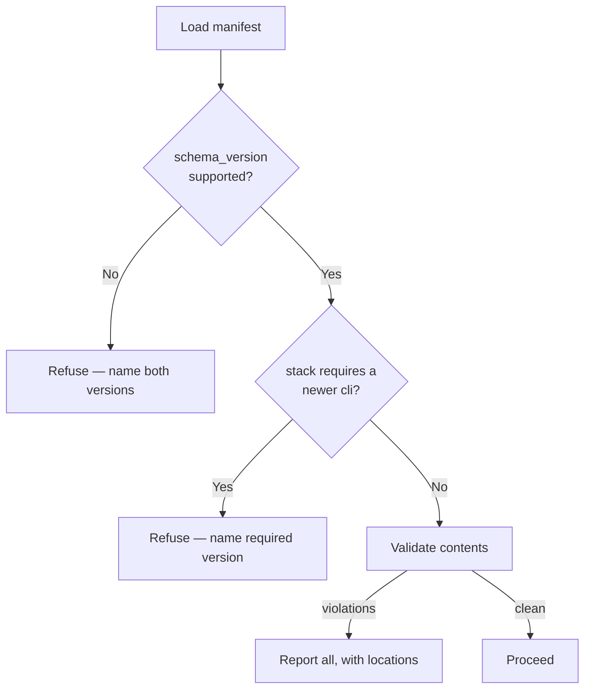

# Contract: versioning & compatibility

**Status:** Accepted

Three things version independently and must stay compatible: the `lemonfiber`
binary, the stack it operates, and the manifest format between them.

**Satisfies:** [E1-R1](../../10-functional/features/e-maintenance/e1-stack-updates.md),
[E2-R9](../../10-functional/features/e-maintenance/e2-self-update.md),
[E2-R11](../../10-functional/features/e-maintenance/e2-self-update.md),
[F1-R9](../../10-functional/features/f-extensibility/f1-customisation.md),
[F1-R12](../../10-functional/features/f-extensibility/f1-customisation.md)

---

## The three versions

| Version | Owns | Scheme |
|---------|------|--------|
| `lemonfiber` binary | The tool | Semver |
| `stack_version` | The service set and forms | Semver |
| `schema_version` | The manifest **format** | Monotonic integer |

They are separate because they change for different reasons. Bumping Sonarr's
pinned tag changes `stack_version` and nothing else. Adding a manifest field
changes `schema_version`. Fixing a TUI bug changes only the binary.

## Why `schema_version` is an integer, not semver

Semver's minor/patch distinction implies backwards-compatible change — and for a
*parsed format* that distinction is unreliable in practice. A field addition is
compatible only if every consumer ignores unknown fields, and a field becoming
optional is compatible only in one direction.

A monotonic integer states the only thing that matters: **can this parser read
this file?** Yes or no. Each `cli` release declares the set it supports.

## The compatibility check



Three distinct refusals, three distinct messages. Collapsing them into "invalid
manifest" would leave the operator guessing which of three unrelated problems
they have.

## Where skew is caught

The embedded stack ([ADR-0005](../../00-overview/decisions/0005-embedded-stack-assets.md))
means the common case never reaches a user:

| Path | Caught |
|------|--------|
| Embedded stack | **Compile time** — `build.rs` validates the submodule's `schema_version` |
| `--stack-dir` fork | Load time, refused with both versions named |
| Manifest edited in place | Load time |

Turning version skew into a build failure is the strongest available mitigation
for the main cost of the [four-repo split](../../00-overview/decisions/0004-four-repo-split.md).
An incompatible pairing cannot ship.

## Changing the schema

| Change | `schema_version` |
|--------|------------------|
| Add an optional field | Unchanged |
| Add a required field | **Increment** |
| Remove or rename a field | **Increment** |
| Change a field's type or meaning | **Increment** |
| Add a permitted enum value | **Increment** — older parsers reject unknown values |
| Add a service, profile or form | Unchanged — that's `stack_version` |

Adding an enum value increments deliberately: a stricter parser rejecting an
unknown `criticality` is correct behaviour, and pretending otherwise produces a
failure that looks like corruption.

## Supported window

`cli` supports the current `schema_version` and **one** predecessor. That gives
one release cycle of overlap for anyone maintaining a fork, without carrying
parser variants indefinitely.

Dropping support is a breaking change for the binary and moves its major version.

## Binary and configuration

lemonfiber holds no irreversibly-migrating state, so **downgrade is supported**
(`E2-R10`) — unlike the \*arr databases, where it isn't
([E1](../../10-functional/features/e-maintenance/e1-stack-updates.md)).

Configuration written by a **newer** binary is refused rather than modified
(`E2-R11`). Silently downgrading a config file is how a downgrade-to-test becomes
an unrecoverable state.

## The machine-readable output contract

`F1-R12` makes machine-readable output a stable interface, so it versions too:

```json
{ "api_version": 1, "kind": "status", "data": { … } }
```

Every payload carries `api_version`. Additive changes leave it alone; removing or
retyping a field increments it. Scripts can assert on it rather than
pattern-matching output shapes.

## Requirements

| ID | Requirement |
|----|-------------|
| **ARCH-R1** | The binary, stack content and manifest format MUST version independently. |
| **ARCH-R2** | `schema_version` MUST be a monotonic integer, not semver. |
| **ARCH-R3** | An unsupported `schema_version` MUST be refused with both the found and supported versions named. |
| **ARCH-R4** | A stack declaring a `min_cli_version` above the running binary MUST be refused, naming the required version. |
| **ARCH-R5** | Unsupported schema, insufficient binary version, and content violations MUST produce distinct messages. |
| **ARCH-R6** | The embedded stack's `schema_version` MUST be validated at build time. |
| **ARCH-R7** | `cli` MUST support the current `schema_version` and exactly one predecessor. |
| **ARCH-R8** | Adding a permitted enum value MUST increment `schema_version`. |
| **ARCH-R9** | Machine-readable output MUST carry an `api_version`. |
| **ARCH-R10** | Configuration written by a newer binary MUST be refused, never modified. |

## Related

- [stack-manifest.md](stack-manifest.md) — the format being versioned
- [ADR-0004 Four-repo split](../../00-overview/decisions/0004-four-repo-split.md) — the skew risk this mitigates
- [ADR-0005 Embedded stack assets](../../00-overview/decisions/0005-embedded-stack-assets.md)
- [E1](../../10-functional/features/e-maintenance/e1-stack-updates.md) · [E2](../../10-functional/features/e-maintenance/e2-self-update.md)
