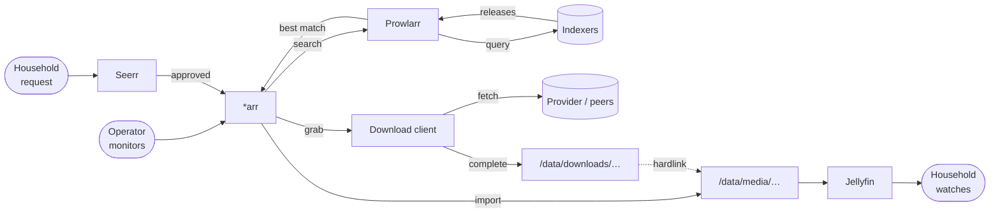
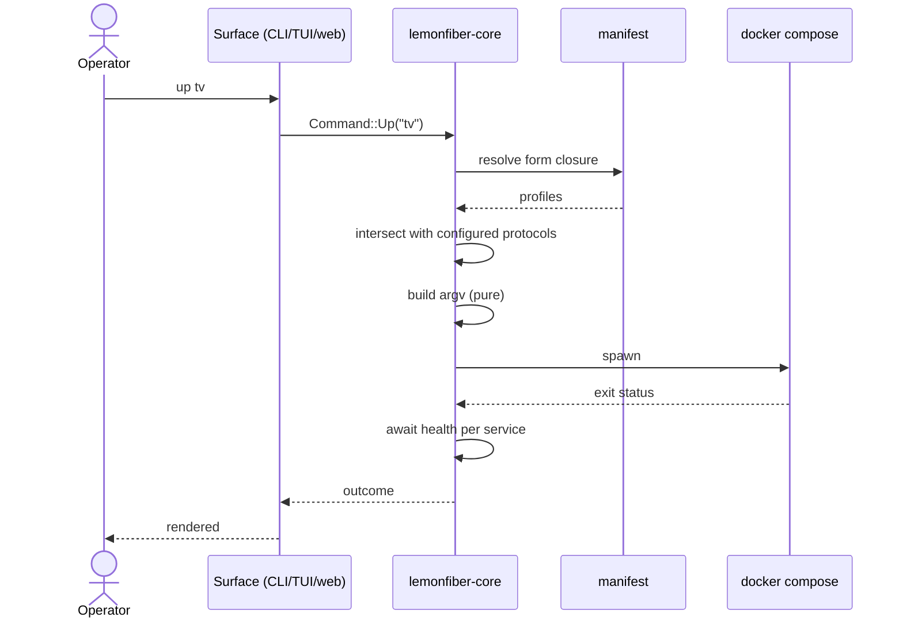
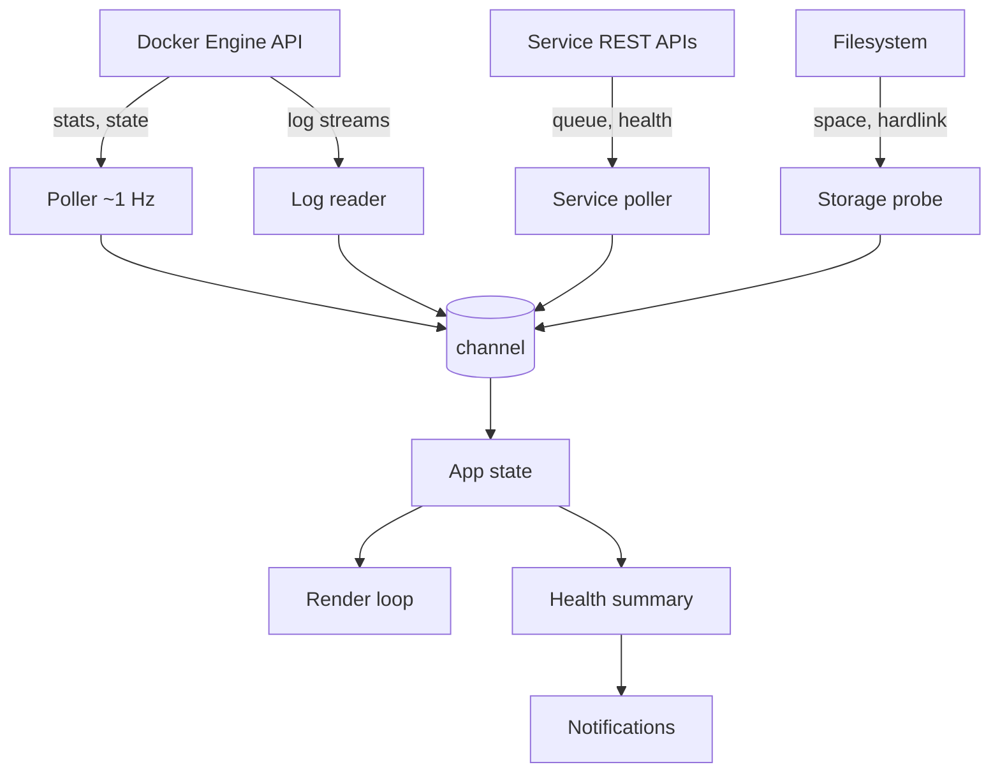
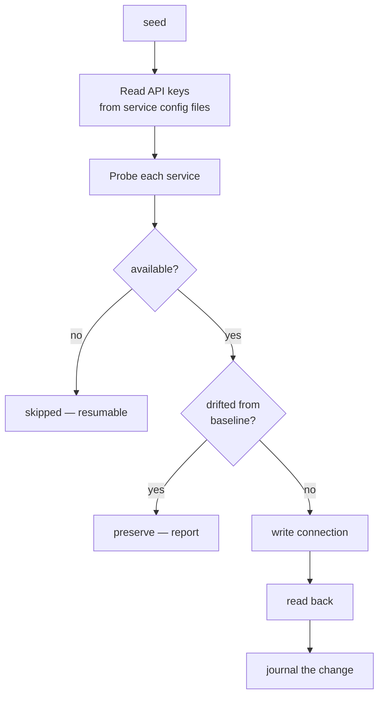

# Data flow

**Status:** Accepted

Three flows worth drawing: how content moves, how control moves, and how
observation moves back.

---

## 1. The content pipeline

The path a single item takes. Understanding it is what makes
[D9's trace](../10-functional/features/d-content/d9-pipeline-trace.md) possible.

### The hardlink edge is the important one

`downloads/` → `media/` is a **hardlink**, not a copy — the same bytes with two
directory entries. That's why both live under one mount
([ADR-0006](../00-overview/decisions/0006-single-data-mount.md)): a hardlink
cannot span filesystems.

Break it and the arrow silently becomes a full copy: minutes instead of instant,
double disk while it runs, and a torrent that can no longer seed from the library
copy because it's a different inode.

Nothing reports this. It is why [C5](../10-functional/features/c-trust/c5-storage.md)
tests it empirically rather than trusting configuration.

### Where it silently stops

Five distinct failures, indistinguishable from outside — *nothing appeared* —
and each with a different cause:

| Stops at | Looks like | Actually |
|----------|-----------|----------|
| Never monitored | Nothing happened | Nobody asked for it |
| Search returns nothing | Nothing happened | Indexers healthy, no match — **or** indexers broken ([C8](../10-functional/features/c-trust/c8-provider-health.md)) |
| Found, never grabbed | Nothing happened | Nothing met the quality preset |
| Grabbed, never downloaded | Nothing happened | Client rejected it, or the provider is exhausted |
| **Downloaded, never imported** | Nothing happened | **Nobody owns this failure** |

The last is the one [C7](../10-functional/features/c-trust/c7-queue-health.md)
exists for. The download client considers the job finished; the \*arr never picked
it up. Neither reports a problem, because from each service's own vantage point
there isn't one.

## 2. Control flow

Two properties:

- **The surface makes no decisions.** It translates input into a command and
  renders a result. Every surface produces identical behaviour because they run
  identical code (`ARCH-R11`).
- **Closure resolution then protocol intersection**, in that order. `dl` on a
  usenet-only setup resolves to `usenet` + `torrent`, then intersects down to
  `usenet` — so Gluetun is never started with credentials that don't exist
  (`B1-R4`).

## 3. Observation flow

Every producer sends **owned snapshots** through a channel; nothing shares mutable
state with the render loop (`ARCH-R16`). A slow service API delays its own panel
and nothing else.

### Reads and writes take different paths

Deliberately ([ADR-0008](../00-overview/decisions/0008-hybrid-docker-access.md)):
observation goes through the Docker API because it's streamed and cheap; control
goes through the Compose CLI because profiles are a Compose concept.

At 1 Hz across 19 services, spawning processes to observe would be both wasteful
and jittery — noticeably so on Windows.

## 4. The seed flow

Two gates before any write:

1. **Availability** — an absent service is `skipped`, not `failed` (`D1-R5`).
2. **Drift** — a value the operator changed is preserved, never reverted
   (`C9-R3`). This is what makes seed safe to run on a tuned stack, and it's the
   resolution of the reproducibility-versus-customisation conflict.

Every write is verified by reading back (`D1-R4`) and recorded in the journal so
it can be rolled back (`E4-R1`).

## Requirements

| ID | Requirement |
|----|-------------|
| **ARCH-R21** | Import MUST hardlink where the filesystem permits, and degradation MUST be detected rather than absorbed. |
| **ARCH-R22** | The five ways an item can silently fail to arrive MUST be distinguishable. |
| **ARCH-R23** | Form closure MUST be resolved before protocol intersection. |
| **ARCH-R24** | Every observation producer MUST send owned snapshots through a channel. |
| **ARCH-R25** | A slow or failed observation source MUST NOT delay unrelated panels. |
| **ARCH-R26** | Seed MUST check availability and drift before any write, and MUST verify by reading back. |

## Related

- [component-model.md](component-model.md) — the components these flows cross
- [ADR-0006](../00-overview/decisions/0006-single-data-mount.md) · [ADR-0008](../00-overview/decisions/0008-hybrid-docker-access.md)
- [C7](../10-functional/features/c-trust/c7-queue-health.md) · [D9](../10-functional/features/d-content/d9-pipeline-trace.md)
