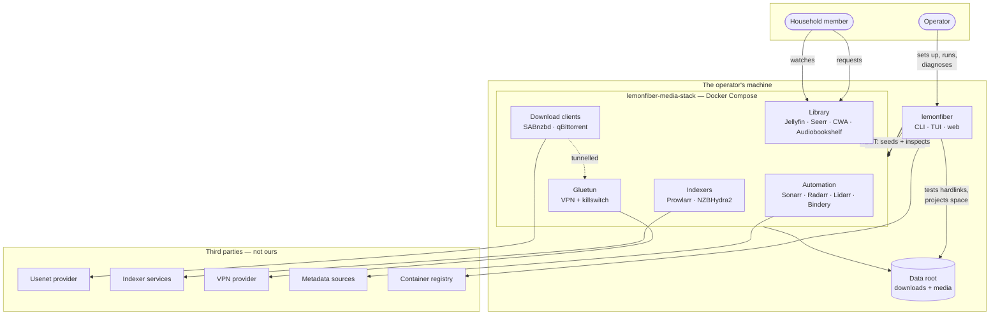
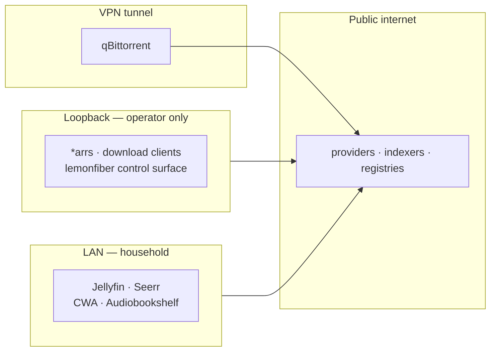

# System context

**Status:** Accepted

What sits inside the system, what sits outside it, and where the boundaries fall.

---

## The picture

## Boundaries

### Inside — ours to specify

`lemonfiber` and the stack definition. We choose the services, pin their
versions, define how they connect, and own every interaction between them.

### Inside — ours to orchestrate, not to build

The 19 services. We don't write Sonarr; we decide it's included, how it's
configured, and what happens when it misbehaves. Its bugs are not ours, but its
*integration* is entirely ours.

### Outside — the operator's

Usenet providers, indexers, VPN providers. lemonfiber can validate credentials
and monitor capacity ([C8](../10-functional/features/c-trust/c8-provider-health.md)),
but cannot create accounts, and deliberately doesn't recommend vendors
([A1-R5](../10-functional/features/a-getting-started/a1-prerequisites.md)).

### Outside — infrastructure

Docker, the container registry, the operating system. Assumed present, verified
at preflight, never installed on the operator's behalf.

## The two human actors

| | Operator | Household member |
|---|---|---|
| Touches | lemonfiber, occasionally a service admin UI | Seerr, Jellyfin |
| Accounts | Several — one per admin app | **Exactly one** — their Jellyfin login |
| Reaches | Loopback + LAN | LAN only |
| Knows lemonfiber exists | Yes | **No** |

The second column is a design constraint, not an observation. A household member
who has to learn what lemonfiber is has been failed —
[G5](../10-functional/features/g-ux/g5-front-door.md) exists to give them one URL
and nothing else.

## Trust zones

Three properties this encodes:

1. **Admin surfaces are unreachable from the LAN** — not obscure, unreachable
   ([C6-R1](../10-functional/features/c-trust/c6-web-security.md)). A household
   member cannot find qBittorrent because it isn't listening on an address their
   device can route to.
2. **Household surfaces are LAN-bound deliberately.** Loopback-only would make
   them useless from a television, which is the entire point of having them.
3. **Torrent traffic leaves only through the tunnel.** Verified empirically by
   comparing observed egress, not assumed from configuration
   ([C2-R1](../10-functional/features/c-trust/c2-vpn-verification.md)).

## Data crossing the boundary

Everything lemonfiber itself sends outward, enumerable and individually
disableable ([G8-R3](../10-functional/features/g-ux/g8-privacy.md)):

| Destination | Purpose | Disableable |
|-------------|---------|-------------|
| Container registry | Pull images, check versions | Only by not updating |
| Update endpoint | Is a newer lemonfiber available | Yes |
| IP echo service | Verify VPN egress | Yes — disables leak detection |
| Quality guide source | Sync profiles | Yes — disables preset sync |

**No telemetry, no analytics, no installation identifier** — enforced by a test,
not by intention (`G8-R9`).

Requests made by the *services* — indexer queries, metadata lookups — are theirs,
documented as such rather than claimed as ours (`G8-R12`).

## What is deliberately not in the picture

| Absent | Why |
|--------|-----|
| A lemonfiber server or cloud service | There isn't one. Everything is local. |
| An account system | Nothing to sign up for. |
| Remote access | Deferred past 1.0; household access is LAN-only |
| A second host | A stack lives on one machine ([B6-R10](../10-functional/features/b-running/b6-remote-stack.md)) |

## Related

- [component-model.md](component-model.md) — inside the lemonfiber box
- [data-flow.md](data-flow.md) — how content moves through it
- [platform-matrix.md](platform-matrix.md) — how the host differs by OS
- [C6](../10-functional/features/c-trust/c6-web-security.md) · [G8](../10-functional/features/g-ux/g8-privacy.md)
