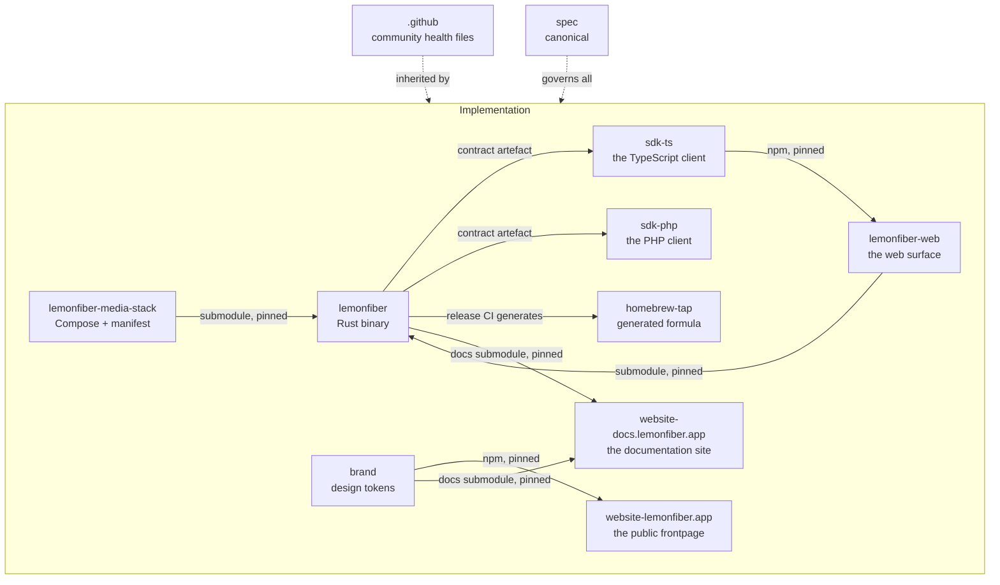

# Per-repo specifications

**Status:** Accepted

Where [20-architecture](../20-architecture/) describes the system, this section
describes each repository — its structure, its rules, and what is specific to
working inside it.

---

## The repos

| Repo | Spec | Language | What's specific about it |
|------|------|----------|--------------------------|
| `spec` | [../README.md](../README.md) | Markdown | This repository — canonical, and cited by every change to the rest |
| `lemonfiber` | [lemonfiber.md](lemonfiber.md) · [lemonfiber-tui.md](lemonfiber-tui.md) · [lemonfiber-reference.md](lemonfiber-reference.md) | Rust | Three surfaces, one core; the submodule; the build |
| `lemonfiber-web` | [lemonfiber-web.md](lemonfiber-web.md) | TypeScript | Two surfaces, one component library; draws the API, implements nothing |
| `sdk-ts` | [sdk-ts.md](sdk-ts.md) | TypeScript | Published; owns the stream's hard parts so no consumer reimplements them |
| `sdk-php` | [sdk-php.md](sdk-php.md) | PHP | The same contract, implemented as a peer rather than translated |
| `lemonfiber-media-stack` | [lemonfiber-media-stack.md](lemonfiber-media-stack.md) | YAML/TOML | Runs standalone; the compose rules CI enforces |
| `homebrew-tap` | [homebrew-tap.md](homebrew-tap.md) | Ruby | Generated; exists so `brew` works |
| `website-lemonfiber.app` | [website-lemonfiber.md](website-lemonfiber.md) | Astro | The org is the motor; roadmap read, not written |
| `website-docs.lemonfiber.app` | [website-docs.md](website-docs.md) | Astro | It renders; it does not own — every page pinned to the repo that wrote it |
| `brand` | [brand.md](brand.md) | CSS/SVG | Tokens are generated; the marks are not open |
| `.github` | this page | Markdown | Org-wide community health files; no spec of its own |

Those eleven are every repository in the org. `.github` carries the community
health files GitHub serves for a repo that does not define its own — the code of
conduct, the security policy, the issue templates and the org profile — so a
sibling repo inherits them rather than copying them
([tooling](../40-quality/tooling.md)).

## The `REPO-R` namespace

Per-repo requirements use `REPO-R##` — obligations specific to one repository's
structure or tooling, distinct from behaviour (`A2-R4`), architecture (`ARCH-R1`),
governance (`GOV-R2`) and quality (`Q-R1`).

## The relationships that matter

**`lemonfiber-media-stack` → `lemonfiber` (submodule).** `lemonfiber` embeds a
pinned tag of `lemonfiber-media-stack` and validates its `schema_version` at
build time (`ARCH-R6`). They version
independently; the pin says exactly which stack a given binary ships
([versioning](../20-architecture/contracts/versioning.md)).

**`lemonfiber` → `homebrew-tap` (generation).** `lemonfiber`'s release CI regenerates the
formula. The tap is downstream of every `lemonfiber` release and is otherwise inert.

**Every repo → `website-docs.lemonfiber.app` (submodules).** The documentation
site shows each repo's own `.docs/`, README and policy files, pinned to an exact
revision and rendered rather than copied ([ADR-0015](../00-overview/decisions/0015-docs-site-renders-what-it-does-not-own.md)).
The specification is the exception: it is linked to its mdBook, not mirrored.

**Everything ← `spec` (governance).** No change to any of them lands without
citing this repository ([50-governance](../50-governance/)).

**`lemonfiber` → the SDKs (generation).** `lemonfiber` emits one contract artefact
from its own `serde` types; `sdk-ts` and `sdk-php` generate their types from it
and hand-write only behaviour ([ADR-0014](../00-overview/decisions/0014-one-generated-contract-for-every-sdk.md)).

## The one property to remember per repo

- **`lemonfiber`** — logic cannot render. The core crate has no UI dependency, so a
  surface can never grow behaviour of its own.
- **`lemonfiber-media-stack`** — it runs without lemonfiber. Plain
  `docker compose` works, which is what makes adopting the tool reversible.
- **`homebrew-tap`** — nobody writes it. It's generated, and exists only because
  Homebrew requires a repo of that name.
- **`website-lemonfiber.app`** — the org is the motor. Roadmap and status are
  read from the org at build time, never hand-authored, so the page cannot
  drift from reality.
- **`website-docs.lemonfiber.app`** — it renders; it does not own. Every page is
  another repo's file at a revision the site names, so a wrong sentence is fixed
  where it was written.

## Related

- [20-architecture](../20-architecture/) — the system across repos
- [40-quality](../40-quality/) — the standards all code is held to
- [50-governance](../50-governance/) — how change enters each repo
