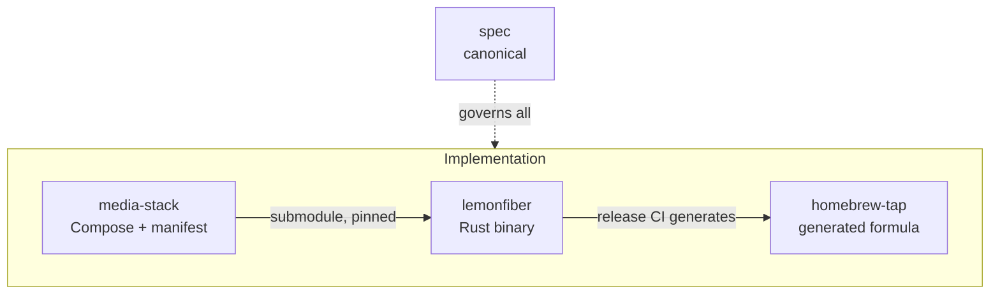

# Per-repo specifications

**Status:** Accepted

Where [20-architecture](../20-architecture/) describes the system, this section
describes each repository — its structure, its rules, and what is specific to
working inside it.

---

## The repos

| Repo | Spec | Language | What's specific about it |
|------|------|----------|--------------------------|
| `lemonfiber` | [lemonfiber.md](lemonfiber.md) · [lemonfiber-tui.md](lemonfiber-tui.md) · [lemonfiber-reference.md](lemonfiber-reference.md) | Rust | Three surfaces, one core; the submodule; the build |
| `media-stack` | [media-stack.md](media-stack.md) | YAML/TOML | Runs standalone; the compose rules CI enforces |
| `homebrew-tap` | [homebrew-tap.md](homebrew-tap.md) | Ruby | Generated; exists so `brew` works |

## The `REPO-R` namespace

Per-repo requirements use `REPO-R##` — obligations specific to one repository's
structure or tooling, distinct from behaviour (`A2-R4`), architecture (`ARCH-R1`),
governance (`GOV-R2`) and quality (`Q-R1`).

## The relationships that matter

**`media-stack` → `lemonfiber` (submodule).** `lemonfiber` embeds a pinned tag of `media-stack`
and validates its `schema_version` at build time (`ARCH-R6`). They version
independently; the pin says exactly which stack a given binary ships
([versioning](../20-architecture/contracts/versioning.md)).

**`lemonfiber` → `homebrew-tap` (generation).** `lemonfiber`'s release CI regenerates the
formula. The tap is downstream of every `lemonfiber` release and is otherwise inert.

**Everything ← `spec` (governance).** No change to any of the three lands without
citing this repository ([50-governance](../50-governance/)).

## The one property to remember per repo

- **`lemonfiber`** — logic cannot render. The core crate has no UI dependency, so a
  surface can never grow behaviour of its own.
- **`media-stack`** — it runs without lemonfiber. Plain `docker compose` works,
  which is what makes adopting the tool reversible.
- **`homebrew-tap`** — nobody writes it. It's generated, and exists only because
  Homebrew requires a repo of that name.

## Related

- [20-architecture](../20-architecture/) — the system across repos
- [40-quality](../40-quality/) — the standards all code is held to
- [50-governance](../50-governance/) — how change enters each repo
