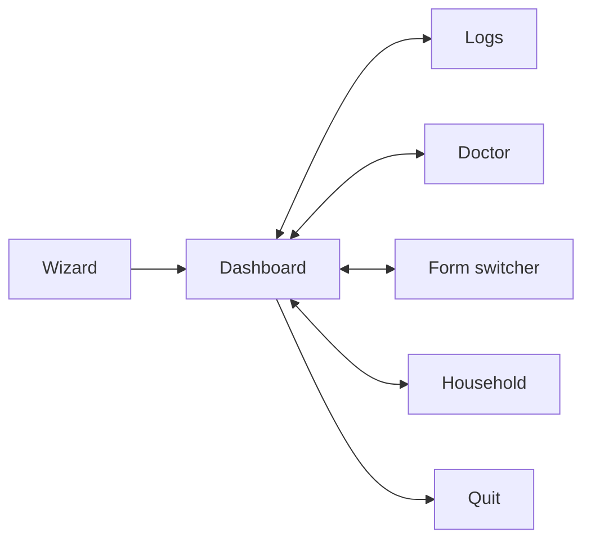

# `lemonfiber` — TUI specification

**Status:** Accepted

The terminal interface, screen by screen. What each shows, how input moves, and
how each degrades.

**Implements:** [B3](../10-functional/features/b-running/b3-dashboard.md),
[B4](../10-functional/features/b-running/b4-logs.md),
[A2](../10-functional/features/a-getting-started/a2-setup-wizard.md),
[C1](../10-functional/features/c-trust/c1-diagnostics.md) in a terminal, under
[G1](../10-functional/features/g-ux/g1-interface-tiers.md) and
[G3](../10-functional/features/g-ux/g3-accessibility.md).

---

## Screen map



The dashboard is home. Every other screen is reachable from it by a single key
and returns with `Esc`.

## Global conventions

| | |
|---|---|
| Navigation | `Tab`/arrows move focus; single letters jump screens; `Esc` goes back |
| Quit | `q` from the dashboard; `Esc` elsewhere |
| Help | `?` overlays context help |
| State symbols | Never colour alone (`G3-R1`): `✓` healthy · `!` degraded · `✗` failed · `·` stopped · `?` unknown |
| Refresh | ~1 Hz, non-blocking (`B3-R4`) |

## Dashboard

```
┌ lemonfiber ─────────────────────────────────────────────────┐
│ ✓ Everything's fine · 12 services · 3 downloading · 480 GB   │
├─────────────────────────────────────────────────────────────┤
│ VPN      185.65.x.x (NL) · port 51413 · egress ✓            │
│ Transfers                                                    │
│   The Expanse S04E03   ▓▓▓▓▓▓▓░░░ 71%  14 MB/s   2m         │
│   Dune Part Two        ▓▓░░░░░░░░ 18%   8 MB/s  21m         │
│ Queue    sonarr 4 · radarr 1 · lidarr 0                     │
│ Storage  480 GB free · hardlinks ✓ · ~26 days               │
│ Services 12 healthy                                          │
├─────────────────────────────────────────────────────────────┤
│ [l]ogs [d]octor [f]orms [h]ousehold [?]help [q]uit          │
└─────────────────────────────────────────────────────────────┘
```

Layout order is priority order (`B3-R2`): the summary line, then VPN (the only
item with off-machine consequences), then transfers, queue, storage, services.

The top line is [G7](../10-functional/features/g-ux/g7-health-summary.md)'s
summary — computed from findings, not container counts (`G7-R2`). All twelve
services up with a leaking VPN reads `✗ VPN leak detected`, not `Everything's
fine` (`G7-R4`).

**Degraded rendering** when telemetry drops (`B3-R7`): the affected panel shows
`— unavailable —`, the rest stays live, the screen stays open. `unknown` and `0`
render distinctly (`B3-R5`).

## Form switcher

```
┌ Forms ──────────────────────────────────────────┐
│  ● tv        8 services   running               │
│    movies    8 services                          │
│    library   4 services                          │
│    full     18 services                          │
├──────────────────────────────────────────────────┤
│ tv → search, usenet, torrent, tv, subs          │
│ starts: prowlarr, sabnzbd, gluetun, qbittorrent, │
│         sonarr, bazarr  (+2 already running)     │
│ [enter] switch   [space] compose   [esc] back    │
└──────────────────────────────────────────────────┘
```

Shows the closure preview before acting (`B1-R7`) — profiles, resulting services,
and what's already running. `space` composes forms (`B1-R5`); `enter` switches,
stopping only what falls outside the new closure (`B1-R10`).

## Logs

```
┌ Logs · sonarr,sabnzbd · [e]rror ────────── following ┐
│ 19:42:01 sonarr   Import failed: permission denied   │
│ 19:42:01 sabnzbd  Completed: The.Expanse.S04E03      │
│ 19:41:58 sonarr   Grabbed from Prowlarr              │
├──────────────────────────────────────────────────────┤
│ [/]filter [s]ervice [e]severity [x]port [esc] back   │
└──────────────────────────────────────────────────────┘
```

Multiple services interleaved chronologically, tagged by source (`B4-R1`) — the
whole point, since the import failure above is only explicable with both lines
adjacent. Scrolling up detaches and counts new lines (`B4-R3`, `B4-R4`); `x`
exports through redaction (`B4-R10`).

## Doctor

```
┌ Doctor ─────────────────────────────────────────────┐
│ ✓ Storage      hardlinks working, 480 GB free       │
│ ✓ VPN          egress matches, port 51413           │
│ ✗ Queue        1 item stuck 26h — The Expanse S04E03│
│   → import failing: permission denied on /data/…    │
│     [f] fix   [i] ignore                             │
│ ? Killswitch   unverified — [r]un disruptive check  │
├──────────────────────────────────────────────────────┤
│ [a]ll [r]erun [f]ix-all [esc] back                  │
└──────────────────────────────────────────────────────┘
```

Every finding carries its remedy inline (`C1-R2`). `unverified` renders as `?`,
visibly distinct from `✓` (`C1-R3`). Fixable findings offer `[f]` (`C3-R1`);
disruptive checks are opt-in and labelled (`C1-R5`).

## Wizard

The [setup flow](../10-functional/features/a-getting-started/a2-setup-wizard.md)
in the TUI: one step per screen, a persistent progress rail, `←`/`→` between
steps with back-navigation (`A2-R4`), and a review screen before anything is
written (`A2-R2`).

The wizard is richer in the [web UI](../10-functional/features/g-ux/g1-interface-tiers.md#the-web-ui-is-where-the-wizard-shines)
— inline help, provider links, QR codes — but is fully completable here (`G1-R14`).

## Household

Invitations and member management
([D6](../10-functional/features/d-content/d6-household-identity.md)): list members
with access and activity, issue an invitation, show the link **and a QR code
rendered in the terminal** (`D6-R4`), issue a password reset.

## Degradation

| Condition | Behaviour |
|-----------|-----------|
| No true colour | Symbols carry all state; no information lost (`G3-R1`) |
| `NO_COLOR` | Honoured (`G3-R2`) |
| No Nerd Font | ASCII fallback for symbols (`G3-R9`) |
| Narrow terminal | Drop lower-priority columns, never corrupt layout (`B3-R9`) |
| Resize | Reflow, keep scroll position (`B3-R10`) |
| Screen reader | Direct to the web UI — the supported path (`G3-R3`) |

## Requirements

| ID | Requirement |
|----|-------------|
| **REPO-R1** | The dashboard MUST order panels by priority: summary, VPN, transfers, queue, storage, services. |
| **REPO-R2** | Every screen MUST be reachable from the dashboard by one key and return with `Esc`. |
| **REPO-R3** | State MUST be conveyed by symbol, never colour alone. |
| **REPO-R4** | The form switcher MUST show the closure preview before switching. |
| **REPO-R5** | Logs MUST interleave multiple services chronologically with source tags. |
| **REPO-R6** | `unverified` findings MUST render distinctly from passing ones. |
| **REPO-R7** | Invitations MUST render a QR code in the terminal. |
| **REPO-R8** | The wizard MUST be fully completable in the TUI, with back-navigation. |
| **REPO-R9** | Every screen MUST degrade to a no-colour, ASCII-only terminal without losing information. |

## Related

- [lemonfiber.md](lemonfiber.md) — the repo overall
- [lemonfiber-reference.md](lemonfiber-reference.md) — the non-interactive equivalents
- [B3](../10-functional/features/b-running/b3-dashboard.md) · [B4](../10-functional/features/b-running/b4-logs.md) · [G3](../10-functional/features/g-ux/g3-accessibility.md)
