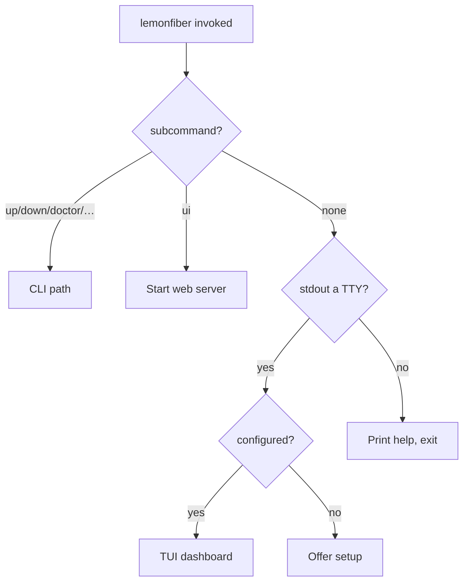

# Repo: `lemonfiber`

**Status:** Accepted

The `lemonfiber` binary — CLI, TUI and web UI over one core. Rust, Hippocratic 3.0.

**Implements:** the operator-facing half of [10-functional](../10-functional/),
under the structure fixed in [20-architecture/component-model](../20-architecture/component-model.md).

---

## What this repo is

One binary, three surfaces, one core. It sets the stack up, runs it, and proves
it's working. It is **not** a general Docker manager
([vision non-goals](../00-overview/vision.md#non-goals)) — its value is that it
knows about *this* stack.

## Layout

```
lemonfiber/
├── Cargo.toml                  workspace
├── crates/
│   ├── lemonfiber/             bin — the only crate that renders
│   │   ├── src/
│   │   │   ├── cli/            clap: subcommands, flags, exit codes
│   │   │   ├── tui/            ratatui: dashboard, wizard, logs, doctor
│   │   │   ├── api/            axum: the JSON endpoints
│   │   │   ├── embedded/       serves the built frontend from the binary
│   │   │   └── main.rs         surface selection
│   │   └── web-ui/             frontend source; dist/ embedded
│   ├── lemonfiber-core/        lib — all logic, no UI
│   └── lemonfiber-manifest/    lib — stack.toml
├── assets/media-stack/         git submodule, embedded at build
├── build.rs                    validates submodule schema_version
├── .docs/                      repo-local technical docs
└── tests/                      integration + golden files
```

Crate responsibilities are fixed in
[component-model](../20-architecture/component-model.md#crate-layout); this doc
covers what's specific to building the repo.

## `.docs/` — repo-local documentation

Per the [three-layer model](../40-quality/code-comments.md#the-three-documentation-layers),
`lemonfiber` carries its own `.docs/` tree for Rust-specific technical detail that is
**not** a product decision (those live in this spec) and **not** a code comment.

```
lemonfiber/.docs/
├── 00-index.md
├── architecture/       how subsystems are built — render loop, docker split,
│                       the vpn-port-forwarding push mechanism, …
├── adr/                repo-local decisions (crate choices, not product ones)
├── conventions/        code-comments.md (copied from spec), naming, error style
├── cicd/               pipeline detail
├── runbooks/           release cutting, submodule bumping
└── features/           subsystem notes
```

Code links here (`Q-R5`); these pages cite spec requirement IDs. This is the
middle layer that keeps requirement IDs out of code comments (`GOV-R6`) while
still connecting code to the spec.

## Surface selection



This realises [G1-R3](../10-functional/features/g-ux/g1-interface-tiers.md) and
[G1-R4](../10-functional/features/g-ux/g1-interface-tiers.md): bare invocation
opens the TUI at a terminal and prints help when piped, never blocking on stdin.

## Key dependencies

| Crate | Role | Why |
|-------|------|-----|
| `clap` | CLI parsing | Derive; generates help and completions |
| `ratatui` + `crossterm` | TUI | [ADR-0003](../00-overview/decisions/0003-rust-ratatui-for-cli.md); crossterm for real Windows support |
| `axum` | Web server | Minimal, tokio-native; only in the `web` module |
| `bollard` | Docker API | Reads only; only in `lemonfiber-core::docker` |
| `tokio` | Async | Shallow — [component-model](../20-architecture/component-model.md#async-model) |
| `reqwest` | Service HTTP | Seed clients |
| `serde` + `toml` | Manifest, config | |
| `etcetera` | Platform paths | XDG / `AppData` / `~/Library`; permissive dependencies throughout |
| `include_dir` | Embed stack + web assets | [ADR-0005](../00-overview/decisions/0005-embedded-stack-assets.md) |
| `thiserror` | Library errors | `lemonfiber-core` |
| `color-eyre` | Binary errors | The `lemonfiber` crate only |

`unsafe` is denied crate-wide (see [code-standards](../40-quality/code-standards.md)).

## The submodule

`assets/media-stack` is a git submodule pinned to a `lemonfiber-media-stack` tag.
`build.rs`:

1. Fails clearly if the submodule is empty (`git submodule update --init`).
2. Parses `stack.toml` and fails the build if `schema_version` is unsupported
   (`ARCH-R6`).

So an incompatible stack/binary pairing cannot compile, let alone ship.

## Build-time work

| Step | Produces |
|------|----------|
| `web-ui` build | `web-ui/dist/` — embedded static assets |
| `build.rs` | Schema validation; embedded stack |
| `cargo build` | The binary |

The `web-ui` build is the only non-Rust toolchain, and it runs at **release
time**, not install time (`ARCH-R19`) — an end user never needs npm.

## Configuration on disk

| Path (Linux shown) | Holds |
|--------------------|-------|
| `~/.config/lemonfiber/` | `.env`, expected-state baseline, journal |
| `~/.local/share/lemonfiber/stack/` | Materialised stack files |
| `~/.local/share/lemonfiber/config/` | Per-service config (the `/config` mounts) |
| `~/.local/share/lemonfiber/backups/` | Backup archives |

Resolved via `etcetera`, so macOS and Windows get their conventional
locations. `--stack-dir` overrides the stack path (`F1-R3`).

## Testing posture

Most of `lemonfiber-core` is testable without Docker or a terminal, by design
(`ARCH-R11`). Detail in [testing-strategy](../40-quality/testing-strategy.md); the
load-bearing point:

- **Command construction** is pure → golden-file tested across every form × every
  platform, no daemon.
- **Docker access** is behind a trait → mockable.
- **Platform** is one component → faked, so all four environments run from one
  machine (`ARCH-R35`).

## What lives here vs. in the spec

| Here (`lemonfiber`) | Spec |
|--------------|------|
| How the render loop is built | That it must not block (`B3-R4`) |
| Which crate parses TOML | The manifest contract |
| The exact port-push shell mechanism | That the port must be re-pushed (`C2-R5`) |
| Rust module structure | That core cannot render (`ARCH-R11`) |

Rule of thumb: **what** and **why** are the spec's; **how, in Rust** is this
repo's `.docs/`.

## Related

- [lemonfiber-tui.md](lemonfiber-tui.md) — screen-by-screen TUI spec
- [lemonfiber-reference.md](lemonfiber-reference.md) — every subcommand and flag
- [component-model](../20-architecture/component-model.md) · [platform-matrix](../20-architecture/platform-matrix.md)
- [40-quality](../40-quality/) — how the code is written
