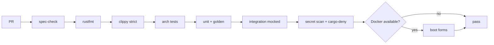
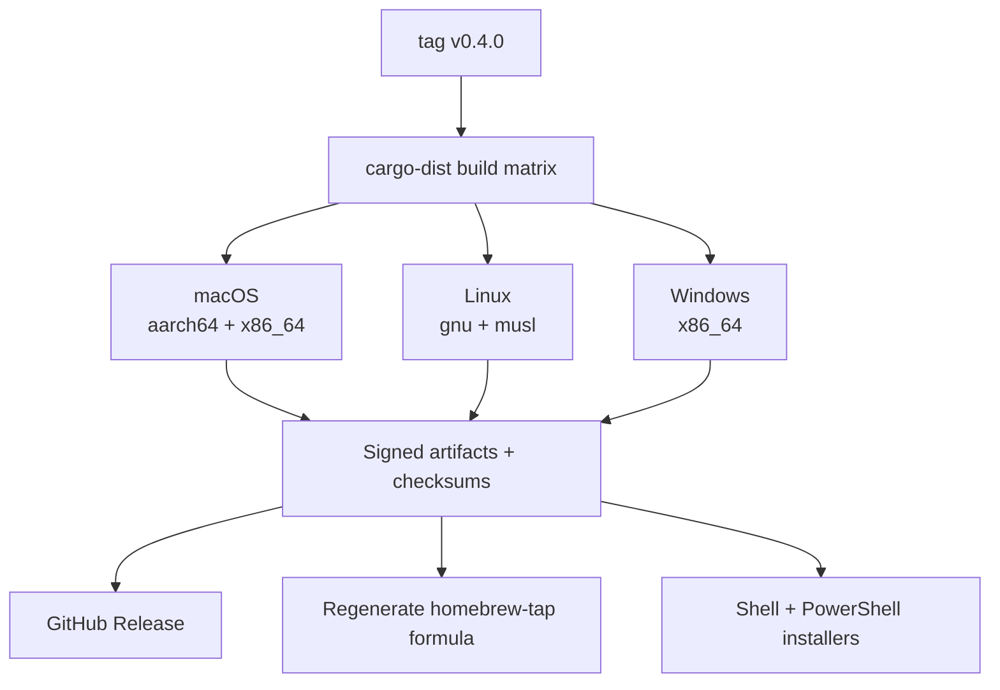

# CI/CD

**Status:** Accepted

The pipeline, the release process, and the checks that gate a merge.

**Satisfies:** [roadmap M6](../00-overview/roadmap.md#m6--release-engineering),
[E2](../10-functional/features/e-maintenance/e2-self-update.md),
[GOV-R](../50-governance/cross-repo-ci.md) enforcement.

---

## PR pipeline — `lemonfiber`

Ordered cheapest-first so a formatting failure doesn't wait on a compile. Every
stage blocks merge.

| Stage | Gate |
|-------|------|
| `spec-check` | Citation present, resolves, spec merged first ([GOV-R](../50-governance/cross-repo-ci.md)) |
| `rustfmt` | Formatting (`Q-R19`) |
| `clippy` | The full strict set; warnings are errors (`Q-R12`) |
| arch tests | Boundaries, no `#[allow]` in `src/`, comment policy (`Q-R13`, `Q-R7`) |
| unit + golden | Logic and command construction (`Q-R23`) |
| integration | Mocked Docker and service APIs |
| secret scan | No credential in any tracked file |
| `cargo-deny` | Licences, advisories, banned/duplicate deps |
| coverage | 100% of applicable lines (`cargo-llvm-cov`, `Q-R61`) |
| SonarCloud | Analysis ingested; zero open issues enforced in CI (`Q-R64`) |
| e2e (conditional) | Boot forms where Docker is present |

## The comment gate in CI

The [comment policy](code-comments.md) runs as an arch test, and — critically —
against its **fixture tree** (`Q-R7`): it must find each planted violation and
pass the compliant control. A comment gate that only runs over production source
passes vacuously on a young repo. Running it over deliberate violations is what
proves it still works.

## `cargo-deny`

Supply chain is a real threat ([security](security.md)), enforced not exhorted:

| Check | Fails on |
|-------|----------|
| `advisories` | A dependency with a known RUSTSEC advisory |
| `licenses` | A dependency licence outside the allow-list |
| `bans` | A banned crate, or a **telemetry-carrying** one (`G8-R11`) |
| `sources` | A dependency from an unapproved registry |

`G8-R11` — dependencies must not introduce telemetry — is checked here rather than
hoped for.

## Secret scanning

Runs over **all** tracked files including tests (`Q-R29`). A real key in a fixture
is a leak whatever the intent. This is defence-in-depth behind the allow-list
redaction ([C4](../10-functional/features/c-trust/c4-support-bundle.md)) — the
redaction protects the operator's secrets; this protects the project's.

## SonarCloud — enforced in CI, not by the plan gate

Code quality and coverage run through SonarQube Cloud, which ingests the
`cargo-llvm-cov` report (`Q-R52`, `Q-R61`). But the **free plan cannot set the
quality gate to this project's standard**: its gate is fixed around an 80%
new-code coverage default and cannot be configured to require 100% coverage or
zero open issues. Relying on Sonar's own gate would let a sub-standard change
merge.

So the standard is enforced in CI directly, independently of the Sonar plan gate,
and both checks block the merge:

| Enforced in CI | How | Fails on |
|----------------|-----|----------|
| Coverage | `cargo-llvm-cov --fail-under-lines 100` over the applicable set | Any applicable line uncovered (`Q-R61`) |
| Issues | A step that reads the summary SonarCloud posts on the PR when its analysis finishes | Any open issue — bug, vulnerability or code smell (`Q-R64`) |

The issues check blocks on a **counted** issue and on nothing else. A summary that
never arrived, and one whose shape the check no longer understands, are the
analysis's problem or the check's own; blocking a contributor's pull request on
either would punish the wrong person, and — worse — an unreadable summary that
fails looks exactly like a summary that failed, so the real finding hides behind the
noise. Both cases warn instead, in the log and in the verdict comment, which says
plainly that `Q-R64` is not being enforced until someone fixes the check.

It also waits for a summary of the **commit under test**. SonarCloud edits one
comment in place, so after a push the previous analysis's comment is still there
with its old count — and a check that reads the first count it finds fails the
push that fixed the issue it is reporting, then passes on a manual re-run. A
re-run as the remedy is the bug wearing a hat, so the comment is believed only
once it is newer than the commit it describes.

This is the documented cap `Q-R63` calls for. **Reason:** the free plan's gate is
not configurable. **Lift condition:** a paid plan or self-hosted SonarQube whose
gate can be set to 100% coverage and zero issues — at which point Sonar's gate and
the CI checks say the same thing and the CI issue check becomes belt-and-braces
rather than the enforcement.

The issue check reads what the analysis already reports rather than asking the
SonarCloud API for it: SonarCloud posts a summary on the PR when its run
finishes, and the CI step reads that summary and fails on any open issue — turning
"Sonar found something" from advisory into blocking without a second credential
or a separate query. Where the scan did not run — a fork PR without the
`SONAR_TOKEN` secret — there is no summary to read, and the check does not fail
for something it could not observe.

## Release — `cargo-dist`

A tagged release on `lemonfiber` triggers the three-platform build:

| Output | For |
|--------|-----|
| Per-platform archives + checksums | Direct download, and every installer |
| `homebrew-tap` formula | `brew` ([homebrew-tap](../30-repos/homebrew-tap.md)) |
| `install.sh` / `install.ps1` | `curl \| sh`, `irm \| iex` |
| Signed release | Integrity |

The `web-ui` build runs here, at release time — the only non-Rust toolchain, and
an end user never sees it (`ARCH-R19`).

## Real cross-platform testing

Not "it compiles" — actually run. The release matrix builds all targets; a
smoke-test job **runs** the binary on macOS, Linux and Windows (`roadmap M6`
exit). A binary that builds for Windows and panics on first launch has been
tested for the wrong thing.

## `media-stack` and `homebrew-tap` pipelines

- **`media-stack`** — `spec-check`, then the structural checks in its
  [repo spec](../30-repos/media-stack.md#ci). No stack boot in CI (no
  credentials).
- **`homebrew-tap`** — `spec-check` and `brew audit` (configured to accept the
  non-SPDX licence). Mostly receives generated commits.

## Branch protection

All four repos: required checks must pass, `spec-check` among them, before merge
(`roadmap M0.5`). The [override](../50-governance/overrides.md) bypasses
`spec-check` **only**, never the build, tests, or review (`GOV-R19`).

## Requirements

| ID | Requirement |
|----|-------------|
| **Q-R30** | PR CI MUST run spec-check, format, strict clippy, arch tests, unit, golden, integration, secret scan, `cargo-deny`, the coverage gate and SonarCloud analysis, all blocking. |
| **Q-R31** | The comment and boundary arch tests MUST run against their fixture trees, not only production source. |
| **Q-R32** | `cargo-deny` MUST fail on advisories, disallowed licences, banned crates, and telemetry-carrying dependencies. |
| **Q-R33** | Secret scanning MUST cover all tracked files. |
| **Q-R34** | Releases MUST build macOS (arm64 + x86_64), Linux (gnu + musl) and Windows, with checksums. |
| **Q-R35** | The release MUST regenerate the Homebrew formula and produce shell and PowerShell installers. |
| **Q-R36** | A release smoke test MUST run the binary on all three platforms, not merely build it. |
| **Q-R37** | All four repos MUST require passing checks before merge; the override MUST bypass only spec-check. |
| **Q-R64** | Open SonarCloud issues MUST be zero, enforced as a blocking CI check independent of the Sonar plan's own quality gate, since the free plan's gate cannot be configured to this standard (`Q-R63`). |

## Related

- [testing-strategy.md](testing-strategy.md) — what the test stages run
- [security.md](security.md) — why `cargo-deny` and secret scanning matter
- [50-governance/cross-repo-ci.md](../50-governance/cross-repo-ci.md) — spec-check
- [roadmap M6](../00-overview/roadmap.md#m6--release-engineering)
