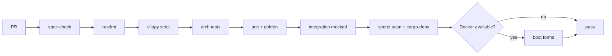
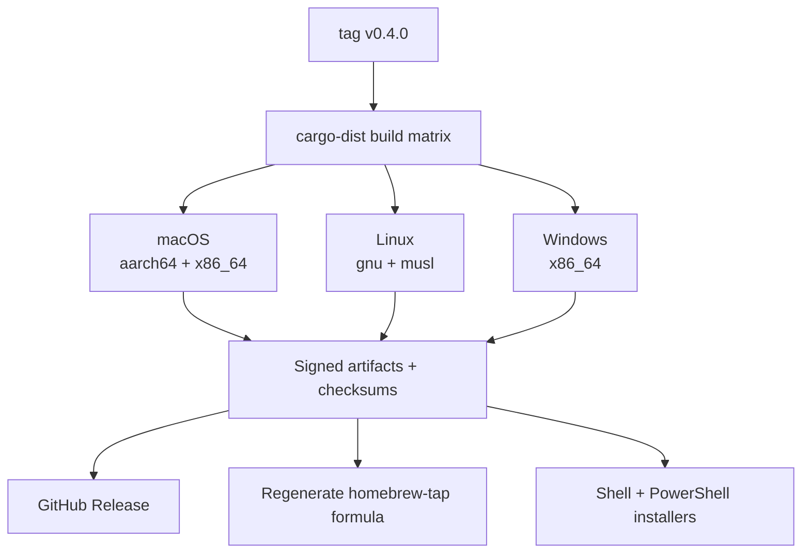

# CI/CD

**Status:** Accepted

The pipeline, the release process, and the checks that gate a merge.

**Satisfies:** [roadmap M10](../00-overview/roadmap.md#m10--release-engineering),
[E2](../10-functional/features/e-maintenance/e2-self-update.md),
[GOV-R](../50-governance/cross-repo-ci.md) enforcement.

---

## PR pipeline — `lemonfiber`

```mermaid
flowchart LR
    pr[PR] --> spec[spec-check]
    spec --> fmt[rustfmt]
    fmt --> lint[clippy strict]
    lint --> arch[arch tests]
    arch --> unit[unit + golden]
    unit --> integ[integration mocked]
    integ --> sec[secret scan + cargo-deny]
    sec --> e2e{Docker available?}
    e2e -->|yes| boot[boot forms]
    e2e -->|no| done[pass]
    boot --> done
```

Ordered cheapest-first so a formatting failure doesn't wait on a compile. Every
stage blocks merge.

| Stage | Gate |
|-------|------|
| `spec-check` | Citation present, resolves, spec merged first ([GOV-R](../50-governance/cross-repo-ci.md)) |
| `rustfmt` | Formatting (`Q-R19`) |
| `clippy` | The full strict set; warnings are errors (`Q-R12`) |
| arch tests | Boundaries, no `#[allow]` in `src/`, comment policy (`Q-R13`, `Q-R7`) |
| unit + golden | Logic and command construction (`Q-R23`) |
| integration | Mocked Docker and service APIs |
| secret scan | No credential in any tracked file |
| `cargo-deny` | Licences, advisories, banned/duplicate deps |
| coverage | 100% of applicable lines (`cargo-llvm-cov`, `Q-R61`) |
| SonarCloud | Analysis ingested; zero open issues enforced in CI (`Q-R64`) |
| e2e (conditional) | Boot forms where Docker is present |

## The comment gate in CI

The [comment policy](code-comments.md) runs as an arch test, and — critically —
against its **fixture tree** (`Q-R7`): it must find each planted violation and
pass the compliant control. A comment gate that only runs over production source
passes vacuously on a young repo. Running it over deliberate violations is what
proves it still works.

## `cargo-deny`

Supply chain is a real threat ([security](security.md)), enforced not exhorted:

| Check | Fails on |
|-------|----------|
| `advisories` | A dependency with a known RUSTSEC advisory |
| `licenses` | A dependency licence outside the allow-list |
| `bans` | A banned crate, or a **telemetry-carrying** one (`G8-R11`) |
| `sources` | A dependency from an unapproved registry |

`G8-R11` — dependencies must not introduce telemetry — is checked here rather than
hoped for.

## CodeQL — the analysis is not the gate

`Q-R53` puts SAST in CI, and for years that was where it stopped. The check
GitHub raises beside a CodeQL analysis compares the *configurations* a pull
request produced against every one seen on `main`; the supply-chain scan uploads
three that only ever run on `main`, so on a pull request that check is neutral
whatever the analysis found. Requiring it gates nothing. A finding would be
raised, shown in the Security tab, and block no merge.

So the question is asked directly, by a reusable
[`codeql-alerts.yml`](../.github/workflows/codeql-alerts.yml)
each repository's own `codeql.yml` calls: *of the alerts the API holds against
this branch, is any of them open.* An alert dismissed with a reason is not open,
which leaves the judgement about what is worth acting on where it was recorded.

Two things that gate must not do, both of which an earlier copy of it did:

| It would pass on | Because | So it |
|---|---|---|
| a commit nobody analysed | `code-scanning/alerts` returns `[]` for *analysed and clean* and for *never analysed* alike | reads the analysis list alongside, and refuses a commit carrying none |
| a commit already replaced | `analyses?ref=…` answers about the **ref**, and a pull request's merge ref is rebuilt on every push | is handed a commit sha and asks about that |

It waits, rather than races: an upload the `analyze` job accepted is not an
analysis the API will answer about yet, and the two are minutes apart. The same
function decides the wait and the verdict, so there is no second opinion to
drift. Where the analysis already failed, it asks once and is red in seconds —
running after a failed analysis is safe now precisely because it refuses a
commit it has no analysis of, by language and by name.

The languages come off the caller's own workflow — `strategy.matrix` where there
are several, `init`'s `languages:` where there is one — rather than being passed
in beside it. A second copy of that list is free to fall behind silently, which
is how a gate comes to check two of three and report a pass.

A caller adopting it adds `codeql` to its `awaiting-maintainer` wait list in
the same change. That list is what re-asks *is this mergeable yet* when a
workflow finishes; a gating workflow left out of it can be the last one to go
green, with nothing afterwards to notice — the flag never goes up and nothing
says why. The workflow need not be a required context first: naming it costs one
extra evaluation and means the list is already right on the day it becomes one.

The job runs under `if: ${{ !cancelled() }}`. `needs:` alone made it *vanish*
when a language failed, and [a skipped required check satisfies branch
protection](#when-a-pull-request-is-blocked-and-does-not-say-by-what) — so the
one gate that refuses an alert was absent in exactly the case where the analysis
went wrong. `always()` would also finish a run somebody pressed stop on, which
serves nobody.

## Secret scanning

Runs over **all** tracked files including tests (`Q-R29`). A real key in a fixture
is a leak whatever the intent. This is defence-in-depth behind the allow-list
redaction ([C4](../10-functional/features/c-trust/c4-support-bundle.md)) — the
redaction protects the operator's secrets; this protects the project's.

## SonarCloud — enforced in CI, not by the plan gate

Code quality and coverage run through SonarQube Cloud, which ingests the
`cargo-llvm-cov` report (`Q-R52`, `Q-R61`). But the **free plan cannot set the
quality gate to this project's standard**: its gate is fixed around an 80%
new-code coverage default and cannot be configured to require 100% coverage or
zero open issues. Relying on Sonar's own gate would let a sub-standard change
merge.

So the standard is enforced in CI directly, independently of the Sonar plan gate,
and both checks block the merge:

| Enforced in CI | How | Fails on |
|----------------|-----|----------|
| Coverage | `cargo-llvm-cov --fail-under-lines 100` over the applicable set | Any applicable line uncovered (`Q-R61`) |
| Issues | A step that reads the summary SonarCloud posts on the PR when its analysis finishes | Any open issue — bug, vulnerability or code smell (`Q-R64`) |

The issues check blocks on a **counted** issue and on nothing else. A summary that
never arrived, and one whose shape the check no longer understands, are the
analysis's problem or the check's own; blocking a contributor's pull request on
either would punish the wrong person, and — worse — an unreadable summary that
fails looks exactly like a summary that failed, so the real finding hides behind the
noise. Both cases warn instead, in the log and in the verdict comment, which says
plainly that `Q-R64` is not being enforced until someone fixes the check.

It also waits for a summary of the **commit under test**. SonarCloud edits one
comment in place, so after a push the previous analysis's comment is still there
with its old count — and a check that reads the first count it finds fails the
push that fixed the issue it is reporting, then passes on a manual re-run. A
re-run as the remedy is the bug wearing a hat, so the comment is believed only
once it is newer than the commit it describes.

This is the documented cap `Q-R63` calls for. **Reason:** the free plan's gate is
not configurable. **Lift condition:** a paid plan or self-hosted SonarQube whose
gate can be set to 100% coverage and zero issues — at which point Sonar's gate and
the CI checks say the same thing and the CI issue check becomes belt-and-braces
rather than the enforcement.

The issue check reads what the analysis already reports rather than asking the
SonarCloud API for it: SonarCloud posts a summary on the PR when its run
finishes, and the CI step reads that summary and fails on any open issue — turning
"Sonar found something" from advisory into blocking without a second credential
or a separate query. Where the scan did not run there is no summary to read, and
the check does not fail for something it could not observe.

Two kinds of run reach it that way. A pull request from a fork is given no
secrets at all. A pull request Dependabot opened reads secrets from the
Dependabot store rather than the Actions store, and `SONAR_TOKEN` is not in it —
so a CI-driven scan there receives an empty token and can only fail, on a step
that has nothing to do with the bump, holding a required check red on every
dependency update. The scan is skipped on those runs instead, keyed on
`pull_request.user.login` — the field `Q-R55` already keys on, and the only one
the pull request's opener cannot write.

Neither run changes what the coverage gate measures: it needs no token and still
runs, so `Q-R61` is enforced on a dependency update exactly as it is elsewhere.
Both leave `Q-R64` unenforced, and both say so — in the log, and in the verdict
the gate writes to the run summary as well as to the pull request. A skipped scan
reports itself under its own name too, because a step missing from a log reads
the same as a step that ran and found nothing.

## Release — `cargo-dist`

A tagged release on `lemonfiber` triggers the three-platform build:

```mermaid
flowchart TD
    tag["tag v0.4.0"] --> build[cargo-dist build matrix]
    build --> mac["macOS<br/>aarch64 + x86_64"]
    build --> lin["Linux<br/>gnu + musl"]
    build --> win["Windows<br/>x86_64"]
    mac & lin & win --> art[Signed artifacts + checksums]
    art --> gh[GitHub Release]
    art --> tap[Regenerate homebrew-tap formula]
    art --> inst[Shell + PowerShell installers]
```

| Output | For |
|--------|-----|
| Per-platform archives + checksums | Direct download, and every installer |
| `homebrew-tap` formula | `brew` ([homebrew-tap](../30-repos/homebrew-tap.md)) |
| `install.sh` / `install.ps1` | `curl \| sh`, `irm \| iex` |
| Signed release | Integrity |

No web build runs here. The app is compiled in `lemonfiber-web`'s CI and carried
as a pinned submodule, so the Rust build sees files (`ARCH-R19`, [ADR-0012](../00-overview/decisions/0012-web-assets-embedded-at-build-time.md)).

## Real cross-platform testing

Not "it compiles" — actually run. The release matrix builds all targets; a
smoke-test job **runs** the binary on macOS, Linux and Windows (`roadmap M10`
exit). A binary that builds for Windows and panics on first launch has been
tested for the wrong thing.

## `lemonfiber-media-stack` and `homebrew-tap` pipelines

- **`lemonfiber-media-stack`** — `spec-check`, then the structural checks in its
  [repo spec](../30-repos/lemonfiber-media-stack.md#ci). No stack boot in CI (no
  credentials).
- **`homebrew-tap`** — the shared gates only. It holds one generated file and no
  formula-specific check yet.

## Branch protection

Every repo: required checks must pass, `spec-check` among them, before merge
(`roadmap M0.5`). The [override](../50-governance/overrides.md) bypasses
`spec-check` **only**, never the build, tests, or review (`GOV-R19`).

### When a pull request is blocked and does not say by what

GitHub names a failing check and links its log. It does not name a required
check that **never reported** — that one appears in no check list at all, so the
merge box says "Required statuses must pass" with nothing to click. A `paths:`
filter that did not match, a job whose `needs:` dependency failed, a reusable
workflow granted too few `permissions:`, a workflow that could not start, and a
third-party app having an outage all look identical from outside, which is to say
they look like nothing.

`just blocked <owner/repo> [<number>…]`, or `just blocked <owner> --org`, reads
what protection requires against what the head commit carries and names the
difference. It also reports the rules that are not checks — `strict`,
`required_signatures`, conversation resolution, review — which block just as hard
and appear in no list either.

Read it as a second opinion, not an authority: where it and GitHub disagree it
says so, and GitHub decides.

## A push replaces the run it supersedes

The organisation's repositories share one pool of runners, twenty jobs at a
time. A pull request pushed again has no use for the run on its old head: the
checks that decide the merge are the ones on the new head, and a run nobody will
read holds runners the new one is queued behind. One repository's pipeline, run
to the end on every superseded push, is enough to leave every other repository's
checks queued behind it.

So a pull request's workflows cancel the run they replace. A push to `main` and
a release tag cancel nothing: what runs there is the record of the branch and
the build of a release, and each has a ref of its own that a pull request's run
never shares.

Every such workflow carries the one block in
[`shared/concurrency.yml`](../shared/concurrency.yml), which keys a pull
request's runs on its ref and every other event on its own run. The hygiene
gate's `shared-files` job holds each repository to it through
`check_superseded_runs.py`, which runs from this repository's `main` and so
reaches every caller without moving a pin. It refuses a workflow a pull request
runs without the block, a group that cancels and is not the block, a job with a
group of its own in a workflow a pull request runs, and two workflows sharing
the name the group is keyed on. A job waiting in a group is replaced by the next
one to arrive whatever `cancel-in-progress` says, which is why a job's group is
refused there even when it cancels nothing.

The reusable workflows this repository's own pull requests also run directly
cannot carry the block: a group declared in one is evaluated in each caller's
context, where it is the caller's own. They are covered by `cancel-superseded`,
which cancels this pull request's runs on the heads a push replaced through the
API. `homebrew-tap`, `website-docs.lemonfiber.app` and `website-lemonfiber.app`
are reported by the check rather than refused, and are named in it.

## A runner is spent on assurance

Twenty jobs at a time is the whole budget, and a job costs a runner's start-up
whether it then works for ten minutes or six seconds. So the count of jobs is
held down as hard as their minutes, and nothing changes what any check asks.

**A job that would do nothing does not start.** Where the event alone answers
whether a job has anything to do — a `workflow_run` that did not succeed, a
pull request run nobody will be told about — the answer is a job-level `if:`,
which is evaluated before a runner is assigned. A step that exits early still
cost a runner to reach.

**The shared checks are one job.** Measured on 107 pull request jobs on
8 October 2026, the median job ran for 10 seconds and waited 5 minutes for a
runner, nine minutes at the 90th percentile, and a pull request ran 25 to 64
jobs. The wait is the cost, so every shared check that runs in seconds is a
step of one job, `gates`:
- spec-check's reading;
- the hygiene checks;
- both security scans;
- workflow pins, DCO, attribution, commit lint and the squash message;
- what the explainers detect.

Each step runs whatever the steps of other checks concluded, so one run reports
every failure. The run's summary lists each check with its result, and the job
fails when any check failed. Branch protection requires that one context,
`gates / gates`. The job holds no write permission, so a pull request from a
fork runs it as it is.

What writes to a pull request is a second job, `report`, which runs no
third-party tool. It closes a pull request spec-check refuses, applies labels
and goals, and posts and removes the citation and explainer comments. It judges
nothing, and a fork's pull request, whose token cannot write, skips it.
Nothing that used to run is dropped: the same checks run, packaged as steps.

The tests, coverage, CodeQL's analysis and Sonar stay jobs of their own. They
run for minutes rather than seconds, and some need a runner to themselves.

`gates.yml` is generated from the reusable workflows that define each check, by
`scripts/gen_gates.py`, and a gate refuses a generated file that has drifted
from them. Those reusables stay the definition.

**A bump that changes nothing is not pushed.** A bot that regenerates a
repository against an upstream compares what it would commit with what its
open branch already carries, and leaves the branch alone where they match. A
newer upstream move cancels a bump still running, whose result it would
overwrite. `check_superseded_runs.py` lets a group of its own cancel only on a
workflow that nothing but a dispatch or a schedule starts, which no push and no
tag can reach.

**A cache is written by `main`.** A pull request can read its own caches and its
base branch's, never another pull request's, so a cache saved on one pull
request's ref serves only that pull request while evicting `main`'s against the
repository's limit. Caches are saved from a push to `main` only, and every job
whose cache a pull request restores also runs there.

**An analysis runs where its language changed.** On a pull request, CodeQL's
`actions` analysis runs when the change touches `.github/`, and reports success
having analysed nothing otherwise. A push to `main` and the weekly schedule
analyse every language.

## A change that touches no code

A pull request that changes only documentation holds runners for a build, a test
suite, a coverage run and an analysis that cannot answer differently than they
did on its base. So a repository's code-judging jobs ask a `what changed` job
first, and skip where every changed path is one none of them reads.

The classification is an allowlist, and it fails safe. A path counts as code-free
only where the repository names it as one no code-judging job reads: its Markdown
outside anything a test or generator reads, its docs directory, its tracker,
`LICENSE`, its issue templates. Everything else is code, so a new kind of file
runs every job, and so does any change to a workflow, a build file, a lockfile,
a generated contract or a source file. A `what changed` job that fails, or finds
no base to compare against, decides nothing, and every job runs.

The gates that judge documentation run on every change: markdown, links, typos,
spec references, a tracker's generator check, secret scanning, DCO and
attribution.

Each skipped job is skipped by a job-level `if:` rather than by a `paths:`
filter, so it still reports, as skipped, and a skipped required check satisfies
branch protection. Three shapes need more than that, because they report under
a different name when skipped:

- A job that calls a reusable workflow reports as the caller's job name alone,
  `gate` rather than `gate / gate`, so it is never skipped. `sonar-gate` and
  `codeql-alerts` take `code: false` instead and answer at once: no analysis
  ran, and none was needed.
- A matrix job reports with its matrix unexpanded, so a required
  `analyze (rust)` goes missing. Its steps are skipped instead, and the job
  reports success having analysed nothing.
- A check another service posts, such as `SonarCloud Code Analysis`, appears
  only where its scan ran, so a repository requiring one keeps the scan.

## Requirements

| ID | Requirement |
|----|-------------|
| **Q-R30** | PR CI MUST run spec-check, format, strict clippy, arch tests, unit, golden, integration, secret scan, `cargo-deny`, the coverage gate and SonarCloud analysis, all blocking. |
| **Q-R31** | The comment and boundary arch tests MUST run against their fixture trees, not only production source. |
| **Q-R32** | `cargo-deny` MUST fail on advisories, disallowed licences, banned crates, and telemetry-carrying dependencies. |
| **Q-R33** | Secret scanning MUST cover all tracked files. |
| **Q-R34** | Releases MUST build macOS (arm64 + x86_64), Linux (gnu + musl) and Windows, with checksums. |
| **Q-R35** | The release MUST regenerate the Homebrew formula and produce shell and PowerShell installers. |
| **Q-R36** | A release smoke test MUST run the binary on all three platforms, not merely build it. |
| **Q-R37** | Every repository in the org MUST require passing checks before merge; the override MUST bypass only spec-check. |
| **Q-R64** | Open SonarCloud issues MUST be zero, enforced as a blocking CI check independent of the Sonar plan's own quality gate, since the free plan's gate cannot be configured to this standard (`Q-R63`). |
| **Q-R67** | A repository that has not yet reached zero MUST declare what it still carries, in its own workflow, as a number that MUST NOT increase beyond what already stands against the branch it merges into. |
| **Q-R75** | A workflow a pull request runs MUST cancel that pull request's run it supersedes when the pull request is pushed again, and MUST NOT cancel a run for a push to a protected branch or for a tag. |
| **Q-R76** | A job whose only outcome for an event is to do nothing MUST be skipped by a job-level condition the event answers, so that no runner starts for it. |
| **Q-R77** | *Superseded by [Q-R82](ci-cd.md): the shared checks are one job whose conclusion is the one context a branch requires, and no check is published as a check run of its own. The number is not reused.* |
| **Q-R82** | The shared checks a pull request runs that take seconds MUST be steps of one job, each step running whatever the steps of other checks concluded, with the job's summary listing every check and its result and the job failing when any check failed; that job MUST hold no write permission, MUST NOT run code out of the pull request's tree, which every tool it calls reads as data, and MUST hand what the pull request wrote to a script only through its environment, and branch protection MUST require it as one context. What writes to the pull request MUST be a separate job that runs no third-party tool and judges nothing. The job MUST be generated from the reusables that define each check, and CI MUST refuse it when it has drifted from them. |
| **Q-R83** | A pull request MUST NOT change what a repository's checks run unless a maintainer merges it by choice: every repository MUST run `pin-only` from its base branch, on `pull_request_target`, checking out nothing of the pull request and holding a token that only reads, and it MUST fail a pull request that changes anything under `.github/workflows/` or `.github/actions/`, read from git's trees at the merge base and at the head commit the event names, unless each change only moves a pin of a lemonfiber/spec workflow forward along spec's `main` at a job's or a step's `uses`, the two documents read by a loader that refuses anchors, aliases, merge keys, a key given twice and explicit tags; a tree the forge returns truncated, and a pull request whose head is no longer that commit, MUST fail it, and a push MUST cancel the run for the head it replaced. Branch protection MUST require it in every repository that calls it. |
| **Q-R78** | An automated bump MUST NOT push when what it would commit is identical to what its open branch already carries, and a newer upstream move MUST cancel a bump run still in progress. |
| **Q-R79** | A build cache MUST be saved only from a push to the protected branch, and every job whose cache a pull request restores MUST also run on that push. |
| **Q-R80** | On a pull request, a CodeQL analysis of the `actions` language MUST run when the change touches `.github/` and MAY otherwise report success without analysing; a push to the protected branch and the scheduled run MUST analyse every language. |

### Reaching zero from a backlog

`Q-R64` names a number the shared gate did not read for months: it counted the
*new* issues on a pull request, and new is not open, so findings that predated
the gate were invisible to it. Sixty-one of them accumulated across the fleet
under checks that were green throughout.

The gate reads both now. New issues on a pull request are the contributor's and
block immediately. The open total is the repository's, and blocks when it rises
above the number that repository declares — `allowed-open` in its own
`sonar.yml`, in the tree, readable without a SonarCloud login.

That declaration is a ratchet and not an exemption, and the gate enforces it
rather than trusting it. A pull request runs the workflow file its own head
declares, so the diff that brings the issues could raise the number that permits
them; the gate reads the same declaration on the base branch and refuses any run
whose number is higher, a first declaration where there was none included. A base
it cannot read is refused too wherever the run declares anything above zero —
not knowing whether the ratchet held is not the same as it having held — and zero
needs no comparison, since no count is below it. The gate also says so in its
verdict when the true count is below the declaration, and a repository that
declares its backlog rather than reducing it is failing `Q-R67` whatever the
check reports.

A backlog can arrive without anybody writing a line. An analyser enables a rule,
and a repository that had reached zero is carrying issues no diff of its own
introduced. "Declare what is left and work it down" is what the allowance is for,
and at zero there was no way to say it — the ratchet refused every number above
the zero already declared, **including on the pull request that fixed them**. A
gate whose remedy it blocks is a gate nobody can obey, and the only ways past it
were an override or a lie.

So a raise is permitted, and only as far as reality: the gate reads how many
issues actually stand against the base branch and refuses any declaration past
that number. What cannot be declared is headroom. A diff that brings a new issue
cannot raise the ceiling to cover it, because the count it would have to point at
is the count from before the diff — and the new-issue check has already refused
it on its own. A raise the gate cannot check is refused on the same reasoning as
a base it cannot read.

That raise is also how a pull request that fixes issues standing on `main` gets
through the gate:

1. It raises `allowed-open` in the repository's own sonar workflow to exactly
   the number of issues open on `main`, and the ratchet accepts that raise.
2. It merges, and the issues it fixes leave `main`.
3. A follow-up pull request lowers `allowed-open` to what is left, usually 0.

The raise is needed because the open total the gate compares against the
allowance is the count on `main`, and SonarCloud reports no issue as fixed by a
pull request: until the fix has merged, the issues it removes still count
against it. Nor can the count be taken from the pull request's own branch:
SonarCloud's Free plan cannot read branch analyses.

## Related

- [testing-strategy.md](testing-strategy.md) — what the test stages run
- [security.md](security.md) — why `cargo-deny` and secret scanning matter
- [50-governance/cross-repo-ci.md](../50-governance/cross-repo-ci.md) — spec-check
- [roadmap M10](../00-overview/roadmap.md#m10--release-engineering)
