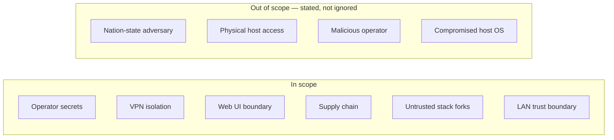

# Security

**Status:** Accepted

The threat model, and how each threat is mitigated. A single-operator, LAN-only,
self-hosted tool — but "small" is not "no threats", and one of them (VPN failure)
has consequences outside the machine.

**Satisfies:** [C2](../10-functional/features/c-trust/c2-vpn-verification.md),
[C4](../10-functional/features/c-trust/c4-support-bundle.md),
[C6](../10-functional/features/c-trust/c6-web-security.md),
[A7](../10-functional/features/a-getting-started/a7-credential-management.md),
[G8](../10-functional/features/g-ux/g8-privacy.md).

---

## Scope

The out-of-scope items are named deliberately. A household media tool that
claimed to defend against a nation-state or a compromised host OS would be lying,
and a threat model's honesty is most of its value. If the operator's machine is
already owned, lemonfiber's guarantees are void — and it says so rather than
implying otherwise.

## Assets

| Asset | Sensitivity |
|-------|-------------|
| VPN private key | High — enables tunnel impersonation |
| Usenet/indexer credentials | High — paid accounts, some tied to identity |
| Service API keys | Medium — full control of each service |
| Web UI session | Medium — controls the whole stack |
| The operator's real IP | **High — the VPN exists to protect it** |
| Media library | Low confidentiality, high replaceability cost |
| Household watch history | Low, but private within the home |

## STRIDE by component

### lemonfiber (the control surface)

| Threat | Vector | Mitigation |
|--------|--------|------------|
| **S**poofing | Something impersonates the web UI on the LAN | Loopback by default; LAN binding refused without auth (`C6-R4`); plain HTTP stated honestly (`C6-R6`) |
| **T**ampering | Config or manifest altered out of band | Drift detection surfaces it (`C9`); manifest validation refuses malformed forks (`F1-R9`) |
| **R**epudiation | "I didn't change that" | Every change journaled with actor and prior value (`E4-R1`) |
| **I**nfo disclosure | Secret in a log / bundle / error | Allow-list redaction, fails closed (`C4-R5`); secrets never in output (`A7-R3`); enforced by test (`Q-R26`) |
| **D**enial of service | Web UI flooded | Rate-limited auth (`C6-R11`); local-only surface limits exposure |
| **E**levation | Household member reaches admin | Admin surfaces unreachable from LAN by binding, not obscurity (`C6-R1`) |

### The VPN path — the consequential one

| Threat | Vector | Mitigation |
|--------|--------|------------|
| **I**nfo disclosure | VPN fails open, real IP leaks to peers | Fail-closed killswitch; **egress verified empirically** by comparing IPs inside both containers (`C2-R1`); continuous while torrents run (`C2-R9`) |
| **T**ampering | qBittorrent escapes the namespace | `network_mode: service:gluetun`; a client not sharing the namespace reports `leaking` (`C2-R12`) |
| **R**epudiation | "Was I ever leaking?" | Leak detection notifies at critical severity and is recorded (`C2-R10`) |

This is the row that matters most. Every other threat here costs money or
privacy *within* the home; a VPN leak exposes the operator's identity to
strangers. It is the one place the spec insists on empirical proof over
configuration (`P3`).

### The credential store

| Threat | Vector | Mitigation |
|--------|--------|------------|
| **I**nfo disclosure | Other local user reads secrets | Owner-only file permissions (`A7-R8`); the guarantee is stated honestly — protects against other users, **not** against malware running as the operator (`A7-R9`) |
| **T**ampering | Backup carries secrets to insecure storage | Backups labelled sensitive at creation (`A7-R12`, `E3-R4`) |
| **E**levation | Service API key reused as a foothold | Keys are per-service and rotatable (`A7-R4`) |

### Supply chain

| Threat | Vector | Mitigation |
|--------|--------|------------|
| **T**ampering | Malicious dependency | `cargo-deny` advisories + source allow-list (`Q-R32`); `forbid(unsafe_code)` shrinks the blast radius |
| **T**ampering | Dependency adds telemetry | Banned and checked (`G8-R11`, `Q-R32`) |
| **T**ampering | Compromised container image | Pinned tags (`E1-R1`); images from known publishers; digest pinning available |
| **I**nfo disclosure | Build leaks secrets | No secrets in the build; release artifacts signed with checksums (`Q-R34`) |
| **T**ampering | A published binary is swapped or rebuilt maliciously | SLSA build provenance + an SBOM per release ([OPS-R20](../70-operations/releasing.md)); a consumer can verify origin |

### The stack fork boundary

| Threat | Vector | Mitigation |
|--------|--------|------------|
| **T**ampering | A `--stack-dir` fork does something hostile | It runs with the operator's own privileges by their own choice — same trust as any software they run. Manifest validation still applies; `capabilities` beyond an allow-list are refused (`stack.toml` contract) |
| **E**levation | Fork requests `NET_ADMIN` for a non-VPN service | Capability allow-list refuses it at validation |

## Secure-by-default posture

The defaults are the security model, because defaults are what people run
([P5](../00-overview/vision.md#p5--secure-by-default-not-by-configuration)):

| Default | Not the default |
|---------|-----------------|
| Admin surfaces on loopback | Exposed to LAN |
| Web UI off until asked | Always-on daemon |
| Only Gluetun gets `NET_ADMIN` | Broad capabilities |
| Pinned image tags | Floating |
| No telemetry | Opt-out analytics |
| HTTP stated honestly | Self-signed TLS teaching click-through |

## Privacy as a security property

[G8](../10-functional/features/g-ux/g8-privacy.md): no telemetry, no installation
identifier, every outbound request enumerable and disableable — **enforced by a
test** (`G8-R9`), not by intent. For a tool people run precisely to avoid being
watched, phoning home would be a security failure, not merely a faux pas.

## Supply-chain posture and its ceilings

The org runs **OpenSSF Scorecard** and **SonarCloud** on every repo. The checks we
can enforce, we enforce — and stay green:

| Enforced | How |
|----------|-----|
| Pinned-Dependencies | Every `uses:` is SHA-pinned ([ADR-0009](../00-overview/decisions/0009-action-pinning.md)); Renovate advances them |
| Token-Permissions | Minimal, job-scoped `permissions:` on every workflow |
| SAST | CodeQL (Rust + Actions) and SonarCloud on every PR |
| Vulnerabilities | OSV-Scanner; zero open SonarCloud vulnerabilities |
| Dependency-Update-Tool | Renovate on every repo |
| Dangerous-Workflow | No untrusted input in `run:`; fork PRs never see secrets |
| Branch-Protection | PR-required, signed commits, strict status checks, linear history, conversation-resolution |
| Fuzzing | `cargo-fuzz` targets over the manifest parser and its validation; a smoke run on every PR that touches them, a long run weekly, corpus carried between runs |
| Security-Policy / License / Maintained / CI-Tests | Present and green |

Some checks are **structurally capped** for a solo, pre-release, ethical-source
project. These are documented, not gamed — a low sub-score with a stated reason is
honest; a padded one is not:

| Capped check | Why | Rises when |
|--------------|-----|-----------|
| Code-Review, Contributors | One maintainer, who cannot review their own PRs | A second maintainer joins and PRs are reviewed before merge |
| Signed-Releases | The artifacts **are** attested — `actions/attest` runs on each build and `gh attestation verify` succeeds against every published one — but Scorecard reads the release's assets, and an attestation is not one; it lives in GitHub's attestation store | Provenance appears beside the artifacts, or the check learns to ask the store. [`L1-R2`](../10-functional/features/l-release/l1-release-engineering.md) obliges a verifiable signature at 1.0.0, with `L1-R4` and `L1-R5` obliging an installer to check it (`Q-R44`, [OPS-R20](../70-operations/releasing.md)) |
| Packaging | Pre-release, and the shell installer is the only one published | The tap publish returns at 1.0.0 (`L1-R3`), which waits on a tap token, alongside the PowerShell installer and a Windows target |
| CII-Best-Practices | The badge is a manual registration | Registered at public launch |
| License | Hippocratic 3.0 is deliberately **not** OSI-approved, so Scorecard may not recognise it | Not a defect — an accepted trade-off ([licence rationale](../90-appendix/license-rationale.md)) |

`enforce_admins` is on for every repository that carries code or specification,
so the maintainer meets the same gates as anybody else and `main` cannot be
written past them. It is off only on `.github`, which holds community health
files and no gated content. Where a rule is ever set aside, the override is
recorded ([overrides](../50-governance/overrides.md)).

## Disclosure

A private path in each repo's `SECURITY.md` (`GOV-R24`). Security fixes are the
primary legitimate [override](../50-governance/overrides.md) use — a spec PR
describing the vulnerability must not precede the patch.

## Requirements

| ID | Requirement |
|----|-------------|
| **Q-R38** | The threat model MUST state its out-of-scope threats explicitly, not omit them. |
| **Q-R39** | VPN egress isolation MUST be verified empirically, continuously while torrents run. |
| **Q-R40** | Secrets MUST NOT appear in any output, enforced by test; redaction MUST fail closed. |
| **Q-R41** | Credential-store guarantees MUST be stated accurately, including what they do not protect against. |
| **Q-R42** | `cargo-deny` MUST enforce advisories, licence allow-list, and a telemetry/banned-crate list. |
| **Q-R43** | Container capabilities beyond an allow-list MUST be refused at manifest validation. |
| **Q-R44** | Release artifacts MUST be checksummed and signed. |
| **Q-R45** | Each repo MUST publish a private security disclosure path. |
| **Q-R46** | The no-telemetry property MUST be enforced by an automated test. |
| **Q-R63** | The enforceable OpenSSF Scorecard / SonarCloud checks MUST be kept green; a structurally-capped check MUST be documented with its reason and lift condition, never gamed. |

## Related

- [C2](../10-functional/features/c-trust/c2-vpn-verification.md) · [C4](../10-functional/features/c-trust/c4-support-bundle.md) · [C6](../10-functional/features/c-trust/c6-web-security.md)
- [A7](../10-functional/features/a-getting-started/a7-credential-management.md) · [G8](../10-functional/features/g-ux/g8-privacy.md)
- [ci-cd.md](ci-cd.md) — where supply-chain and secret checks run
- [50-governance/overrides.md](../50-governance/overrides.md) — security disclosure handling
