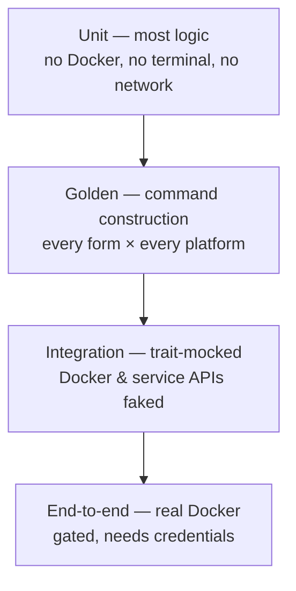

# Testing strategy

**Status:** Accepted

What must be tested, how, and why the architecture makes most of it possible
without Docker or a terminal.

**Satisfies:** the verification posture of
[P3](../00-overview/vision.md#p3--the-tool-proves-things-rather-than-assuming-them);
depends on [ARCH-R11](../20-architecture/component-model.md),
[ARCH-R12](../20-architecture/component-model.md),
[ARCH-R35](../20-architecture/platform-matrix.md).

---

## The shape



Wide at the bottom, narrow at the top — because the architecture was built to
keep it that way. The core has no UI dependency (`ARCH-R11`), command
construction is pure (`ARCH-R12`), and platform is one fakeable component
(`ARCH-R35`). Each of those is a *testability* decision as much as a design one.

## Unit — the bulk

Most of `lemonfiber-core` is pure or trait-fronted, so most tests need nothing
external:

| Tested | How |
|--------|-----|
| Manifest parse + **every validation rule** | Fixtures: valid, and one-violation-each |
| Form closure + protocol intersection | Pure function over manifest + config |
| Config read/write, comment preservation | In-memory |
| Error → remedy mapping | Assert every variant carries a remedy |
| Drift three-way comparison | Table of (expected, actual, desired) → outcome |
| Platform-conditional behaviour | Faked platform, all four environments |

The manifest validator gets the same run-it-twice treatment as the
[comment gate](code-comments.md#proving-the-gate-fires): a valid manifest passes,
and a fixture-per-rule tree proves each rule catches *its own* violation and no
other. A validator that accepts everything passes its happy-path test and is
useless.

## Golden — command construction

The compose command builder is a pure function (`ARCH-R12`), so its output is
snapshot-tested:

```
tests/golden/
├── up_tv_macos.txt
├── up_tv_linux_native.txt
├── up_full_proxy_windows.txt
└── …  every form × every environment
```

`lemonfiber up tv --dry-run` on macOS must produce exactly the committed vector.
This covers the highest-value, highest-risk surface — *"does lemonfiber generate
the right `docker compose` invocation?"* — with **no daemon**, across platforms a
single CI machine can't otherwise exercise.

Because `--dry-run` and real execution share the path (`ARCH-R13`), the golden
tests cover both.

## Integration — mocked externals

Docker access is behind a trait; service clients are traits. Both are mocked:

| Tested | Mock |
|--------|------|
| Lifecycle orchestration, health-gating | Fake Docker reporting scripted states |
| Seed wiring, idempotency, partial failure | Fake service APIs |
| Doctor checks | Injected conditions |
| **VPN egress comparison logic** | Two fake `exec` results — matching and mismatching |

The VPN leak *logic* is testable without a VPN: feed the comparison two IPs and
assert it reports `verified`, `leaking`, or `killswitch-holding` correctly
(`C2-R1`). The *real* check needs a tunnel and lives in e2e.

## End-to-end — gated

Real Docker, real containers. **Not on every PR** — it needs a Docker daemon and,
for the full path, real provider credentials that cannot live in CI.

| Runs | When |
|------|------|
| Boot each form, assert health | CI with Docker available (no credentials) |
| Hardlink import, real files | CI with Docker |
| VPN leak test end-to-end | Gated job with test VPN credentials |
| Full pipeline (search→import) | Manual, M1 exit criterion |

What can't be automated is stated rather than pretended
([media-stack CI](../30-repos/media-stack.md#ci) draws the same line): a green CI
does not mean the full acquisition path works, because CI has no Usenet account.

## What MUST be covered

Not coverage percentage — **specific high-consequence paths**:

| Must be tested | Because |
|----------------|---------|
| Every manifest validation rule, positively and negatively | A hole here ships a broken fork silently |
| VPN state classification | The one failure with off-machine consequences (`C2`) |
| Hardlink detection | Silent degradation otherwise (`C5`) |
| Secret redaction | A miss publishes a credential (`C4`, `A7`) |
| Drift preservation | A miss reverts the operator's work (`C9`) |
| Every error carries a remedy | Structural, but assert it (`G4`) |
| Command construction per platform | The core correctness surface |

## What is deliberately not chased

- **Coverage percentage as a target.** It rewards testing trivial getters and
  ignores the hard paths. The must-cover list above is the real bar.
- **UI pixel/layout tests.** Brittle and low-value; the TUI's *logic* is tested,
  its rendering is reviewed.
- **Testing the services themselves.** Sonarr's correctness is Sonarr's problem;
  our *integration* with it is ours.

## Secret hygiene in tests

Test fixtures use obviously-fake credentials. The [secret-scan](ci-cd.md) runs
over test code too — a real key pasted into a fixture is a leak regardless of
intent.

## Requirements

| ID | Requirement |
|----|-------------|
| **Q-R21** | Every manifest validation rule MUST have a positive and a negative test. |
| **Q-R22** | The validator MUST be tested against a fixture-per-rule tree; each rule MUST catch only its own violation. |
| **Q-R23** | Command construction MUST be golden-tested for every form on every platform. |
| **Q-R24** | Docker and service-API access MUST be trait-fronted and mockable. |
| **Q-R25** | VPN state classification MUST be unit-tested against matching and mismatching egress. |
| **Q-R26** | Secret redaction MUST be tested against known secret patterns. |
| **Q-R27** | End-to-end tests requiring credentials MUST be gated, and their absence from PR CI stated. |
| **Q-R28** | The must-cover paths MUST be tested; coverage percentage MUST NOT be a merge gate. |
| **Q-R29** | Secret scanning MUST run over test code as well as production code. |

## Related

- [code-standards.md](code-standards.md) — the posture this verifies
- [ci-cd.md](ci-cd.md) — where these run
- [component-model](../20-architecture/component-model.md) — the boundaries that make it testable
