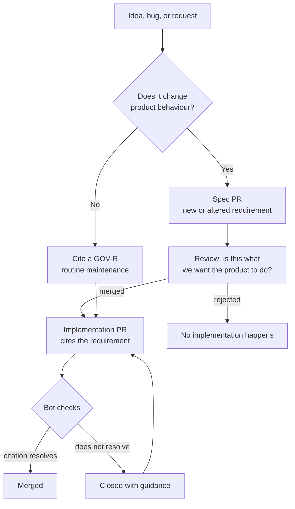

# Change lifecycle

**Status:** Accepted

How a change moves from idea to merged code across two repositories.

---

## The shape



The important edge is **`review --> impl`**: implementation begins after the spec
change merges, not alongside it.

## Why spec-first, rather than together

Two PRs in flight simultaneously look tidier and are worse:

| Together | Spec-first |
|----------|-----------|
| Reviewer sees behaviour and implementation at once | Reviewer answers *"is this what the product should do?"* without being anchored by working code |
| The spec change is shaped to match code already written | The code is shaped to match a decision already made |
| If the implementation is abandoned, the spec change is orphaned | The spec stands alone and remains true |
| Citation cannot be verified — the requirement isn't merged yet | Citation resolves mechanically |

The second row is the substantive one. Reviewing a design *next to* its
implementation reliably produces approval of the implementation, because working
code is persuasive in a way a proposal isn't. Separating them restores the
question.

## The three paths

### 1. New or changed behaviour

```
1. Open a spec PR adding or amending a requirement.
2. Review answers: should the product do this?
3. Merge.
4. Open the implementation PR citing the new ID.
```

The spec PR is often small — one requirement row and a paragraph of behaviour.
It is not a document-writing exercise.

### 2. Implementing something already specified

Most work. The requirement exists; cite it and implement.

```
Spec: B2-R1, B2-R8
```

No spec PR needed — the decision was already made, possibly months earlier.

### 3. Routine maintenance

Dependency bumps, formatting, CI configuration, typo fixes. Cite `GOV-R12`.

```
chore: bump tokio to 1.48

Spec: GOV-R12
```

## When implementation reveals the spec is wrong

This will happen, and it's the most interesting case. Implementation surfaces
things design cannot — an interaction that doesn't work, a requirement that's
impossible, two requirements that contradict.

**Stop and fix the spec.** Open a spec PR describing what was learned and what
should change; merge it; continue.

What must not happen is implementing the better behaviour and leaving the spec
describing the worse one. That is precisely the drift the rule exists to prevent,
and it is most tempting exactly here — the code works, the deadline is close, and
the spec change feels like paperwork.

If the discovery is urgent, that's what the [override](overrides.md) is for: merge
now, with the justification recorded, and correct the spec immediately after.

## Bidirectional obligation

**GOV-R7**: a spec change altering an accepted requirement must state which
implementation repos are affected.

This stops the spec drifting *ahead* into fiction — a specification describing
behaviour nobody has built is as misleading as one describing behaviour that was
replaced. Naming the affected repos makes the gap visible, and tracking issues
are opened there.

## Status vocabulary

| Status | Meaning |
|--------|---------|
| **Draft** | Proposed, not binding. Implementation MUST NOT cite it. |
| **Accepted** | Binding. Citable. |
| **Superseded** | Replaced; links to its replacement. Not citable for new work. |
| **Withdrawn** | Removed. Its number is retired permanently (**GOV-R8**). |

Draft requirements are not citable — otherwise the ordering guarantee collapses,
since anyone could merge a draft and implement against it in the same breath.

## Related

- [canonical-spec.md](canonical-spec.md) — the rule and the `GOV-R` namespace
- [cross-repo-ci.md](cross-repo-ci.md) — how the ordering is enforced
- [contributing.md](contributing.md) — the same flow, from a contributor's side
- [overrides.md](overrides.md)
