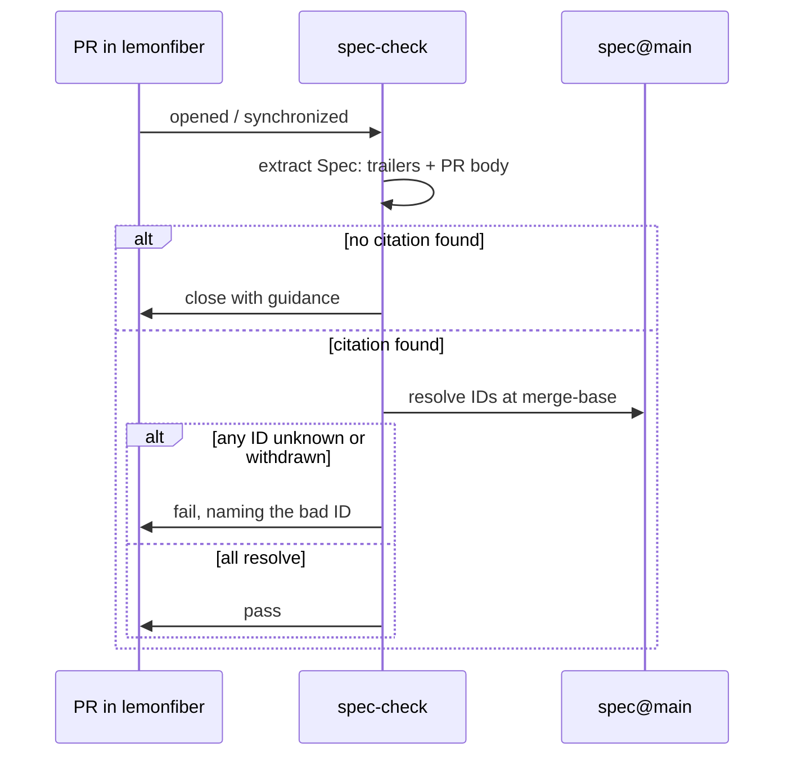

# Cross-repo CI

**Status:** Accepted

The mechanical enforcement of [GOV-R2 through GOV-R5](canonical-spec.md#the-gov-r-namespace).

---

## What runs, and where

A check runs on every pull request in every repository the org governs, and on
every merge group where one merges through a queue — see [In a merge
queue](#in-a-merge-queue). The reusable workflow is called from each repo's
`ci.yml`, so a repository added later inherits it by wiring three lines rather
than by being added to a list here.
It reads the PR's commits and body, extracts citations, and resolves them against
this repository.



## The checks

| # | Check | Failure |
|---|-------|---------|
| 1 | At least one citation present in a commit trailer **or** the PR body | Fail |
| 2 | Every cited ID is well-formed | Fail, naming the malformed ID |
| 3 | Every cited ID **exists** in `spec@main` at the merge-base | Fail, naming the unknown ID |
| 4 | No cited requirement is `Draft` or `Withdrawn` | Fail, naming it and its status |
| 5 | Spec change merged before this PR, where behaviour changed | Fail, with the ordering explained |
| 6 | Every ID the change **writes into a file** exists in `spec@main` | Fail, naming the unknown ID |

Check 3 is what distinguishes this from a regex looking for a plausible string.
Check 5 is what makes the spec structurally incapable of falling behind.
Check 6 is what closes the gap between the two places a citation is made.

### The citation nobody declared

Checks 1 to 5 read the pull request's body and its commit messages. An identifier
written into a file — the sentence a refusal prints telling somebody what to go
and read, a page under a repository's own requirements directory, a rule's own
title — is a citation in every sense that matters to the person who follows it,
and was resolved against nothing at all. A digit slipped there names a
requirement that does not exist, on a line whose whole job is to send a reader to
one.

Check 6 reads the lines a change **adds** and nothing else. A file's existing text
is not this change's to answer for, and a gate that refused a pull request over a
line somebody wrote two years ago is a gate that gets switched off rather than
fixed.

It resolves only families the spec defines, and that is where the rule stops
rather than where it was convenient to stop. A placeholder such as `X-R…` in a
doc comment means *any requirement of any family*, and a family the spec has
never heard of is
prose about requirements rather than a citation of one. What that costs is worth
stating plainly: a slip in the family rather than the number — an `M1` where an
`N1` was meant — reads as prose here and is passed over. The number is where
the slips are, and a rule that refused every capital-letter-and-digit token would
refuse the writing that explains the rules.

Retirement is not asked of a file, for the same reason. A comment recording that a
number was withdrawn has to name it, and nothing here can tell that sentence from
a citation. The trailer is where a citation is *made*, and that is where
**GOV-R8** and **GOV-R47** are enforced.

It does not read its own tests. `scripts/test_spec_check.py` exists to name
identifiers that do not resolve — that is what a test of *refuse an unknown
identifier* is — and reading it would have the gate refuse the change that
teaches it to refuse. The exemption is two paths and deliberately not a pattern:
a test's own title is exactly the kind of citation check 6 exists to resolve, so
`tests/` anywhere would be a hole wide enough to walk a repository through.

A repository may declare the same thing about its own fixtures, in
`.github/spec-check-fixtures` — one path per line, `#` for a comment. This gate
is not the only code with a test that must name an identifier nothing answers
to: the Rust stack renders a withdrawn requirement and asserts the
strikethrough, and refuses an id past the ceiling by asking for one. Without an
answer for those, check 6 refuses the next change that touches such a line and
the only way to satisfy it is to write the fixture out of a real requirement
number — which ties that repository's tests to whatever the spec holds this
week, and is the gate making the code worse.

Three things keep the declaration from becoming a way out:

- **Exact paths, never a pattern.** A glob is refused, for the reason above.
- **A path that is not there is refused**, naming the line to delete. A
  declaration outlives the file it was written for, and a list carrying an entry
  that stopped applying is one nobody trusts enough to shorten.
- **Every skipped path is printed** on every run. An exemption nobody sees is an
  exemption nobody revisits, and a gate reporting clean over files it never
  opened reads exactly like one that read them.

## Surfacing what a PR cites

Enforcement is only half the loop. Alongside `spec-check`, a **spec-references**
comment is posted on each PR: it resolves every cited identifier to its defining
file and lists them as links, with the requirement text, updating the *same*
sticky comment on each push rather than adding new ones. Where `spec-check` fails a
*missing* citation, this puts a *present* one one click from its source — for the
author and the reviewer both. It reads only PR metadata and the spec repo, never
the PR's code, so it is safe on any PR.

| ID | Requirement |
|----|-------------|
| **GOV-R32** | Each PR MUST receive an automated, self-updating comment that links every cited spec identifier to its defining file; it MUST NOT execute untrusted PR code. |

## Explaining the non-standard checks

Some checks here surprise a first-time contributor: the citation gate *closes* a
PR, the DCO check *skips* merge and bot commits, the Sonar gate reads a summary
comment rather than a status. A rule that reads as arbitrary reads as hostile —
so a check likely to confuse posts a self-updating explainer comment saying what
it does and how to satisfy it, through the one shared `explain-check` reusable so
the wording lives in one place. The explainer is the courtesy that turns a closed
PR from a rejection into a sequenced next step.

The first two of those run in **every** repository in the organisation, so the
explanation is called from every repository too, the way the gates themselves are:

```yaml
  explain:
    permissions:
      contents: read
      pull-requests: write
    uses: lemonfiber/spec/.github/workflows/explain.yml@<sha> # main
```

`explain.yml` is the caller that knows about those two; `explain-check.yml` is the
primitive under it, and a repository with a surprising check of its own calls that
one directly with its own wording. Neither is copied: an explanation in fifteen
places is fifteen wordings the day one of them is improved.

| ID | Requirement |
|----|-------------|
| **GOV-R33** | A non-standard or PR-closing check MUST post a self-updating explainer comment describing what it does and how to satisfy it, via the shared reusable, **only when the contributor has not already satisfied the check** — and MUST remove the explainer once they do; it MUST NOT execute untrusted PR code. |

## The citation format

A `Spec:` trailer on at least one commit:

```
feat: health-gate service startup

Wait for health rather than process start before reporting a service
as running.

Spec: B2-R1, B2-R2
```

And in the PR body — the same IDs, so a reviewer sees them without reading
commits. The bot requires both because they serve different readers: the trailer
is permanent provenance in `git log`, the body is context for review.

## Determining whether behaviour changed

Check 5 only applies to behavioural change, so the bot needs to tell the
difference. It uses the citation itself:

| Cited | Interpretation |
|-------|----------------|
| Only `GOV-R` identifiers | Routine maintenance — ordering check skipped |
| Any requirement or ADR | Behavioural — ordering check applies |

If a requirement is cited and that requirement was added to the spec **after**
this PR's merge-base, the ordering was violated: the contributor wrote the spec
change and the implementation together, and merged them out of order.

The remedy is simply to rebase once the spec PR has landed.

## What "close" means

**GOV-R9**: non-conforming PRs are closed, not left failing.

A red check that sits indefinitely is worse for everyone — the contributor
doesn't know whether to wait, and maintainers accumulate a queue of PRs that can
never merge. Closing is a clear signal with a clear remedy, and reopening costs
one click.

The closing comment is covered in [contributing.md](contributing.md#when-your-pr-is-closed);
in short: thank them, state the rule and why, link the spec, give copy-pasteable
steps, and say explicitly that the work isn't rejected — it's sequenced.

## In a merge queue

A repository whose default branch merges through a **merge queue** runs its
checks twice: once on the pull request, and once on the queue's own branch — the
base branch's tip with every queued pull request applied — under the
`merge_group` event. Every context the branch requires has to report on that
event. One that does not is not read as a failure; it is read as a wait, and the
queue drops the pull request when the status-check timeout expires, naming
nothing.

Two things about that are worth writing down, because both were found the
expensive way.

**A skipped job reports success; a skipped *caller* reports nothing at all.**
The context a reusable workflow produces is `caller / callee`, and the callee
exists only if the caller ran. So `if: github.event_name == 'pull_request'` on
the caller does not leave a skipped tick on a merge group — it leaves no tick,
which is exactly the state a queue waits on. A caller of a required reusable
therefore runs on `merge_group` and lets the workflow inside decide what it can
answer.

**This gate asks less of a merge group, and says so.** That event carries no
pull request: no body, and no author. **GOV-R2** allows a citation to live in
the body and **Q-R55**'s Dependabot allowance keys on the author, so requiring a
trailer of the commits alone would refuse a batch for citing exactly where the
rule permits it, and would refuse every dependency update outright. So presence
is not re-asked there — it was asked of each pull request before the queue
accepted it, and a merge group does not rewrite a commit message. **GOV-R3 is**
re-asked: every identifier the batch cites is resolved against `spec@main` as it
stands now, which is the one answer that can change while a pull request waits
in a queue. The run states which half it asked rather than leaving a bare tick.

Nothing is closed on a merge group. A batch that reaches a refusal there is the
queue's rather than any one author's, and closing one of the pull requests in it
would pick a victim out of a batch. The batch is rejected, the pull requests stay
open, and their authors are told why.

## Spec-side checks

This repository runs its own checks, since **GOV-R11** subjects governance to
itself:

| Check | Purpose |
|-------|---------|
| Every cited ID resolves | No dangling internal references |
| No duplicate requirement IDs | IDs are unique and permanent (**GOV-R8**) |
| No reused withdrawn ID | Retired numbers stay retired |
| Requirement-altering PRs name affected repos | **GOV-R7** |
| Every link resolves | Same class of rot |

## Failure modes of the bot itself

Enforcement machinery that fails badly is worse than none, because it fails
*silently* and everyone assumes it's working.

| Situation | Behaviour |
|-----------|-----------|
| Spec repo unreachable | **Fail the check, do not close.** Inability to verify is not evidence of violation. |
| Bot errors unexpectedly | Report as a bot error, never as a contributor violation. |
| Rate-limited | Retry with backoff; report as unverified rather than failing. |
| PR from a fork | Same rules. Citations are public information. |
| Bot is down entirely | Merging is blocked. Use the [override](overrides.md) — that is a legitimate use. |
| Citation valid, spec changed since | Resolve at merge-base, not at HEAD. Later spec edits must not retroactively invalidate a merged PR. |
| Very large PR touching many areas | One valid citation suffices. The bot counts references, not coverage. |
| Required check absent on `merge_group` | The queue waits and then drops the pull request. A caller that skips there reports nothing at all, rather than reporting a skip — see [In a merge queue](#in-a-merge-queue). |

The last row is deliberate: requiring a citation *per file* would produce
box-ticking, and box-ticking is how a rule stops meaning anything.

## The pin on a shared workflow

Every repository in the org runs its CI out of this one. `spec-check`, `dco`,
`hygiene`, `commitlint` and the rest are reusable workflows defined here once and
called from each repo's `ci.yml` (**Q-R56**), and each call names an exact commit
rather than a branch — `@main` is an instruction to run whatever was pushed here
a minute ago, on a runner holding that repository's token.

An exact commit is a copy, and a copy goes stale in silence. `workflow-pins` is
what makes it say so. It reads every
`uses: lemonfiber/spec/.github/workflows/<name>.yml@<sha>` out of the calling
repository's own `.github/workflows/`, and fails the pull request naming the
commits that pin has not taken (**Q-R68**, **Q-R70**). A pin on somebody else's
action is not its business; that one has versions, and the dependency bot does it.

**A pin is measured against the one file it names**, not against this
repository's `main`. Measured against the branch, every pin in the organisation
is behind from the first unrelated commit after each merge, which is to say for
most of every day — and a check that is red on every pull request is a check that
stops being required. Narrowed to the workflow's own history it is red only when
something that can reach the caller has moved.

One asymmetry is worth knowing before reading one of its logs. *Which copy of the
reader runs* is the caller's own where the caller is this repository — the same
split the `shared-files` job makes, and for the same reason: the definition under
review is the one that should be run by the review. It is also the only way a
gate like this can be introduced at all, since `main` does not hold it until the
change that adds it has merged.

**This repository does not pin itself.** Every call to one of its own reusable
workflows is `./`. The `lemonfiber/spec/…@<sha>` form aimed at your own tree is a
supply-chain pin against yourself: it runs an older copy of the file you are
looking at, and it guarantees a refusal from one commit after each merge. The
self-run therefore reports *nothing to check*, which is the honest answer rather
than a gap — the rule is about depending on **another** repository at an exact
revision, and this one does not depend on itself.

### What a stale pin actually holds back

Narrower than it reads, and sharper for it. **The workflow file is pinned; the
scripts it runs are not.** Every one of these workflows checks this repository out
at `ref: main` and runs `spec_check.py`, `dco_check.py`, `check_shared_files.py`
from there — so a fix to what a gate *decides* reaches every consumer on their
next run, whatever their pin says. What a stale pin holds is the workflow: its
steps, the arguments they pass, the events it declares itself to run on.

That is the half that changes rarely, which is exactly the half nobody watches,
and it is the half where a gate is switched off rather than made wrong. A step
added here does not run there. A workflow taught to run on `merge_group` does not
run on one there. Nothing goes red to say so, because from inside the consuming
repository the job is present, green, and doing less than its name.

### How a pin gets bumped

Dependabot does it, and `publish-pin-tag.yml` is what lets it. Its
`github-actions` updater compares **versions**: a raw commit has nothing to be
newer than, so a pin whose trailing comment names no version gives the updater
nothing to propose — and a bot that is configured and quiet is indistinguishable
from one that is configured and satisfied.

So every commit to `main` that changes a published workflow is tagged `v1.0.N`.
The series carries no meaning beyond order, which is all the comparison needs.
Each pin names its tag in the comment beside it:

```yaml
uses: lemonfiber/spec/.github/workflows/dco.yml@<sha> # v1.0.12
```

`github-actions` is on in every one of these repositories on a daily schedule,
with `lemonfiber/spec*` grouped ahead of the wildcard so a shared gate is never
held behind a cooldown. The bump arrives as a pull request like any other.

`workflow-pins` and the bot answer different questions and neither replaces the
other. The bot keeps a pin at the newest tag whether or not it matters; the check
refuses only a pin whose own workflow has moved. A repository can sit a tag or
two behind and be entirely current.

### Could not ask is not clean

Three outcomes, and the third is the one the check exists for as much as the
first. Exit 0 is every pin current, or a repository that pins nothing of ours.
Exit 1 is drift, naming it. Exit 2 is **could not ask** — no spec checkout
arrived, or a pin that this checkout cannot resolve to a commit, which is what a
shallow clone looks like from the inside.

Exit 2 fails the run and **closes nothing**. The distinction is the same one
`spec-check` draws when it declines to close on its own fault (**GOV-R9** is about
non-conforming work, and a checkout that did not arrive is not that), and it is
load-bearing here for a plainer reason: a drift check that reports clean over a
question it failed to ask is how a pin goes unwatched for months. The history is
fetched at full depth for this reason and no other — without it the honest answer
is 2, on every run, forever.

### Two pin checks, and why both

The `pins` job in `hygiene` also looks at these revisions, and the two are not
duplicates. It reports over the wire, gates only past a threshold — thirty days,
seventy-five commits — and is deliberately a **notice**, because reddening every
repository the moment anything lands here is the check people learn to route
around. It also answers a question this one does not: *which* of the workflows a
repository runs changed in the commits it has not taken.

`workflow-pins` is the gate, and it puts the catch-up in front of the next change
rather than behind it. Its cost is the honest one and worth stating: this
repository moves, so a repository green on Friday is behind on Monday without
anyone touching it, and an author who changed none of it pays the bump. What
makes that bearable is **OPS-R48** — `fan-out-pins.yml`, which opens the bump in
every consumer rather than leaving it owed by all of them.

It hangs off `publish-pin-tag` rather than off the merge, because the comment
beside a pin carries the tag and the tag is what Dependabot compares: a fan-out
firing on the merge would have no number to write. It rewrites through
`workflow_pins.py`'s own reader, so it cannot bump a pin the gate would not have
named nor leave one it would. And it visits the repositories `30-repos/repos.toml`
lists rather than a second copy of that list, so the day somebody adds a
fourteenth repository is not the day the fan-out quietly stops covering the org.

**It does not replace the dependency bot and is not racing it.** The bot proposes
whatever tag existed when it ran; this fires from the tag itself. The difference
is the one that cost an afternoon — see below.

Until this existed the bump was done by hand, and that was the reason to keep the
check off the required list on a default branch: a gate whose remedy nothing
automates, made required, is a gate that blocks its own cure. **Q-R71** is the
form that admission takes in a repository that has to defer it, and a deferral
recorded under it names the work it waits on — which is now landed, so those are
the deferrals to review rather than to renew.

### When two freshness gates are red at once

A repository can hold more than one check of this shape: *is what we pin still
what they have?* `workflow-pins` asks it of the shared workflows, `sdk-drift` and
`contract-drift` ask it of a vendored client. Each is independently reasonable
and each is required where it runs.

Together they have a failure mode neither has alone. **When two of them are red
on `main` at the same time, nothing merges at all** — the pull request that fixes
one still fails the other, in both directions, so neither can go first. It is not
a deadlock between two changes; it is a deadlock over every change, because both
gates read `main`'s state rather than the branch's.

On 2026-09-22 it happened twice. `lemonfiber-web` had #128 bumping the pins and
failing `sdk-drift`, and #127 taking the client and failing `workflow-pins`;
`sdk-php` had the same pair. Both were resolved the only way the rule allows: one
commit doing both. That is the remedy, and it is worth knowing before spending an
hour looking for the one PR that will unblock the others.

What makes it rare is that both gates have to go stale on the same afternoon,
which is what a tag here landing while `lemonfiber` was also moving produced. What
makes it survivable is that the fan-out now closes one of the two before anybody
notices it opened.

## Related

- [canonical-spec.md](canonical-spec.md) · [change-lifecycle.md](change-lifecycle.md)
- [contributing.md](contributing.md) — the contributor's view
- [overrides.md](overrides.md) — including when the bot itself is broken
- [issue-routing.md](issue-routing.md)
