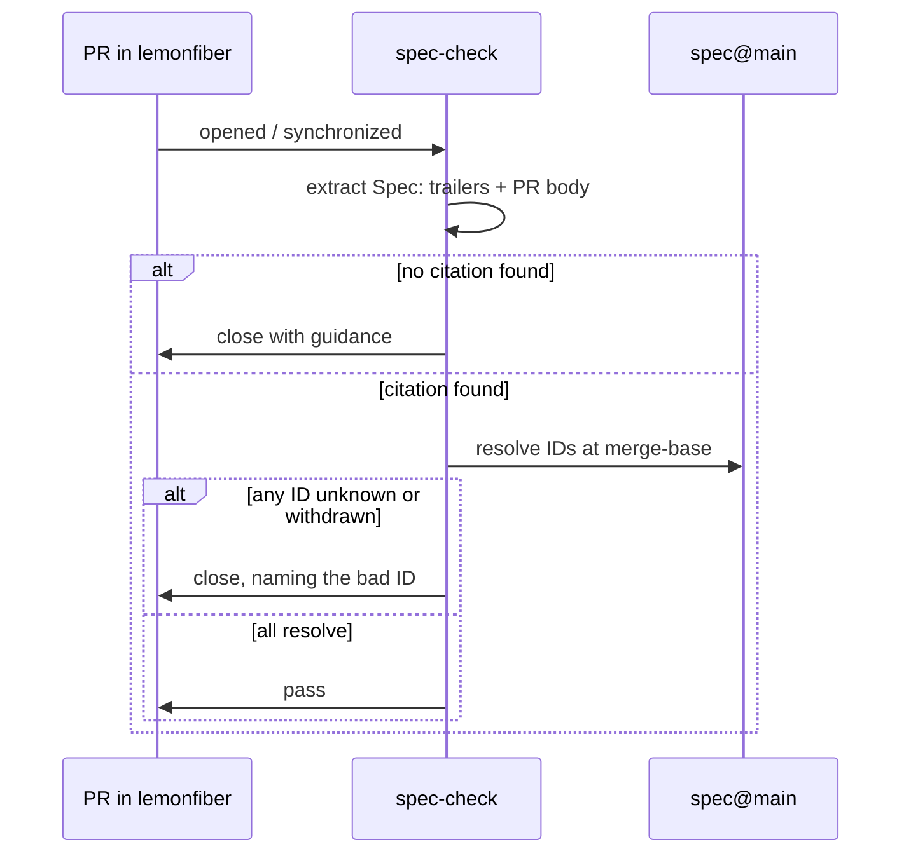

# Cross-repo CI

**Status:** Accepted

The mechanical enforcement of [GOV-R2 through GOV-R5](canonical-spec.md#the-gov-r-namespace).

---

## What runs, and where

A check runs on every pull request in `lemonfiber`, `lemonfiber-media-stack` and
`homebrew-tap`.
It reads the PR's commits and body, extracts citations, and resolves them against
this repository.



## The checks

| # | Check | Failure |
|---|-------|---------|
| 1 | At least one citation present in a commit trailer **and** the PR body | Close |
| 2 | Every cited ID is well-formed | Close, naming the malformed ID |
| 3 | Every cited ID **exists** in `spec@main` at the merge-base | Close, naming the unknown ID |
| 4 | No cited requirement is `Draft` or `Withdrawn` | Close, naming it and its status |
| 5 | Spec change merged before this PR, where behaviour changed | Close, with the ordering explained |

Check 3 is what distinguishes this from a regex looking for a plausible string.
Check 5 is what makes the spec structurally incapable of falling behind.

## Surfacing what a PR cites

Enforcement is only half the loop. Alongside `spec-check`, a **spec-references**
comment is posted on each PR: it resolves every cited identifier to its defining
file and lists them as links, with the requirement text, updating the *same*
sticky comment on each push rather than adding new ones. Where `spec-check` fails a
*missing* citation, this puts a *present* one one click from its source — for the
author and the reviewer both. It reads only PR metadata and the spec repo, never
the PR's code, so it is safe on any PR.

| ID | Requirement |
|----|-------------|
| **GOV-R32** | Each PR MUST receive an automated, self-updating comment that links every cited spec identifier to its defining file; it MUST NOT execute untrusted PR code. |

## Explaining the non-standard checks

Some checks here surprise a first-time contributor: the citation gate *closes* a
PR, the DCO check *skips* merge and bot commits, the Sonar gate reads a summary
comment rather than a status. A rule that reads as arbitrary reads as hostile —
so a check likely to confuse posts a self-updating explainer comment saying what
it does and how to satisfy it, through the one shared `explain-check` reusable so
the wording lives in one place. The explainer is the courtesy that turns a closed
PR from a rejection into a sequenced next step.

| ID | Requirement |
|----|-------------|
| **GOV-R33** | A non-standard or PR-closing check MUST post a self-updating explainer comment describing what it does and how to satisfy it, via the shared reusable, **only when the contributor has not already satisfied the check** — and MUST remove the explainer once they do; it MUST NOT execute untrusted PR code. |

## The citation format

A `Spec:` trailer on at least one commit:

```
feat: health-gate service startup

Wait for health rather than process start before reporting a service
as running.

Spec: B2-R1, B2-R2
```

And in the PR body — the same IDs, so a reviewer sees them without reading
commits. The bot requires both because they serve different readers: the trailer
is permanent provenance in `git log`, the body is context for review.

## Determining whether behaviour changed

Check 5 only applies to behavioural change, so the bot needs to tell the
difference. It uses the citation itself:

| Cited | Interpretation |
|-------|----------------|
| Only `GOV-R` identifiers | Routine maintenance — ordering check skipped |
| Any requirement or ADR | Behavioural — ordering check applies |

If a requirement is cited and that requirement was added to the spec **after**
this PR's merge-base, the ordering was violated: the contributor wrote the spec
change and the implementation together, and merged them out of order.

The remedy is simply to rebase once the spec PR has landed.

## What "close" means

**GOV-R9**: non-conforming PRs are closed, not left failing.

A red check that sits indefinitely is worse for everyone — the contributor
doesn't know whether to wait, and maintainers accumulate a queue of PRs that can
never merge. Closing is a clear signal with a clear remedy, and reopening costs
one click.

The closing comment is covered in [contributing.md](contributing.md#when-your-pr-is-closed);
in short: thank them, state the rule and why, link the spec, give copy-pasteable
steps, and say explicitly that the work isn't rejected — it's sequenced.

## Spec-side checks

This repository runs its own checks, since **GOV-R11** subjects governance to
itself:

| Check | Purpose |
|-------|---------|
| Every cited ID resolves | No dangling internal references |
| No duplicate requirement IDs | IDs are unique and permanent (**GOV-R8**) |
| No reused withdrawn ID | Retired numbers stay retired |
| Requirement-altering PRs name affected repos | **GOV-R7** |
| Every link resolves | Same class of rot |

## Failure modes of the bot itself

Enforcement machinery that fails badly is worse than none, because it fails
*silently* and everyone assumes it's working.

| Situation | Behaviour |
|-----------|-----------|
| Spec repo unreachable | **Fail the check, do not close.** Inability to verify is not evidence of violation. |
| Bot errors unexpectedly | Report as a bot error, never as a contributor violation. |
| Rate-limited | Retry with backoff; report as unverified rather than failing. |
| PR from a fork | Same rules. Citations are public information. |
| Bot is down entirely | Merging is blocked. Use the [override](overrides.md) — that is a legitimate use. |
| Citation valid, spec changed since | Resolve at merge-base, not at HEAD. Later spec edits must not retroactively invalidate a merged PR. |
| Very large PR touching many areas | One valid citation suffices. The bot counts references, not coverage. |

The last row is deliberate: requiring a citation *per file* would produce
box-ticking, and box-ticking is how a rule stops meaning anything.

## Related

- [canonical-spec.md](canonical-spec.md) · [change-lifecycle.md](change-lifecycle.md)
- [contributing.md](contributing.md) — the contributor's view
- [overrides.md](overrides.md) — including when the bot itself is broken
- [issue-routing.md](issue-routing.md)
