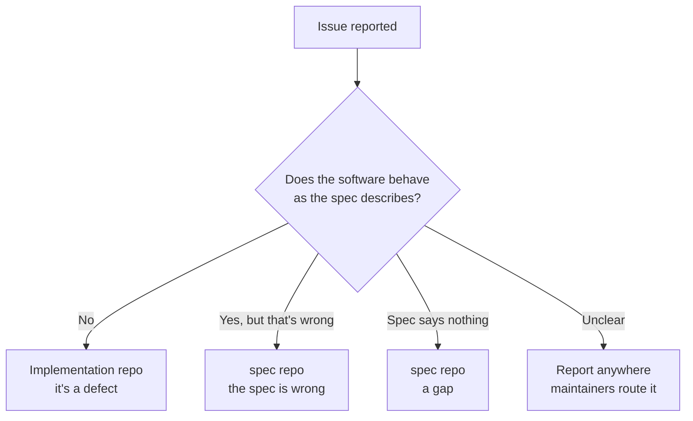

# Issue routing

**Status:** Accepted

Which repository an issue belongs in, and how it gets there.

---

## The problem

Four repos, and a reporter who reasonably doesn't know the split. Someone whose
VPN check reports a leak files against `lemonfiber` — but if the check is behaving as
specified and the *specification* is wrong, the issue belongs here.

Misrouted issues are not merely untidy: they sit in a queue nobody who can act on
them is reading.

## The routing question

**Is the behaviour what the spec says it should be?**

That single question resolves most cases:

| Symptom | Repo | Because |
|---------|------|---------|
| Command crashes | `lemonfiber` | Nothing specifies crashing |
| Wizard asks something answerable only by an expert | `spec` | Contradicts [A2-R5](../10-functional/features/a-getting-started/a2-setup-wizard.md) — but if the spec permits it, the spec is wrong |
| Service won't start | `media-stack` | Compose or manifest defect |
| Homebrew formula installs the wrong version | `homebrew-tap` | Release engineering |
| "It should also do X" | `spec` | A feature request is a spec change |
| Error message unhelpful | `lemonfiber` or `spec` | `lemonfiber` if it violates [G4](../10-functional/features/g-ux/g4-error-model.md); `spec` if G4 doesn't cover it |
| VPN provider unsupported | `spec` | Capability model change first |

## Feature requests always start here

A feature request is a proposed spec change. Filing it against `lemonfiber` invites the
sequence the [lifecycle](change-lifecycle.md) exists to prevent: someone
implements it, then writes the spec to match.

The request doesn't need to be written as a requirement — describe the problem
and the desired behaviour, and a maintainer shapes it.

## When you can't tell

**Report it anywhere.** Routing is a maintainer's job, not a reporter's, and a
misrouted issue is far better than an unreported one.

Issues are transferred rather than closed-and-refiled, so the history, the
reporter's attribution, and any discussion survive the move.

## Cross-repo linking

An issue that spans repos is filed **in `spec`** and linked from tracking issues
in each affected implementation repo. The spec issue is the parent; it closes
when the specification is settled, and the implementation issues close as work
lands.

This mirrors **GOV-R7** — a spec change altering accepted behaviour states which
repos are affected, and those statements become the tracking issues.

## Security reports

**Not through public issues.** A private disclosure path is published in each
repo's `SECURITY.md`.

Security fixes are the primary legitimate use of the
[override](overrides.md#what-makes-an-override-legitimate), since a spec PR
announcing what is being patched must not precede the patch.

## Requirements

| ID | Requirement |
|----|-------------|
| **GOV-R20** | Each repo MUST publish issue templates that ask the routing question. |
| **GOV-R21** | Misrouted issues MUST be transferred, not closed and refiled. |
| **GOV-R22** | Feature requests MUST be routed to the spec repository. |
| **GOV-R23** | Cross-repo issues MUST be parented in the spec repository with tracking issues in each affected repo. |
| **GOV-R24** | Each repo MUST publish a private security disclosure path. |
| **GOV-R25** | Issue templates MUST NOT require a reporter to identify the correct repository. |

**GOV-R25** is the one that keeps this from becoming a burden on people trying to
help. Asking a reporter to understand a four-repo split before filing is asking
them to do triage — and the predictable outcome is that they don't file at all.

## Related

- [change-lifecycle.md](change-lifecycle.md) — where an issue goes once accepted
- [contributing.md](contributing.md) — turning an issue into a change
- [overrides.md](overrides.md) — security disclosure handling
