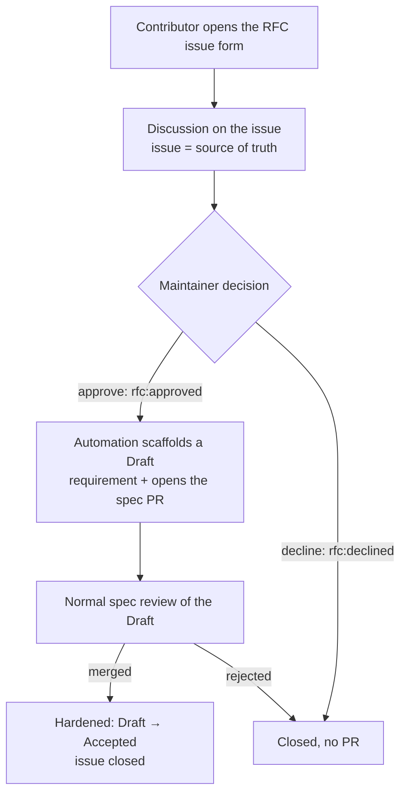

# The RFC process

**Status:** Accepted

How an idea from outside the maintainers becomes a proposal, gets decided, and —
only if approved — becomes a Draft requirement in the spec. It is the
[change lifecycle](change-lifecycle.md) opened to the community and made runnable
from a GitHub issue, so a contributor never has to touch git to propose a change.

---

## The issue is the source of truth

Until a proposal is approved **and** merged, **the issue is authoritative** — not
a branch, not a doc. The proposal lives, is discussed, and is decided on the
issue. Only when a maintainer approves it does a Draft requirement appear in the
repo, and only when that Draft merges is the proposal *hardened* into the spec
(and the issue closed). Before then, the repo says nothing about it; the issue
says everything.

This is deliberate: a proposal that materialised in the repo before it was decided
would be indistinguishable from an accepted one, which is exactly the drift the
[Draft status](change-lifecycle.md#status-vocabulary) exists to prevent.

## The lifecycle

## The four steps

1. **Propose.** A contributor opens an issue through the **RFC form**
   (`.github/ISSUE_TEMPLATE/rfc.yml`), which collects a structured proposal — area,
   title, the problem, the proposed behaviour, and rationale — and labels it
   `rfc`. No git, no local tooling.
2. **Discuss.** The proposal is refined on the issue. The public
   [RFC page](../30-repos/website.md) surfaces open `rfc` issues alongside the
   repo's `Draft` items as the pre-approval feed, so the community can see and
   weigh in on what is being considered.
3. **Decide.** A **maintainer** marks the issue `rfc:approved` (to accept) or
   `rfc:declined` (to reject). Only a maintainer can: the automation verifies the
   approver has write access before it does anything, so the label is a real gate,
   not a suggestion.
4. **Harden.** On `rfc:approved`, the automation scaffolds a **Draft** requirement
   or feature (`status: draft`, the next free permanent ID) and opens the spec PR
   linking the issue. From there it is a normal [spec review](change-lifecycle.md);
   merging it flips the Draft to `Accepted` and closes the issue. A `rfc:declined`
   issue is closed with no PR.

## Untrusted input

The issue-form fields are written by anyone on the internet. The automation MUST
treat them as untrusted: fields are read through environment variables, never
interpolated into a shell; the target area is validated against `A`–`K` and the
derived filename against a safe pattern before any file is written; and the
scaffold only ever writes a **Draft** markdown stub for human review — it never
executes a field's contents. The result is a PR a maintainer reads before it can
merge, so a malicious proposal is contained to reviewable text.

## Requirements

| ID | Requirement |
|----|-------------|
| **GOV-R40** | A community proposal MUST be opened as a GitHub issue via the RFC form, and that issue MUST be the source of truth for the proposal until it is approved and merged. |
| **GOV-R41** | The process MUST NOT create a spec PR from a proposal until a maintainer marks the issue approved, and the automation MUST verify the approver has write access before acting. |
| **GOV-R42** | On approval, the automation MUST scaffold a requirement or feature at `status: draft` with the next free permanent ID and open a spec PR linking the issue; the scaffold MUST NOT be `Accepted`. |
| **GOV-R43** | The automation MUST treat the issue-form fields as untrusted: read via environment variables, never interpolated into a shell; the area MUST be validated against `A`–`K` and the filename against a safe pattern before any write; and it MUST NOT execute field contents. |
| **GOV-R44** | Merging an RFC's PR MUST harden the proposal (Draft → Accepted per the [change lifecycle](change-lifecycle.md)) and close its issue; a declined proposal MUST be closed with no PR. |
| **GOV-R45** | The public RFC surface MUST render open `rfc` issues and the repo's `Draft` items as one pre-approval feed, so what is under consideration is visible before it binds. |

## Related

- [change-lifecycle.md](change-lifecycle.md) — the review this opens to the community
- [issue-routing.md](issue-routing.md) — how issues are triaged
- [contributing.md](contributing.md) — the contributor's path
- [canonical-spec.md](canonical-spec.md) — the `GOV-R` namespace
- [../30-repos/website.md](../30-repos/website.md) — where the RFC feed is rendered
