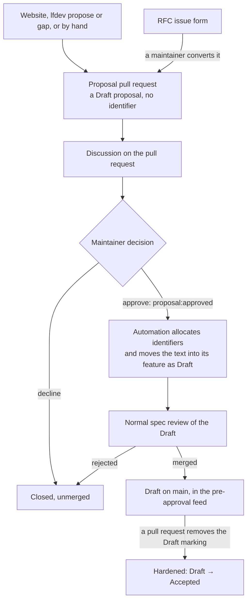

# The RFC process

**Status:** Accepted

How an idea from outside the maintainers becomes a proposal, gets decided, and —
only if approved — becomes a Draft requirement in the spec. It is the
[change lifecycle](change-lifecycle.md) opened to the community. A proposal is a
pull request from the start, opened from the website, from the developer command
line or by hand; the website composes it in the browser and opens it under the
contributor's own account, so a contributor never has to install git to propose a
change.

---

## The pull request is the proposal

A proposal is a pull request adding one file under `10-functional/proposals/`: a
Draft proposal with no identifier, in the shape the proposal template gives — the
area, a title, the problem, the proposed behaviour as MUST, SHOULD and MAY
statements, and the rationale. Reporting a gap is the same pull request in the gap
shape: what the specification does not say, and the feature or page that is silent.
The pull request is where the proposal is discussed and decided, and its body
carries a `Spec:` line citing this process.

Identifiers are allocated when a maintainer approves the proposal, not when it is
opened. Two proposals opened the same day cannot then take the same number, and a
declined proposal leaves no hole in the namespace.

An `rfc` issue opened through the issue form stays a way in for someone who will
not touch a file. A maintainer converts it into a proposal pull request before its
text is discussed.

## The lifecycle

```mermaid
flowchart TD
    web[Website, lfdev propose or gap, or by hand] --> pr[Proposal pull request<br/>a Draft proposal, no identifier]
    form[RFC issue form] -->|a maintainer converts it| pr
    pr --> disc[Discussion on the pull request]
    disc --> dec{Maintainer decision}
    dec -->|approve: proposal:approved| alloc[Automation allocates identifiers<br/>and moves the text into its feature as Draft]
    dec -->|decline| closed[Closed, unmerged]
    alloc --> review[Normal spec review of the Draft]
    review -->|merged| draft[Draft on main, in the pre-approval feed]
    review -->|rejected| closed
    draft -->|a pull request removes the Draft marking| hard[Hardened: Draft → Accepted]
```

## The four steps

1. **Propose.** A contributor opens the proposal pull request: from the website's
   propose or gap form, with `lfdev propose` or `lfdev gap`, or by adding the file
   by hand.
2. **Discuss.** The proposal is refined on the pull request. The frontpage's
   [proposals page](../30-repos/website-lemonfiber.md) renders open proposal pull
   requests, open `rfc` issues and the specification's `Draft` items as the
   pre-approval feed, so the community can see what is being considered.
3. **Decide.** A **maintainer** labels the pull request `proposal:approved`, or
   closes it unmerged to decline. The automation verifies the approver has write
   access before it does anything, so the label is a real gate.
4. **Harden.** On approval the automation allocates the next free permanent
   identifiers with `next_id.py` and moves the proposal's text into the
   specification as Draft. A new feature is written with `status: draft`. Rows
   added to an existing feature or page each open with `*Draft:*`, so the rest of
   an Accepted feature stays as it was. It pushes to the branch where the author
   allows edits by maintainers, or opens a follow-up pull request crediting the
   author. That pull request is a normal [spec review](change-lifecycle.md), and
   merging it puts the Draft on `main`. A later pull request that removes the
   `*Draft:*` markers, or sets the feature's status to `accepted`, hardens it.

## Untrusted input

A proposal's title, body and file are written by anyone on the internet. The
automation MUST treat them as untrusted: fields are read through environment
variables or files, never interpolated into a shell; the area is validated against
the areas the catalogue defines and the derived filename against a safe pattern
before any file is written; and the automation only ever writes **Draft** markdown
for human review — it never executes a field's contents.

## Requirements

| ID | Requirement |
|----|-------------|
| **GOV-R40** | A community proposal, or a report of a gap, MUST be opened as a pull request adding a Draft proposal with no identifier to the specification, from the website, the developer command line or by hand; an RFC issue MAY be opened and MUST be converted into such a pull request by a maintainer before its text is discussed. |
| **GOV-R41** | The process MUST NOT allocate identifiers or move a proposal into the specification until a maintainer approves it, and the automation MUST verify the approver has write access before acting. |
| **GOV-R42** | On approval, the automation MUST allocate the next free permanent identifiers and move the proposal into the specification as Draft: a new feature at `status: draft`, and each row added to an existing feature or page opening with `*Draft:*`; nothing it writes MUST be `Accepted`. |
| **GOV-R43** | The automation MUST treat a proposal's fields as untrusted: read through environment variables or files, never interpolated into a shell; the area MUST be validated against the areas the catalogue defines and the filename against a safe pattern before any write; and it MUST NOT execute field contents. |
| **GOV-R44** | An approved proposal MUST be hardened (Draft → Accepted per the [change lifecycle](change-lifecycle.md)) by a reviewed pull request that removes its Draft marking; a declined proposal MUST be closed unmerged. |
| **GOV-R45** | The pre-approval feed MUST be rendered on the organisation's website from the board snapshot: open proposal pull requests, open `rfc` issues and the specification's `Draft` features and requirements. |

## Related

- [change-lifecycle.md](change-lifecycle.md) — the review this opens to the community
- [issue-routing.md](issue-routing.md) — how issues are triaged
- [contributing.md](contributing.md) — the contributor's path
- [canonical-spec.md](canonical-spec.md) — the `GOV-R` namespace
- [../30-repos/website-lemonfiber.md](../30-repos/website-lemonfiber.md) — where the pre-approval feed is rendered
- [working-in-the-repositories.md](working-in-the-repositories.md) — the developer command line and the website's part
