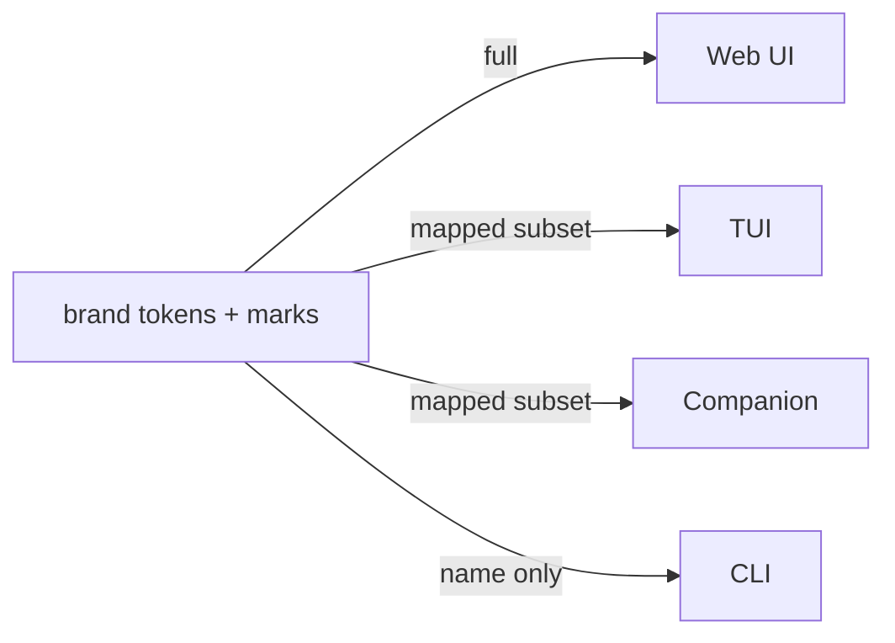

# Surface mapping

**Status:** Accepted

The brand reaches the four surfaces very unequally. Designing as if the logo and
the amber palette apply everywhere is the mistake this page exists to prevent.

---

## The four surfaces, honestly

| | Web UI | TUI | Companion | CLI |
|---|--------|-----|-----------|-----|
| Logo (SVG) | ✅ full | ⚠️ ASCII mark only | ✅ app icon and launch mark | ⚠️ ASCII mark, optional |
| Colour palette | ✅ all tokens | ⚠️ mapped to terminal capability | ⚠️ mapped to platform theme roles | ❌ terminal default |
| Bricolage Grotesque | ✅ | ❌ terminal font, not ours | ❌ the platform's face, and the reader's size | ❌ |
| Space / radius / shadow | ✅ | ❌ meaningless | ⚠️ the platform's, not ours | ❌ |
| The *voice* (plain, warm, precise) | ✅ | ✅ | ✅ | ✅ |

The last row is the point: what actually carries across all four isn't the
palette — it's the [plain-language voice](../10-functional/features/g-ux/g2-plain-language.md).
The visual brand is largely a web concern.

## Web UI — the full brand

The web UI wears everything: the SVG marks, the complete token palette via
`@lemonfiber/brand` ([contract](../20-architecture/contracts/design-tokens.md)),
Bricolage Grotesque, the ink theme. This is the one surface the brand was designed
for, and the only one where "does it look on-brand?" is a meaningful question.

Everything in [brand-rules](brand-rules.md) applies here in full.

## TUI — a mapped subset

A terminal is not a canvas. It offers a colour palette the terminal owns (16 /
256 / truecolour, and the user's theme may override it), a font the user chose,
and no concept of spacing units, radii, or shadows.

So the TUI takes a **deliberate, small mapping**, not the token set:

| Brand token | TUI mapping |
|-------------|-------------|
| `ink` | Default foreground |
| `paper` | Default background (often the terminal's own) |
| `lemon` | The one accent — headings, the health-OK state |
| `fiber` (amber) | Active/attention — consistent with its signal role |
| `leaf`, surfaces, type, space, radius, shadow | **Not mapped** — no terminal equivalent |

Two constraints make this safe:

1. **Truecolour is not assumed.** The mapping degrades to the 16-colour set, and
   to no colour at all under `NO_COLOR` — where [G3](../10-functional/features/g-ux/g3-accessibility.md)'s
   symbols carry all state (`G3-R1`). Brand colour is enhancement, never the
   information.
2. **The user's terminal theme wins where it must.** A user with a customised
   palette sees their colours; the TUI maps *roles*, not exact hexes, so it
   remains legible in any theme.

The mark, in the TUI, is an **ASCII rendering** — the patch-panel slice
suggested in text, shown in the wizard header and nowhere that needs it to be
precise. It is not the SVG and does not pretend to be.

## CLI — name, not brand

Piped or scripted output carries essentially no brand: it is plain text, often
consumed by another program, and colour there is noise ([G3-R7](../10-functional/features/g-ux/g3-accessibility.md)
forbids control sequences in redirected output).

The CLI's brand is the word `lemonfiber` and the voice. An optional ASCII mark may
appear in interactive help; it never appears in machine output.

## Companion — the platform's look, wearing our name

The companion app is the one surface where deferring to somebody else's design
language is the *reason* it was built that way.

Its components are the platform's own — SwiftUI on iOS, Jetpack Compose on
Android ([ADR-0017](../00-overview/decisions/0017-the-companion-app-as-a-fourth-surface.md)).
That is what buys the accessibility tree, the reader's own text size, the
system's contrast and reduced-motion settings and its light and dark modes,
without any of them being built a second time here. Overriding that look to
reach the web UI's palette would spend exactly what it was chosen for.

So the mapping is the TUI's shape rather than the web's, for a different reason.
The TUI takes a subset because a terminal cannot render more. The companion takes
a subset because taking more would make it a worse app:

| Brand token | Companion mapping |
|-------------|-------------------|
| `lemon` | The accent role — the one place brand colour is asserted |
| `ink` / paper | Left to the platform's theme roles, which honour the reader's setting |
| Everything else | Not mapped; the platform's own spacing, radii, type and elevation |

**Where the brand is worn in full is the app icon and the launch mark**, which
are ours, are not a reading surface, and are where somebody recognises the
product on a home screen.

**The wordmark is not re-typeset.** Bricolage Grotesque is not shipped as an
interface font here — the interface is set in whatever face the platform and the
reader have chosen, at whatever size they chose. `DES-R6` already forbids
re-typesetting the wordmark from its outlined form, and that holds on a phone as
anywhere else.

## Why this asymmetry is stated, not hidden

A designer handed the brand assets will reasonably assume they apply to "the app."
They apply to *one* of four surfaces in full. Without this page, effort goes into terminal
colour schemes that a `NO_COLOR` user never sees, or an ASCII logo in JSON output
that breaks scripts — both plausible, both wrong.

Stating the mapping up front means each surface gets brand-appropriate effort:
full on the web, restrained in the TUI, none in machine output.

## Requirements

| ID | Requirement |
|----|-------------|
| **DES-R9** | The web UI MUST render the full brand — SVG marks, complete palette, Bricolage Grotesque, ink theme. |
| **DES-R10** | The TUI MUST map only a defined subset of tokens to terminal roles, and MUST NOT assume truecolour. |
| **DES-R11** | TUI brand colour MUST degrade to the 16-colour set and to no colour under `NO_COLOR`, with state still conveyed by symbol. |
| **DES-R12** | The TUI MUST map colour *roles*, not exact hex values, so a user's terminal theme remains legible. |
| **DES-R13** | The SVG marks MUST NOT be used in the TUI or CLI; an ASCII rendering MUST be used where a mark is shown. |
| **DES-R14** | Machine-readable CLI output MUST carry no brand colour or logo. |
| **DES-R24** | The companion app MUST map brand colour to the platform's theme roles rather than asserting token values, so the reader's light, dark and contrast settings are honoured. |
| **DES-R25** | The companion app MUST NOT ship Bricolage Grotesque as an interface font, and MUST render text in the platform's face at the reader's chosen size. |
| **DES-R26** | The companion app MUST NOT override the platform's spacing, radii, elevation or motion with brand values. |
| **DES-R27** | The companion app's icon and launch mark MUST carry the full brand, and are the only surfaces of the app that do. |

## Related

- [brand-rules.md](brand-rules.md) — the constraints, which apply fully only to web
- [accessibility.md](accessibility.md) — the contrast baseline for the web palette
- [G2 Plain-language](../10-functional/features/g-ux/g2-plain-language.md) — the voice, which does carry across
- [G3 Accessibility](../10-functional/features/g-ux/g3-accessibility.md)
