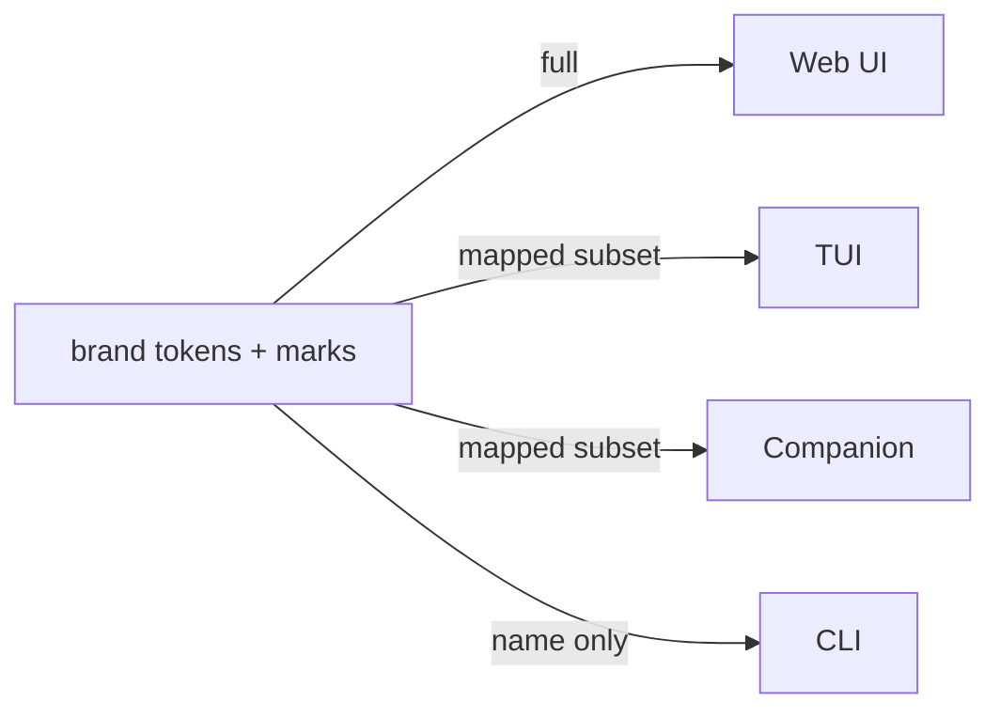

# Surface mapping

**Status:** Accepted

The brand reaches the four surfaces very unequally. Designing as if the logo and
the amber palette apply everywhere is the mistake this page exists to prevent.

---

## The four surfaces, honestly

```mermaid
flowchart LR
    brand[brand tokens + marks] -->|full| web[Web UI]
    brand -->|mapped subset| tui[TUI]
    brand -->|mapped subset| app[Companion]
    brand -->|name only| cli[CLI]
```

| | Web UI | TUI | Companion | CLI |
|---|--------|-----|-----------|-----|
| Logo (SVG) | ✅ full | ⚠️ ASCII mark only | ✅ app icon, launch mark, outlined mark in the app | ⚠️ ASCII mark, optional |
| Colour palette | ✅ all tokens | ⚠️ mapped to terminal capability | ✅ the brand's tokens, as two themes | ❌ terminal default |
| Bricolage Grotesque | ✅ | ❌ terminal font, not ours | ❌ the wordmark only; text in Golos Text and DM Mono | ❌ |
| Space / radius / shadow | ✅ | ❌ meaningless | ✅ the brand's spacing and radii; hairlines rather than shadow | ❌ |
| The *voice* (plain, warm, precise) | ✅ | ✅ | ✅ | ✅ |

The last row is the point: what actually carries across all four isn't the
palette — it's the [plain-language voice](../10-functional/features/g-ux/g2-plain-language.md).
The visual brand is largely a web concern.

## Web UI — the full brand

The web UI wears everything: the SVG marks, the complete token palette via
`@lemonfiber/brand` ([contract](../20-architecture/contracts/design-tokens.md)),
Bricolage Grotesque, the ink theme. This is the one surface the brand was designed
for, and the only one where "does it look on-brand?" is a meaningful question.

Everything in [brand-rules](brand-rules.md) applies here in full.

## TUI — a mapped subset

A terminal is not a canvas. It offers a colour palette the terminal owns (16 /
256 / truecolour, and the user's theme may override it), a font the user chose,
and no concept of spacing units, radii, or shadows.

So the TUI takes a **deliberate, small mapping**, not the token set:

| Brand token | TUI mapping |
|-------------|-------------|
| `ink` | Default foreground |
| `paper` | Default background (often the terminal's own) |
| `lemon` | The one accent — headings, the health-OK state |
| `fiber` (amber) | Active/attention — consistent with its signal role |
| `leaf`, surfaces, type, space, radius, shadow | **Not mapped** — no terminal equivalent |

Two constraints make this safe:

1. **Truecolour is not assumed.** The mapping degrades to the 16-colour set, and
   to no colour at all under `NO_COLOR` — where [G3](../10-functional/features/g-ux/g3-accessibility.md)'s
   symbols carry all state (`G3-R1`). Brand colour is enhancement, never the
   information.
2. **The user's terminal theme wins where it must.** A user with a customised
   palette sees their colours; the TUI maps *roles*, not exact hexes, so it
   remains legible in any theme.

The mark, in the TUI, is an **ASCII rendering** — the patch-panel slice
suggested in text, shown in the wizard header and nowhere that needs it to be
precise. It is not the SVG and does not pretend to be.

## CLI — name, not brand

Piped or scripted output carries essentially no brand: it is plain text, often
consumed by another program, and colour there is noise ([G3-R7](../10-functional/features/g-ux/g3-accessibility.md)
forbids control sequences in redirected output).

The CLI's brand is the word `lemonfiber` and the voice. An optional ASCII mark may
appear in interactive help; it never appears in machine output.

## Companion — two themes, one brand

The companion is two applications in one: what a member of the household sees,
and what the operator sees ([N3](../10-functional/features/n-companion/n3-household-companion.md),
[N2](../10-functional/features/n-companion/n2-operator-companion.md)). Each has a
theme, and whose session a screen is drawn for decides which (`DES-R28`).

**The member theme is dark and led by artwork.** The ground is the ink theme's
darkest surface, artwork carries the colour, and lemon is the one thing on a
screen to press. A member is never shown how the stack stands, so the member
theme has no severity colours at all.

**The operator theme is the web console's language on a phone.** Ink ground,
hairline rules, small radii, DM Mono wherever a figure is read, and the severity
colours, each with a shape of its own.

Both are built from the brand's tokens and nothing else. Artwork is the one thing
on screen the palette does not govern, because it is the household's films rather
than lemonfiber's colour (`DES-R31`). Both honour the reader's text size,
reduced motion and increased contrast, and every pairing is measured (`DES-R15`).

The components underneath are the platform's own — SwiftUI on iOS, Jetpack
Compose on Android ([ADR-0017](../00-overview/decisions/0017-the-companion-app-as-a-fourth-surface.md)) —
which is what gives the app the platform's accessibility tree.

**Where the brand is worn in full is the app icon and the launch mark**, which
are ours and are where somebody recognises the product on a home screen. Inside
the app a mark is the outlined asset, never re-typeset (`DES-R6`, `DES-R35`).

## Why this asymmetry is stated, not hidden

A designer handed the brand assets will reasonably assume they apply to "the app."
They apply to *one* of four surfaces in full. Without this page, effort goes into terminal
colour schemes that a `NO_COLOR` user never sees, or an ASCII logo in JSON output
that breaks scripts — both plausible, both wrong.

Stating the mapping up front means each surface gets brand-appropriate effort:
full on the web, restrained in the TUI, none in machine output.

## Requirements

| ID | Requirement |
|----|-------------|
| **DES-R9** | The web UI MUST render the full brand — SVG marks, complete palette, Bricolage Grotesque, ink theme. |
| **DES-R10** | The TUI MUST map only a defined subset of tokens to terminal roles, and MUST NOT assume truecolour. |
| **DES-R11** | TUI brand colour MUST degrade to the 16-colour set and to no colour under `NO_COLOR`, with state still conveyed by symbol. |
| **DES-R12** | The TUI MUST map colour *roles*, not exact hex values, so a user's terminal theme remains legible. |
| **DES-R13** | The SVG marks MUST NOT be used in the TUI or CLI; an ASCII rendering MUST be used where a mark is shown. |
| **DES-R14** | Machine-readable CLI output MUST carry no brand colour or logo. |
| **DES-R24** | *Superseded by [DES-R28](surface-mapping.md)–[DES-R31](surface-mapping.md): the companion draws with a member theme and an operator theme, chosen by whose session it is, built on the brand's tokens. The number is not reused.* |
| **DES-R25** | *Superseded by [DES-R32](surface-mapping.md): the companion sets its text in Golos Text and its figures in DM Mono, at the reader's chosen size. The number is not reused.* |
| **DES-R26** | *Superseded by [DES-R33](surface-mapping.md) and [DES-R34](surface-mapping.md): the companion takes its spacing and radii from the brand's tokens, and its motion stops under reduced motion. The number is not reused.* |
| **DES-R27** | *Superseded by [DES-R35](surface-mapping.md): the icon and launch mark carry the full brand, and a mark inside the app is the outlined asset. The number is not reused.* |
| **DES-R28** | The companion MUST draw every screen with one of two themes: the member theme on a screen drawn for a household member's session, and the operator theme on a screen drawn for the operator's session, decided as `N3-R1` decides the application. It MUST NOT offer a setting that chooses between them. A screen drawn for no session MUST use the member theme. |
| **DES-R29** | The member theme MUST draw, whatever the platform's light or dark setting, on the ink theme's `canvas` (#100F0A), raise on `ink-soft`, and set text in `paper` and `text-muted` at their ink-theme values. `lemon`, with `ink` on it, MUST be the fill of the one primary action on a screen and of nothing else at scale, and `fiber` MUST be used only as signal: a watched-progress line and a new-item mark. The member theme MUST NOT use the severity tokens (`DES-R36`). |
| **DES-R30** | The operator theme MUST draw, whatever the platform's light or dark setting, on `ink` with `line` hairlines one pixel wide, raise on `ink-soft`, and set text in `paper`, `text-muted` and `text-faint` at their ink-theme values. It MUST use `lemon` for the operator's own actions, `fiber` for activity, and the severity tokens (`DES-R36`) for how a thing stands. Each severity MUST be drawn with a shape of its own as well as its colour (`G3-R1`). |
| **DES-R31** | Artwork a stack serves (a poster, a backdrop, a still) is content and not asserted colour: `DES-R1` to `DES-R3` govern every colour the companion asserts and do not govern the pixels of artwork. The companion MUST NOT derive an asserted colour from artwork. A scrim over artwork MUST be `canvas` or `ink` running to transparent. |
| **DES-R32** | The companion MUST set interface text in Golos Text, and figures, identifiers, timestamps and log text in DM Mono, both bundled with the app and never fetched at run time. Text MUST scale with the platform's text-size setting, a size the theme names being the size at the platform's default. Bricolage Grotesque MUST appear only in the outlined wordmark (`DES-R6`). |
| **DES-R33** | The companion MUST take every colour, spacing, radius and type value from the brand's `tokens.json` at one pinned brand commit, and MUST hardcode none. Radii MUST be the brand's `sm` and `md` (3 and 4 px), with `pill` only on a chip or a button. |
| **DES-R34** | The companion MAY animate press feedback, screen transitions and cross-fades. Under the platform's reduced-motion setting, every animation MUST stop or become a fade, nothing MUST play or advance on its own, and nothing MUST flash (`G3-R6`). |
| **DES-R35** | The companion's icon and launch mark MUST carry the full brand. A mark or wordmark inside the app MUST be the outlined asset (`DES-R5`, `DES-R6`), and MUST NOT stand in for a title, a label or a control. |
| **DES-R36** | The brand's tokens MUST include the severity colours `ok` and `alarm` and the tints `warn-tint` and `alarm-tint`, each with a paper and an ink value, with `fiber` serving as warning. They MUST be measured with every other token (`DES-R15`, `DES-R16`), and every surface that draws severity MUST take it from them. |

## Related

- [brand-rules.md](brand-rules.md) — the constraints, which apply fully only to web
- [accessibility.md](accessibility.md) — the contrast baseline for the web palette
- [G2 Plain-language](../10-functional/features/g-ux/g2-plain-language.md) — the voice, which does carry across
- [G3 Accessibility](../10-functional/features/g-ux/g3-accessibility.md)
