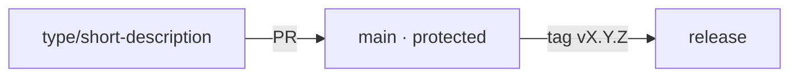

# Project workflow

**Status:** Accepted

Branching, labels, milestones, and issue automation — the mechanics that make the
repos navigable and the same across all of them.

---

## Branching model — trunk-based

One long-lived branch, `main`, protected. Everything else is a short-lived branch
that merges via PR and disappears.

| Rule | |
|------|--|
| `main` is protected | PR required, signed commits required, strict checks (incl. SonarCloud), linear history, conversation-resolution |
| No direct pushes to `main` | Except the admin override, recorded ([overrides](../50-governance/overrides.md)) |
| Branch names | `type/short-description` — `feat/health-gate`, `fix/vpn-port`, `docs/forms` |
| Branch lifetime | Short. Long-lived feature branches drift; break the work down instead |
| No `develop` branch | Trunk-based; releases are tags off `main` |
| History | Signed commits, no AI attribution, `Spec:` trailer ([governance](../50-governance/)) |

Types mirror the conventional-commit prefixes so branch, commit, and changelog
agree: `feat`, `fix`, `docs`, `refactor`, `test`, `chore`, `ci`.

## The canonical label set

The **same labels on every repo**, applied by script (not by hand, so they can't
drift). Colour-coded by kind.

| Label | Kind | Meaning |
|-------|------|---------|
| `bug` | type | Behaviour contradicts the spec |
| `enhancement` | type | New or improved behaviour |
| `documentation` | type | Docs only |
| `question` | type | A question, not yet actionable |
| `spec-change` | type | Requires or is a spec change first |
| `needs-spec` | triage | Accepted, but a spec change must land before implementation |
| `needs-triage` | triage | A new issue awaiting maintainer triage |
| `awaiting-maintainer` | triage | Green PR with no review — a maintainer needs to act |
| `dependencies` | type | Dependency update (Renovate) |
| `security` | type | Security-relevant |
| `breaking-change` | flag | Changes a public contract; needs a major bump |
| `good first issue` | help | Small, well-scoped, newcomer-friendly |
| `help wanted` | help | Maintainers would welcome a contributor |
| `blocked` | status | Waiting on something else |
| `wontfix` | resolution | Considered and declined |
| `duplicate` | resolution | Already tracked elsewhere |
| `brand` | area | Design system |
| `governance` | area | The rules of change |
| `adapters` | area | The code that talks to the outside world |
| `core` | area | The logic that renders nothing |
| `cli` | area | The command-line surface |
| `manifest` | area | The stack manifest — schema and validation |
| `stack` | area | The media stack the tool operates |
| `ci` | area | Pipelines, workflows, and release engineering |

Two labels are project-specific and load-bearing: **`spec-change`** and
**`needs-spec`** encode the canonical-spec workflow — an issue tagged `needs-spec`
cannot be implemented until its spec PR merges.

## Milestones

Milestones mirror the [roadmap](../00-overview/roadmap.md): `M0` … `M6`. An issue
or PR is assigned the milestone whose deliverable it serves, so roadmap progress
is visible without a separate tracker.

## Issue automation

| Automation | What it does | Where |
|------------|--------------|-------|
| **Templates** | Route by the "does it behave as specced?" question | `.github` (inherited) |
| **spec-check** | Non-conforming PRs closed with guidance | reusable, in `spec` |
| **Renovate** | Groups dependency updates, adds the `Spec: GOV-R12` trailer | preset in `.github` |
| **Stale** | Marks inactive issues/PRs stale, then closes, with a grace period | reusable, in `spec` |
| **DCO check** | Verifies the sign-off on every commit | reusable, in `spec` |
| **Commit-lint** | Enforces conventional-commit subjects for a clean changelog | reusable, in `spec` |
| **Auto-labeler** | Labels PRs by changed path | reusable, in `spec` |
| **Label sync** | Upserts the canonical label set into every repo | reusable, in `spec` |
| **Triage** | Labels new issues `needs-triage` and assigns the covering maintainer | per repo → reusable |
| **Discord notify** | Release, build-log, and maintainer-queue posts | reusable, in `spec` |

Release announcements, public build logging, and the maintainer action queue are
specified in [notifications.md](notifications.md).

The stale policy is deliberately gentle — a long grace period and an easy reopen —
because an aggressive stale bot on a young project closes real issues and reads as
hostile.

## Feature requests are spec changes

Restating the routing rule ([issue-routing](../50-governance/issue-routing.md))
because it shapes the workflow: a feature request is filed against `spec`, not an
implementation repo. It becomes a requirement first, then work.

## Requirements

| ID | Requirement |
|----|-------------|
| **OPS-R10** | The project MUST use a trunk-based model: one protected `main`, short-lived branches, PR-only merges. |
| **OPS-R11** | Branch and commit types MUST share the conventional-commit vocabulary. |
| **OPS-R12** | The same canonical label set MUST exist on every repo, applied by automation rather than by hand. |
| **OPS-R13** | `spec-change` and `needs-spec` labels MUST exist and MUST reflect the canonical-spec workflow. |
| **OPS-R14** | Milestones MUST mirror the roadmap. |
| **OPS-R15** | A stale policy MUST have a generous grace period and an easy reopen path. |
| **OPS-R21** | PR commit subjects MUST follow the conventional-commit format, enforced by a commit-lint check. |
| **OPS-R22** | PRs MUST be auto-labelled by changed path. |

## Related

- [releasing.md](releasing.md) — tags off `main`
- [50-governance/](../50-governance/) — the PR gate and issue routing
- [00-overview/roadmap.md](../00-overview/roadmap.md) — the milestones
