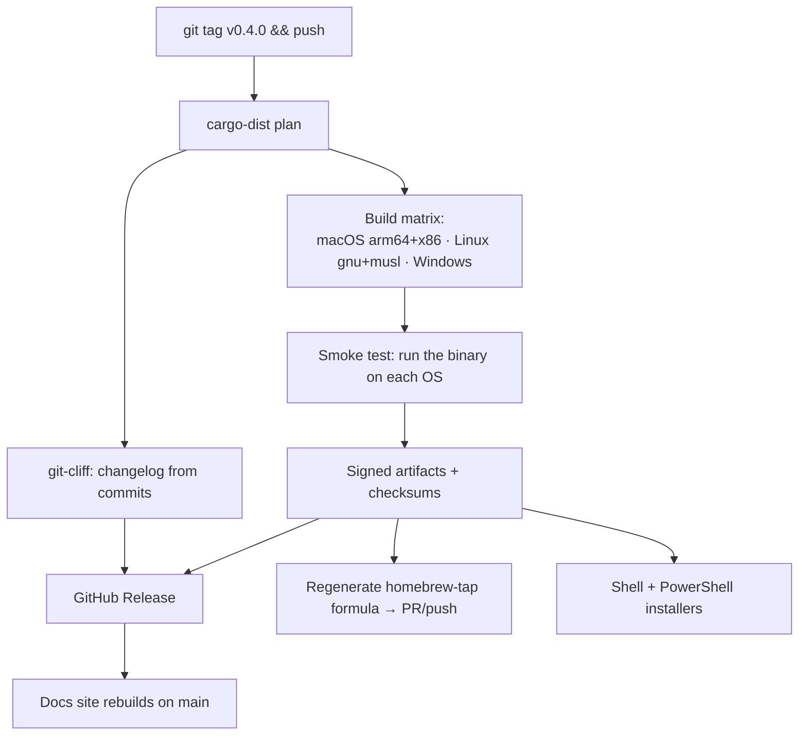

# Releasing

**Status:** Accepted

How a release happens — the one page that answers *"I want to cut a version, what
do I do and what happens?"* The version *model* lives in
[versioning](../20-architecture/contracts/versioning.md); this is the *process*.

**Satisfies:** [roadmap M6](../00-overview/roadmap.md#m6--release-engineering),
[E1](../10-functional/features/e-maintenance/e1-stack-updates.md),
[E2](../10-functional/features/e-maintenance/e2-self-update.md).

---

## Each repo releases on its own clock

The implementation repos are the independent release **streams** — that's the point of the
decoupling. (Distinct from the three version *identifiers* the binary and manifest
carry — `lemonfiber`, `stack_version`, `schema_version` — defined in
[versioning](../20-architecture/contracts/versioning.md); a "stream" is a repo
that tags, a "version" is a number it carries.)

| Repo | Release trigger | Produces |
|------|-----------------|----------|
| `lemonfiber` | git tag `vX.Y.Z` | Binaries, installers, updated formula, changelog, docs |
| `lemonfiber-media-stack` | git tag `vX.Y.Z` | A pinned stack the binary can embed; `stack_version` moves |
| `lemonfiber-web` | git tag `vX.Y.Z` | A pinned web surface the binary embeds at build time |
| `sdk-ts` | git tag `vX.Y.Z` | `@lemonfiber/sdk-ts` published to npm |
| `sdk-php` | git tag `vX.Y.Z` | The PHP client, published to Packagist |
| `brand` | git tag `vX.Y.Z` | `@lemonfiber/brand` published to npm |
| `homebrew-tap` | — | Never released directly; regenerated by `lemonfiber`'s pipeline |

A brand recolour does not force a binary release; a stack service bump does not
force one either — the binary picks up a new embedded stack only when *it* is
released with the submodule re-pinned.

## Cutting a `lemonfiber` release

The binary is the one with real release engineering. The flow is
**tag-triggered** — everything downstream is automatic:

Concretely, a maintainer does **three things**; CI does the rest:

1. **Merge the version bump.** The workspace's `Cargo.toml` must already declare
   the version being released, on `main`, before anything is tagged — `cargo-dist`
   releases the tag whose version the workspace carries, so a tag cut over a
   stale one names a version nothing will build. This is a step in its own right
   rather than a thing to remember while doing the next one, because it is the
   one part of the sequence whose order matters and whose failure is silent until
   the release job runs. `execute-version` refuses to tag a repo that declares
   anything else, so getting it wrong costs a re-run rather than a deleted tag.
2. **Dispatch `execute-version`** with the version, `dry_run` first. It checks the
   goal gate, cross-stream compatibility, release blockers and the declared
   version, then tags every repo the manifest names. A version left at
   `releasable` blocks the next one from being staged, so this is not optional
   bookkeeping.
3. **Review the drafted GitHub Release** and the homebrew-tap PR, then publish.
   Publishing fires `release-finalize`, which records what shipped, pins the stack
   commit the release embedded, and regenerates the public roadmap.

Everything between step 2 and step 3 is `cargo-dist` and `git-cliff`. A draft is
published by a person on purpose: it is the one step that reaches the outside
world, and it is the last place to notice that what was built is not what was
meant.

## The version-bump decision

What moves, and when:

| You changed… | Bump |
|--------------|------|
| A bug fix, no behaviour change | binary **patch** |
| New behaviour, backward-compatible CLI/flags | binary **minor** |
| A removed/renamed flag, changed default, dropped `schema_version` support | binary **major** |
| A service image tag, a new service or form | `lemonfiber-media-stack` **minor** (or major if a form's meaning changes) |
| A manifest field added-optional | `schema_version` unchanged, `stack_version` minor |
| A manifest field required/removed/retyped, or a new enum value | **`schema_version` +1** ([why](../20-architecture/contracts/versioning.md#changing-the-schema)) |
| A token value (recolour) | `brand` **minor** |
| A token renamed/removed | `brand` **major** |

The one that needs coordination is `schema_version`: bumping it means the next
`lemonfiber` release must support it, and `build.rs` will fail the build until the
embedded stack and the binary agree ([ARCH-R6](../20-architecture/contracts/versioning.md)).
That failure is the safety net — an incompatible pairing cannot ship.

## Every release is verifiable

Artifacts don't just carry checksums — they carry **provenance**:

| Artefact | What it proves |
|----------|----------------|
| SHA-256 checksums | The download wasn't altered in transit |
| **SLSA build provenance** (attestation) | The binary was built by *this* pipeline from *this* commit, not tampered with |
| **SBOM** (software bill of materials) | Exactly which dependencies, at which versions, went in |

`cargo-dist` emits the attestation via GitHub's artifact attestations, and an SBOM
is generated per release. This lets a consumer verify a downloaded binary came from
the real pipeline, and lets a security advisory answer "are we affected?" by
reading the SBOM rather than guessing. It also raises the
[OpenSSF Scorecard](../40-quality/tooling.md) signal the project already publishes.

## The changelog is generated, not written

Commits follow a conventional-commit shape and carry `Spec:` trailers, so
`git-cliff` produces the changelog from history. Nobody maintains
`CHANGELOG.md` by hand — which also means a commit message is the release note,
so write it for a reader.

## Pre-1.0 versioning

Until `1.0.0`, the binary is `0.y.z`: `y` moves for features, `z` for fixes, and
breaking changes are allowed within `0.x` as the roadmap milestones land. `1.0.0`
is cut when the M6 exit criteria are met — a non-contributor can install and run
on all three platforms from the README alone.

## What a release must not do

| Never | Because |
|-------|---------|
| Ship a floating image tag in the embedded stack | Defeats reproducibility (`E1-R1`) |
| Publish artifacts without checksums | Integrity ([Q-R44](../40-quality/security.md)) |
| Release a binary that fails its own smoke test | "Builds" ≠ "runs" ([Q-R36](../40-quality/ci-cd.md)) |
| Bump `schema_version` without the binary supporting it | `build.rs` blocks it, but don't force it |
| Overwrite the homebrew formula by hand | It's generated (`REPO-R24`) |

## The one-time setup

Releasing needs two things configured once (they can't be scaffolded):

| Setup | Where |
|-------|-------|
| A token for the pipeline to push to `homebrew-tap` | `lemonfiber` repo secret |
| npm publish auth for `@lemonfiber/brand` | `brand` repo secret |

Both are documented as manual steps ([Q-R60](../40-quality/tooling.md)), like `SONAR_TOKEN`.

## Requirements

| ID | Requirement |
|----|-------------|
| **OPS-R1** | A `lemonfiber` release MUST be triggered by a version tag and MUST require no manual build steps beyond tagging and publishing the drafted release. |
| **OPS-R2** | The release pipeline MUST regenerate the Homebrew formula and open a change against `homebrew-tap`; the formula MUST NOT be edited by hand. |
| **OPS-R3** | The changelog MUST be generated from commit history, not hand-maintained. |
| **OPS-R4** | A release MUST NOT proceed if the binary fails its cross-platform smoke test. |
| **OPS-R5** | The four version streams MUST be releasable independently; one MUST NOT force a release of another. |
| **OPS-R6** | Secrets required for releasing MUST be documented as one-time manual setup. |
| **OPS-R20** | Every release MUST publish SLSA build provenance (an attestation) and an SBOM alongside the checksummed artifacts. |

## Related

- [staging.md](staging.md) — the spec-led, cross-repo release train this cut sits inside
- [versioning](../20-architecture/contracts/versioning.md) — the version model this process applies
- [ci-cd.md](../40-quality/ci-cd.md) — the pipeline stages
- [tooling.md](../40-quality/tooling.md) — cargo-dist, git-cliff
- [30-repos/homebrew-tap.md](../30-repos/homebrew-tap.md) — the generated formula
- [roadmap M6](../00-overview/roadmap.md#m6--release-engineering)
