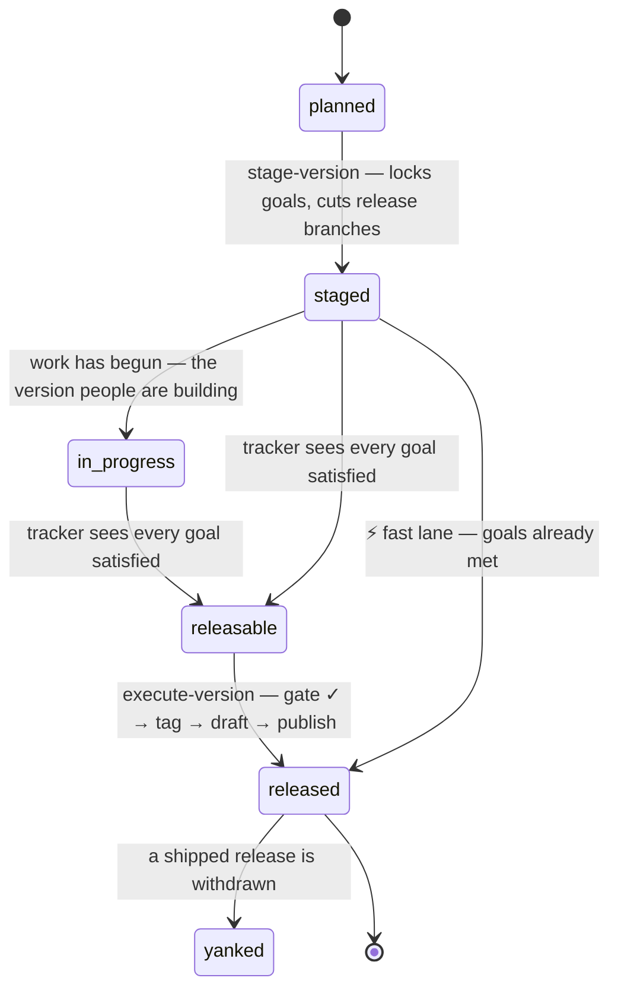

# Release staging — the version train

**Status:** Accepted

[releasing.md](releasing.md) answers *"I want to cut a version, what do I do?"*.
This answers the question before it: *"how does a version come together — spec
first, across repos — and how do we know it is ready?"* It defines the **staging
lifecycle**, the **goal lock**, the **readiness gate**, and the automations that
drive them.

**Satisfies:** [roadmap M6](../00-overview/roadmap.md#m6--release-engineering),
extends [releasing.md](releasing.md) and [project-workflow.md](project-workflow.md).

---

## Spec leads the release

The spec is already structurally ahead of the code: a behavioural PR is closed
unless its spec change merged first ([cross-repo-ci.md](../50-governance/cross-repo-ci.md)).
A release is the same rule at a larger grain. **A version's goals are a set of
`Accepted` requirements** ([change-lifecycle.md](../50-governance/change-lifecycle.md)),
chosen and locked before the work is called done, and the release does not ship
until every one of them is demonstrably implemented.

The train has one source of truth, four states, and four lanes of differing
ceremony. Everything downstream reads the manifest; nothing keeps release state
in a person's head.

## The version manifest — one source of truth

Each version is a machine-readable file in [`versions/`](versions/README.md),
idiomatic to the org's other generated-from-truth files (`maintainers.toml`,
`labels.yml`):

```toml
# 70-operations/versions/0.2.0.toml
version = "0.2.0"
status  = "staged"        # planned → staged → in_progress → releasable → released → yanked
repos   = ["lemonfiber", "media-stack"]   # the streams this version cuts; brand excluded
goals   = ["A2-R1", "A2-R6", "C1-R13"]    # locked Accepted requirement IDs

[pins]                    # recorded at execute, for reproducibility
media-stack = "fbdafe0"   # the submodule commit that shipped
```

Staging writes it, the tracker reads it, the gate checks it, execute flips its
`status` and records its `pins`. The full contract is in
[`versions/README.md`](versions/README.md).

## The lifecycle



Every transition MUST be recorded in the manifest, so the file alone answers
"where is this version" without reading CI history.

**One version at a time.** Outside hotfixes, the train is serial: at most one
version is in flight — `staged` or `releasable` — at once. `stage-version`
refuses while another version is still unreleased, so two minors never compete
for the same `main`, the same goal pool, or the same release branches. A hotfix
is exempt: it branches from an already-`released` tag and never enters staging.

## The four lanes

Ordered by ceremony. Each is a way of reaching the same tag-triggered release
([releasing.md](releasing.md)); they differ in how much is verified first.

| Lane | When | Goal gate | Staging period |
|------|------|-----------|----------------|
| **Staged train** | a planned minor (`0.2.0`) | full — every locked goal satisfied | yes: branches split, progress tracked |
| **Fast lane** | spec and sub-repos already in sync | full, run once at execute | no — stage, gate and execute in one operation |
| **Hotfix** | an urgent patch (`0.2.1`) | bypassed → replaced by a cited fix + maintainer | no |
| **Raw tag** | the primitive under all of the above | none (`git tag` → [release.yml](releasing.md)) | no |

The fast lane still runs the gate: even a one-shot release *proves* its claimed
goals shipped. Only the staging period is skipped.

## Locking goals

A version's goals are seeded from the [roadmap](../00-overview/roadmap.md)
milestone it serves — expanded to the requirement IDs that milestone's
deliverables cite — then trimmed or extended by a maintainer before the lock. A
goal MUST be an `Accepted` requirement; a `Draft` or `Withdrawn` one cannot be a
goal, for the same reason it cannot be cited ([change-lifecycle.md](../50-governance/change-lifecycle.md)).

Once staged, the goal set is **frozen**: changing it requires review (a
`goals-change` label) and is logged to the maintainer channel, so a release's
scope cannot drift silently after the promise is made.

## Release branches — the trunk-based exception

Trunk-based development ([OPS-R10](project-workflow.md)) is the rule; staged
releases are its one carve-out. At staging, the orchestrator cuts a
`release/<version>` branch from `main` in each repo the manifest names (never
`brand`); the branch collects only release-scoped fixes, and is deleted at
release after any fixes are merged back to `main`. No `release/*` branch exists
except for a currently-staged version.

## The gate — every goal satisfied

`execute-version` MUST refuse unless **every** locked goal is satisfied, and a
goal counts as satisfied only when **both** hold:

1. a **merged PR cites its ID** in a `Spec:` trailer (the automatable claim), and
2. the [implementation status](https://github.com/lemonfiber/lemonfiber/blob/main/IMPLEMENTATION-STATUS.md)
   marks it done (the human attestation).

Citation proves someone did the work and said which requirement it served; the
status file proves a human agrees it is complete. Requiring both is defence in
depth: a citation without a tick is work in flight, a tick without a citation is
an unauditable claim. A refusal MUST name the unmet goals, never fail blankly.

Citations are read from each target repo's **whole history**, and the gate MUST
refuse a truncated one rather than read it. A shortened history loses its oldest
commits first, so a goal proven once would come undone as unrelated work landed —
and a verdict that changes with the depth of a clone is not a verdict.

Before tagging, execute MUST also verify the streams still agree — the embedded
stack's `schema_version` and `min_cli_version` against the binary
([versioning.md](../20-architecture/contracts/versioning.md)) — and record the
exact submodule pins in the manifest, so the release is reproducible from the
file.

## What a version number means

A version says how much changed, so the numbers have to describe the product
rather than the order the work happened to be written in. Three rules keep them
honest.

**A major carries the capability that justifies it.** Not a stamp on a finished
backlog — `0.15.0` to `1.0.0` shipping nothing would be a strange thing to
announce. `1.0.0` opens the dashboard on a bare invocation, which is what the v1
epoch builds toward. `2.0.0` runs the stack without Docker, which is a different
product generation. A major that adds no capability is a number nobody can read.

**An epoch's work ships inside its own major.** v2 features used to be scheduled
as `1.1.0` through `1.7.0` — minor bumps, one of which removed the container
runtime. Anyone reading the version would have been misled about how much
changed. v2 is `2.x`, so the epoch boundary and the major boundary agree.

**A version is one theme, not a backlog.** They ranged from nine goals to a
hundred and eighty-five; the large ones were not releases, they were everything
left over with a number attached. Each unreleased version is now something you
can say in a sentence, and its manifest header says it.

## What a feature needs, and what it merely relates to

`requires:` is what a feature cannot meet its own acceptance criteria without —
a notification channel to notify through, a surface to appear on, an error model
to word a remedy in. `relates:` is worth reading and not needed to build.

They used to be one field, and sixty-seven features were scheduled before
something they said they depended on. Fifteen were real; the rest were
cross-references. The real ones had one cause: capabilities everything else is
expressed in terms of — notifications, the error model, the health summary —
were scheduled last, because nothing distinguished "I need this" from "see also".

`scripts/check_order.py` refuses any schedule that ships a feature before
something it `requires:`. A released version is history rather than a plan, so
inversions inside one are recorded and never enforced — nothing can be moved
into or out of something already shipped.

## The epoch gate — a major ships no stubs

A minor proves its own `goals`. A **major** (`X.0.0`) proves its whole **epoch**.
A manifest that declares `closes_epoch = "vN"` MUST NOT execute unless **every**
feature tagged `tracks: vN` in the catalogue is `Accepted` **and** marked done in
the implementation status — the same dual proof as a goal, widened from a
requirement list to the epoch's entire surface. This is what makes "no major
version ships with stubs" mechanical rather than aspirational: `1.0.0` cannot tag
while any `tracks: v1` feature is `Draft` or unbuilt, and `2.0.0` the same for
`tracks: v2`. A refusal MUST name the incomplete features.

## Cross-repo orchestration

Today every arrow points *into* `spec`: repos call its reusable checks. The train
needs the opposite — `spec` driving the sub-repos to cut branches, open PRs and
start releases. That MUST authenticate through a **scoped GitHub App**
(`contents` and `pull-requests` write on the named repos), never a personal
token, so the credential is auditable, org-owned and revocable. Installing it is
one-time setup, like the release secrets in [releasing.md](releasing.md#the-one-time-setup).

## PR and issue automation

The train narrates and enforces itself through automation, so release state is
never a person's memory. Each row is a specified behaviour below; the workflows
implementing them are built per repo.

| Automation | What it does |
|------------|--------------|
| **Version labelling** | A PR citing a locked goal is labelled with that version and assigned its milestone |
| **Goal-advance comment** | A PR advancing a goal gets a self-updating comment linking the tracker and the goal's coverage |
| **Compat gate** | A required check fails a merge that would break `schema_version` / `min_cli_version` agreement for the staged version |
| **Out-of-scope advisory** | During staging, a PR citing outside the locked goals gets a non-blocking advisory routing it to the next version |
| **Tracker issue** | Staging opens a self-updating issue — goal checklist and burndown — that flips to `releasable` at full coverage |
| **Release-blocker linkage** | An issue labelled `release-blocker` for a version links to the tracker and blocks execute until closed |
| **Next-version issue** | Releasing opens the next version's planning issue, seeded from unshipped `Accepted` requirements |
| **Drift watchdog** | A scheduled check flags a locked goal whose requirement was withdrawn, or a release branch fallen behind `main` |
| **Submodule bump** | A `media-stack` release opens a `lemonfiber` PR bumping the submodule pin, gated by the `build.rs` compat check |
| **Pin fan-out** | When `spec`'s reusable workflows move, an automated PR bumps the pinned `@SHA` in every consumer repo in lockstep |
| **Issue lifecycle** | Releasing closes the issues opened for that version — its tracker, and any drift the watchdog raised |
| **Branch lifecycle** | The orchestrator cuts `release/<v>` at staging and deletes it at release, merging release-only fixes back first |
| **Discord cadence** | Staging and progress milestones (25/50/75/100%) post to `#maintainers`; execute posts to `#releases` |

## Requirements

| ID | Requirement |
|----|-------------|
| **OPS-R29** | Every release MUST be scoped by a version manifest under `70-operations/versions/`, which is the single source of truth for the version's status, target repos, and locked goals. |
| **OPS-R30** | Staging a version MUST lock its goals as an explicit list of `Accepted` requirement IDs, seeded from the roadmap milestone it serves and editable before the lock; a `Draft` or `Withdrawn` requirement MUST NOT be a goal. |
| **OPS-R31** | After staging, changing a version's locked goals MUST require review and MUST be announced to the maintainer channel. |
| **OPS-R32** | A version MUST progress through `planned → staged → releasable → released` (with `yanked` terminal), and each transition MUST be recorded in its manifest. |
| **OPS-R33** | A `release/<version>` branch MAY exist only for a currently-staged version, in the repos its manifest names (excluding `brand`); it MUST be cut from `main` at staging and deleted at release after fixes are merged back. |
| **OPS-R34** | `execute-version` MUST refuse unless every locked goal is satisfied — a merged PR cites its ID **and** the implementation-status tracker marks it done — and the refusal MUST name the unmet goals. |
| **OPS-R35** | Before tagging, execute MUST verify cross-stream compatibility (`schema_version` and `min_cli_version` against the binary) and record the embedded submodule pins in the manifest. |
| **OPS-R36** | A fast lane MUST allow staging, gating and executing in one operation when the goals are already satisfied; the goal gate MUST still run. |
| **OPS-R37** | A hotfix lane MUST allow a patch release from a released tag that bypasses the goal gate, requiring instead a cited fix or issue and maintainer authorisation. |
| **OPS-R38** | Cross-repo release orchestration MUST authenticate through a scoped, org-owned GitHub App, never a personal access token. |
| **OPS-R39** | A PR that cites a locked goal MUST be labelled with that version and assigned its milestone. |
| **OPS-R40** | A PR that advances a locked goal MUST receive a self-updating comment linking the version tracker and the goal's current coverage. |
| **OPS-R41** | A required check MUST fail any merge that would break `schema_version` / `min_cli_version` agreement for the staged version. |
| **OPS-R42** | During a staging period, a PR whose citations fall outside the locked goals MUST receive a non-blocking advisory routing it to the next version. |
| **OPS-R43** | Staging MUST open a self-updating tracking issue — a goal checklist with a burndown — that reflects coverage and flips the version to `releasable` at full coverage. |
| **OPS-R44** | An issue labelled `release-blocker` for a version MUST link to that version's tracker and MUST block execute until it closes. |
| **OPS-R45** | Releasing a version MUST open the next version's planning issue, seeded from `Accepted` requirements not yet shipped. |
| **OPS-R46** | A scheduled check MUST flag a locked goal whose requirement became `Withdrawn` or `Superseded`, or a `release/<v>` branch that has fallen behind `main`. |
| **OPS-R47** | A `media-stack` release MUST open a `lemonfiber` PR bumping the embedded submodule pin, gated by the build-time compatibility check. |
| **OPS-R48** | When `spec`'s reusable workflows move, an automated PR MUST bump the pinned `@SHA` in every consumer repo in lockstep. |
| **OPS-R49** | The orchestrator MUST cut `release/<v>` at staging and delete it at release, merging release-only fixes back to `main` first. |
| **OPS-R50** | Staging and progress milestones MUST post to the maintainer channel and execute MUST post to the public announcement channel. |
| **OPS-R52** | At most one version MAY be `staged` or `releasable` at a time; `stage-version` MUST refuse while another version is still in flight. Hotfix patches are exempt. |
| **OPS-R55** | Releasing a version MUST close the issues opened for it — the tracker from `OPS-R43` and any drift issue from `OPS-R46` — so an open issue about a version means something is still owed. |
| **OPS-R54** | Every version manifest MUST carry an `epoch`. A manifest that declares `closes_epoch = "vN"` (only an `X.0.0` major may) MUST NOT execute unless every feature tagged `tracks: vN` is `Accepted` and marked done, and a refusal MUST name the incomplete features. |

## Related

- [releasing.md](releasing.md) — the tag-triggered mechanics this orchestrates
- [project-workflow.md](project-workflow.md) — trunk-based model and OPS-R10, which OPS-R33 carves out
- [notifications.md](notifications.md) — the Discord channels OPS-R50 posts to
- [../20-architecture/contracts/versioning.md](../20-architecture/contracts/versioning.md) — the version streams the gate checks
- [../50-governance/change-lifecycle.md](../50-governance/change-lifecycle.md) — the `Accepted` status a goal must hold
- [../50-governance/cross-repo-ci.md](../50-governance/cross-repo-ci.md) — the citation gate this reuses in reverse
