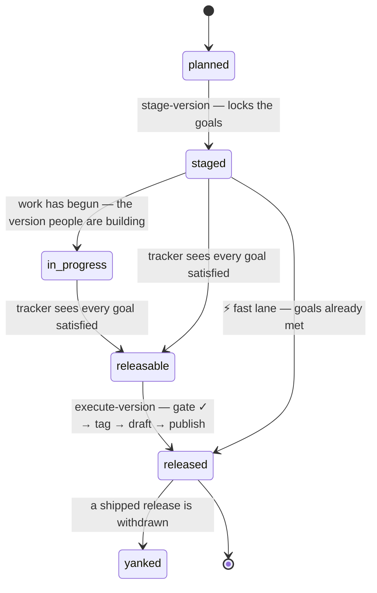

# Release staging — the version train

**Status:** Accepted

[releasing.md](releasing.md) answers *"I want to cut a version, what do I do?"*.
This answers the question before it: *"how does a version come together — spec
first, across repos — and how do we know it is ready?"* It defines the **staging
lifecycle**, the **goal lock**, the **readiness gate**, and the automations that
drive them.

**Satisfies:** [roadmap M10](../00-overview/roadmap.md#m10--release-engineering),
extends [releasing.md](releasing.md) and [project-workflow.md](project-workflow.md).

---

## Spec leads the release

The spec is already structurally ahead of the code: a behavioural PR is closed
unless its spec change merged first ([cross-repo-ci.md](../50-governance/cross-repo-ci.md)).
A release is the same rule at a larger grain. **A version's goals are a set of
`Accepted` requirements** ([change-lifecycle.md](../50-governance/change-lifecycle.md)),
chosen and locked before the work is called done, and the release does not ship
until every one of them is demonstrably implemented.

The train has one source of truth, four states, and four lanes of differing
ceremony. Everything downstream reads the manifest; nothing keeps release state
in a person's head.

## The version manifest — one source of truth

Each version is a machine-readable file in [`versions/`](versions/README.md),
idiomatic to the org's other generated-from-truth files (`maintainers.toml`,
`labels.yml`):

```toml
# 70-operations/versions/0.2.0.toml
version = "0.2.0"
status  = "staged"        # planned → staged → in_progress → releasable → released → yanked
released_on = "2026-07-30"   # written when the release is published; absent until then
repos   = ["lemonfiber", "lemonfiber-media-stack"]   # the streams this version cuts; brand excluded
satisfied_in = ["lemonfiber", "lemonfiber-web"]   # where the gate looks for citations; defaults to `repos`
goals   = ["A2-R1", "A2-R6", "C1-R13"]    # locked Accepted requirement IDs

[pins]                    # recorded at execute, for reproducibility
lemonfiber-media-stack = "fbdafe0"   # the submodule commit that shipped
```

Staging writes it, the tracker reads it, the gate checks it, and publishing
flips its `status`, records its `pins` and stamps the date it went out. The full
contract is in [`versions/README.md`](versions/README.md).

The date belongs on the manifest rather than being looked up from the tag,
because the manifest is what everything downstream reads. A page that renders the
train from these files can say *when* each version shipped without reaching for
the forge, and a version that claims to be released without a date is a record
that was written by hand.

## The lifecycle



Every transition MUST be recorded in the manifest, so the file alone answers
"where is this version" without reading CI history.

**One version at a time.** Outside hotfixes, the train is serial: at most one
version is in flight — `staged` or `releasable` — at once. `stage-version`
refuses while another version is still unreleased, so two minors never compete
for the same `main` or the same goal pool. A hotfix is exempt: it branches from
an already-`released` tag and never enters staging.

## The four lanes

Ordered by ceremony. Each is a way of reaching the same tag-triggered release
([releasing.md](releasing.md)); they differ in how much is verified first.

| Lane | When | Goal gate | Staging period |
|------|------|-----------|----------------|
| **Staged train** | a planned minor (`0.2.0`) | full — every locked goal satisfied | yes: branches split, progress tracked |
| **Fast lane** | spec and sub-repos already in sync | full, run once at execute | no — stage, gate and execute in one operation |
| **Hotfix** | an urgent patch (`0.2.1`) | bypassed → replaced by a cited fix + maintainer | no |
| **Raw tag** | the primitive under all of the above | none (`git tag` → [release.yml](releasing.md)) | no |

The fast lane still runs the gate: even a one-shot release *proves* its claimed
goals shipped. Only the staging period is skipped.

A **pre-release** is none of these. It is not a way of reaching the release tag;
it is a way of shipping artefacts from a version that has not reached it — see
[going out before it is releasable](#going-out-before-it-is-releasable).

## Locking goals

A version's goals are seeded from the [roadmap](../00-overview/roadmap.md)
milestone it serves — expanded to the requirement IDs that milestone's
deliverables cite — then trimmed or extended by a maintainer before the lock. A
goal MUST be an `Accepted` requirement; a `Draft` or `Withdrawn` one cannot be a
goal, for the same reason it cannot be cited ([change-lifecycle.md](../50-governance/change-lifecycle.md)).

Once staged, the goal set is **frozen**: changing it requires review (a
`goals-change` label) and is logged to the maintainer channel, so a release's
scope cannot drift silently after the promise is made.

## Release branches — the hotfix exception

Trunk-based development ([OPS-R10](project-workflow.md)) is the rule, and
OPS-R49 keeps it: a version is released from `main`, the tag names a commit on
the trunk, and staging cuts no branches. The one carve-out is a hotfix to an
**already-released** version, where `main` has moved on and the fix must reach
the shipped tag. OPS-R33 confines the branch to that case — cut from the
version's tag, carrying only the fix, deleted once the fix is merged back to
`main`. No other `release/*` branch exists.

## The gate — every goal satisfied

`execute-version` MUST refuse unless **every** locked goal is satisfied, and a
goal counts as satisfied only when **both** hold:

1. a **merged PR cites its ID** in a `Spec:` trailer (the automatable claim), and
2. the [implementation status](https://github.com/lemonfiber/lemonfiber/blob/main/IMPLEMENTATION-STATUS.md)
   marks it done (the human attestation).

Citation proves someone did the work and said which requirement it served; the
status file proves a human agrees it is complete. Requiring both is defence in
depth: a citation without a tick is work in flight, a tick without a citation is
an unauditable claim. A refusal MUST name the unmet goals, never fail blankly.

Citations are read from each target repo's **whole history**, and the gate MUST
refuse a truncated one rather than read it. A shortened history loses its oldest
commits first, so a goal proven once would come undone as unrelated work landed —
and a verdict that changes with the depth of a clone is not a verdict.

Before tagging, execute MUST also verify the streams still agree — the embedded
stack's `schema_version` and `min_cli_version` against the binary
([versioning.md](../20-architecture/contracts/versioning.md)) — and record the
exact submodule pins in the manifest, so the release is reproducible from the
file.

## Going out before it is releasable

A version can be finished everywhere except in one place nobody on a runner can
reach. `0.15.0` is there: every stack service but two is started and made to
answer on every change, and the two that are not need a real VPN provider and
key, so `F1-R1` closes on one hand-run on the owner's own hardware and on
nothing a workflow can arrange. Waiting is not free — the binary that
would do the hand-run is the binary nobody can install, because installing it is
what the release produces.

So a version may go out as a **pre-release**: the artefacts, built by the same
pipeline, from the same commit on the trunk, carrying the same provenance — and
carrying, on the artefact itself, the gate's verdict including every goal that
is not met.

**A pre-release relaxes the goal gate and nothing else.** Cross-stream
compatibility is checked exactly as `OPS-R35` requires before a tag; release
blockers stop it exactly as they stop an execute; what a plugin must satisfy to
ride the train it satisfies here too. The one thing it does differently is the
one thing it exists for.

### It is never mistaken for the release

Three places say so, and none of them relies on a reader noticing a convention.

| Where | What says it |
|-------|--------------|
| The tag | `v0.15.0-pre.1`, not `v0.15.0`. A semver pre-release identifier orders *below* the version, so nothing that compares tags can rank it above the release it precedes — and the release's own tag is still free to be cut later. |
| The published release | Its title is the tag, and its body **opens with the verdict**: which goals are unmet, by name. |
| The manifest | A `[[prerelease]]` record, beside a `status` that has not moved. The version is still `staged`, because it is. |

**The forge's own pre-release flag is not the signal, and cannot be.** `cargo-dist`
marks every version below `1.0.0` as a pre-release, so all fourteen releases this
project has shipped already carry that flag and it separates nothing. Anything
written on it — an announcement guard, a record guard, a reader deciding what to
offer — would have been wrong about every release so far, and wrong quietly: a
channel that stays silent looks exactly like a channel nobody has posted to yet.
So the distinction is carried by the **tag**, which is why `OPS-R61` puts it there
and why the artefact has to say it in words as well.

The identifier is deliberately not `rc`. `ARCH-R43` uses *the first release
candidate* as the moment `schema_version` stops changing in place and starts
binding, which is a decision about the product's life rather than a tag anybody
cuts. A pre-release that called itself a release candidate would fire that by
accident, so it calls itself what it is.

### Nothing outside the organisation hears about it

`OPS-R23` obliges a **published release** to announce to the public channel. A
pre-release is not one, and the announce path has to refuse on the pre-release
rather than be configured not to run — a channel that is quiet because nobody
turned it on is one release-day mistake from being loud. It announces to the
maintainer channel instead, so a pre-release is recorded rather than silent.

The same applies to the update check. An operator running `0.14.0` is not
offered `0.15.0-pre.1`, because an update offer is a recommendation and this is
not one.

### What the manifest keeps

The version's own `status` does not move: a pre-release is not a lifecycle
transition, and `OPS-R32`'s chain is untouched. What is added is a record per
pre-release — the tag, the day it was cut, the goals unmet at that moment, and
the submodule pins it embedded — so the file answers *what went out before the
release* the same way it already answers what the release shipped.

The pins are enumerated from the tag's own `.gitmodules`, not named in the lane.
That is the expensive lesson `release-finalize` already learned: it spelled out
the one submodule path that existed when it was written and went on recording
only that one after a second arrived, so `0.10.0` shipped a record that did not
say which build of the web app was in it.

The record lands **before** the tag, not after. What writes the verdict onto the
published artefact reads it from here, so a tag cut while the record is still in
review would produce a build that cannot carry its verdict and fails for a reason
that has nothing to do with the build. The wait is bounded and its expiry is a
refusal rather than a shrug: nothing has been tagged, so nothing has to be undone.

The unmet goals are recorded rather than derived later, and that is the point of
recording them. The gate's verdict changes as work lands; what a particular
artefact went out knowing is a fact about that artefact, and a reader asking why
a pre-release exists is asking exactly that.

## Plugins ride the train pinned, and block it when they stop validating

A plugin is not a release stream — `OPS-R59` keeps the catalogue off the train and
nothing here changes that. What a plugin is, to this train, is an **input to the
gate**: a thing the release has to still be compatible with, checked on the way
past, and never tagged.

**Every number the gate compares is the plugin's own.** Its `plugin.toml` says
which manifest generation it is written in; its `targets.toml` says which release
it is validated and proved against. [`plugins.toml`](plugins.toml) holds where to
look and nothing else — a version pinned there as well would be a second statement
of one fact, and the two disagree the day one of them is edited.

The lemonfiber version lives in `targets.toml` rather than in the manifest because
`ARCH-R89` forbids a manifest carrying a minimum lemonfiber version: `F3-R21`
refuses an unmet requirement by naming the capability rather than a number that
cannot say which one, which is the right answer for an operator installing a
plugin. What the train needs is a different fact — which release it gated
against — and each plugin states it in a file of its own.

Every run that would cut a tag — a release and a pre-release alike — re-reads both
pins and re-reads the report the plugin's own proofs left, and **a plugin that no
longer validates blocks the run**.

### A plugin the gate cannot find is not a plugin that passed

This is the half that is easy to get wrong, and the shape this codebase keeps
finding: the answer is true about what was looked at and silent about the rest,
and silence reads as a pass. So each of these fails the run **by name**:

| | |
|---|---|
| The registry cannot be read, or declares nothing | The run cannot be answered at all |
| A registered repository does not exist, or cannot be cloned | Named as unreachable |
| Its manifest is absent, unreadable, or declares no `schema_version` | Named |
| It cannot say which release it targets — no `targets.toml`, unreadable, or naming none | Named |
| Its manifest pins a generation this release does not carry | Named, with both numbers |
| Its proof report is absent, unreadable, or was run against another version | Named |
| Its report names no proof, or names one that is anything but passed | Named — including `unrun`, which is not a passing proof (`F3-R5`) |

What a plugin targets is what keeps this from being retroactive. A release below
it is not that plugin's business and the plugin is passed over; at or above it,
nothing about the plugin may be missing. Every registered plugin is still
*fetched*, because the declaration deciding whether it rides is inside it — a
registry that could answer that question itself would be holding the second copy
this design exists to avoid.

## What a version number means

A version says how much changed, so the numbers have to describe the product
rather than the order the work happened to be written in. Three rules keep them
honest.

**A major carries the capability that justifies it.** Not a stamp on a finished
backlog — `0.15.0` to `1.0.0` shipping nothing would be a strange thing to
announce. `1.0.0` opens the dashboard on a bare invocation and stops the four
interfaces this product is used through from moving again, which is a promise no
version before it can make. A major that adds no capability is a number nobody
can read.

**There is one major to ship into.** The ecosystem features were once scheduled
as `1.1.0` through `1.7.0` and then as a second generation, `2.x`, on the
reasoning that a minor which removed the container runtime would mislead anyone
reading the number. The second half of that is gone: there are no epochs, and
what was sequenced behind `2.0.0` is the last stretch of minors before `1.0.0` —
the container-engine abstraction among them, at `0.23.0`. The first half is why
they are still minors and not one release: each is one theme, and a version that
carried a generation would be the backlog-with-a-number this rule exists to
refuse.

**A version is one theme, not a backlog.** They ranged from nine goals to a
hundred and eighty-five; the large ones were not releases, they were everything
left over with a number attached. Each unreleased version is now something you
can say in a sentence, and its manifest header says it.

## What a feature needs, and what it merely relates to

`requires:` is what a feature cannot meet its own acceptance criteria without —
a notification channel to notify through, a surface to appear on, an error model
to word a remedy in. `relates:` is worth reading and not needed to build.

They used to be one field, and sixty-seven features were scheduled before
something they said they depended on. Fifteen were real; the rest were
cross-references. The real ones had one cause: capabilities everything else is
expressed in terms of — notifications, the error model, the health summary —
were scheduled last, because nothing distinguished "I need this" from "see also".

`scripts/check_order.py` refuses any schedule that ships a feature before
something it `requires:`. A released version is history rather than a plan, so
inversions inside one are recorded and never enforced — nothing can be moved
into or out of something already shipped.

## The no-stub rule — a version ships nothing half-built

A version proves its `goals` requirement by requirement, and that is not the
whole of what it claims. A requirement can be met while the feature around it is
half built: `1.0.0` announcing a dashboard whose panels are stubs would satisfy
every goal it locked and still be the release nobody wanted. **The feature is the
unit a reader understands, so the feature is what this asks about.**

`execute-version` MUST refuse while any feature the manifest locks — one whose
requirements appear in its `goals` — is not `maturity: shipped` in the
[catalogue](../10-functional/features/README.md), and the refusal MUST name
them. That is the whole of what **"a major ships no stubs"** means here: a rule
about every version, and `X.0.0` is only where it bites hardest, because a major
is what people read as a finished generation.

`maturity` is the catalogue's own answer to *how far is this built*, kept apart
from the `status` that describes the specification — a feature can be `Accepted`
and unbuilt, and conflating the two loses whichever question is asked less often.
Like the tracker tick in `OPS-R34`, it is an attestation written before the tag
rather than derived from it: the feature is marked `shipped` with the version
that carries it, and the gate reads that mark.

## Cross-repo orchestration

Today every arrow points *into* `spec`: repos call its reusable checks. The train
needs the opposite — `spec` driving the sub-repos to cut branches, open PRs and
start releases. That MUST authenticate through a **scoped GitHub App**
(`contents` and `pull-requests` write on the named repos), never a personal
token, so the credential is auditable, org-owned and revocable. Installing it is
one-time setup, like the release secrets in [releasing.md](releasing.md#the-one-time-setup).

## PR and issue automation

The train narrates and enforces itself through automation, so release state is
never a person's memory. Each row is a specified behaviour below; the workflows
implementing them are built per repo.

| Automation | What it does |
|------------|--------------|
| **Version labelling** | A PR citing a locked goal is labelled with that version and assigned its milestone |
| **Goal-advance comment** | A PR advancing a goal gets a self-updating comment linking the tracker and the goal's coverage |
| **Compat gate** | A required check fails a merge that would break `schema_version` / `min_cli_version` agreement for the staged version |
| **Out-of-scope advisory** | During staging, a PR citing outside the locked goals gets a non-blocking advisory routing it to the next version |
| **Tracker issue** | Staging opens a self-updating issue — goal checklist and burndown — that flips to `releasable` at full coverage |
| **Release-blocker linkage** | An issue labelled `release-blocker` for a version links to the tracker and blocks execute until closed |
| **Next-version issue** | Releasing opens the next version's planning issue, seeded from the next `planned` manifest's goals |
| **Drift watchdog** | A scheduled check flags a locked goal whose requirement was withdrawn or superseded |
| **Submodule bump** | A `lemonfiber-media-stack` release opens a `lemonfiber` PR bumping the submodule pin, gated by the `build.rs` compat check |
| **Pin fan-out** | When `spec`'s reusable workflows move, an automated PR bumps the pinned `@SHA` in every consumer repo in lockstep |
| **Issue lifecycle** | Releasing closes the issues opened for that version — its tracker, and any drift the watchdog raised |
| **Release from the trunk** | A version is tagged on `main`; a hotfix to a shipped version branches from its tag and merges back |
| **Discord cadence** | Staging and progress milestones (25/50/75/100%) post to `#maintainers`; execute posts to `#releases` |

### When a goal cannot be cited

A merged commit cannot gain a `Spec:` trailer. So a change that closed several
requirements under one trailer leaves the rest uncitable for ever, and the two ways
out are both bad: a later commit citing a goal it did not advance is exactly the
unauditable claim the second arm exists to refuse, and inventing work to carry the
citation is worse.

A done row may therefore name the commit instead — *landed in `3c595bb`* — and the
gate checks it: the sha has to resolve to a commit that is an ancestor of a searched
repository's head, or the row counts for nothing. `git show` is the audit, which is
the whole reason it is a commit rather than a pull request number. One can be checked
against the artefact, offline; the other is a question for the forge.

It is reported separately from an ordinary citation, because an exception nobody can
count is one that spreads. A goal satisfied this way reads `cited=landed` rather than
`cited=yes`, so how many of them there are is a number somebody can look at.

## Requirements

| ID | Requirement |
|----|-------------|
| **OPS-R29** | Every release MUST be scoped by a version manifest under `70-operations/versions/`, which is the single source of truth for the version's status, target repos, and locked goals. |
| **OPS-R30** | Staging a version MUST lock its goals as an explicit list of `Accepted` requirement IDs, seeded from the roadmap milestone it serves and editable before the lock; a `Draft` or `Withdrawn` requirement MUST NOT be a goal. |
| **OPS-R31** | After staging, changing a version's locked goals MUST require review and MUST be announced to the maintainer channel. |
| **OPS-R32** | A version MUST progress through `planned → staged → releasable → released` — optionally through `in_progress` between `staged` and `releasable`, with `yanked` terminal — and each transition MUST be recorded in its manifest. |
| **OPS-R33** | A `release/<version>` branch MAY exist only to carry a hotfix to an already-released version; it MUST be cut from that version's tag and deleted once its fixes are merged back to `main`. |
| **OPS-R34** | `execute-version` MUST refuse unless every locked goal is satisfied — a merged PR cites its ID **and** the implementation-status tracker marks it done — and the refusal MUST name the unmet goals. Where no merged commit cites a goal and none can, a done row MAY name the merged commit that finished it instead; the gate MUST verify that commit is in a searched repository's history, MUST report which goals were satisfied that way, and MUST NOT accept a row naming a commit it cannot find. |
| **OPS-R35** | Before tagging, execute MUST verify cross-stream compatibility (`schema_version` and `min_cli_version` against the binary) and record the embedded submodule pins in the manifest. |
| **OPS-R36** | A fast lane MUST allow staging, gating and executing in one operation when the goals are already satisfied; the goal gate MUST still run. |
| **OPS-R37** | A hotfix lane MUST allow a patch release from a released tag that bypasses the goal gate, requiring instead a cited fix or issue and maintainer authorisation. |
| **OPS-R38** | Cross-repo release orchestration MUST authenticate through a scoped, org-owned GitHub App, never a personal access token. |
| **OPS-R39** | A PR that cites a locked goal MUST be labelled with that version and assigned its milestone. |
| **OPS-R40** | A PR that advances a locked goal MUST receive a self-updating comment linking the version tracker and the goal's current coverage. |
| **OPS-R41** | A required check MUST fail any merge that would break `schema_version` / `min_cli_version` agreement for the staged version. |
| **OPS-R42** | During a staging period, a PR whose citations fall outside the locked goals MUST receive a non-blocking advisory routing it to the next version. |
| **OPS-R43** | Staging MUST open a self-updating tracking issue — a goal checklist with a burndown — that reflects coverage and flips the version to `releasable` at full coverage. |
| **OPS-R44** | An issue labelled `release-blocker` for a version MUST link to that version's tracker and MUST block execute until it closes. |
| **OPS-R45** | Releasing a version MUST open the next version's planning issue, seeded from the goals of the next `planned` manifest. |
| **OPS-R46** | A scheduled check MUST flag a locked goal whose requirement became `Withdrawn` or `Superseded`. |
| **OPS-R47** | A `lemonfiber-media-stack` release MUST open a `lemonfiber` PR bumping the embedded submodule pin, gated by the build-time compatibility check. |
| **OPS-R48** | When `spec`'s reusable workflows move, an automated PR MUST bump the pinned `@SHA` in every consumer repo in lockstep. |
| **OPS-R49** | A version MUST be released from `main`: the tag names a commit on the trunk, and no long-lived release branch is cut. A hotfix to an already-released version MUST branch from that version's tag and MUST be merged back to `main`. |
| **OPS-R50** | Staging and progress milestones MUST post to the maintainer channel and execute MUST post to the public announcement channel. |
| **OPS-R52** | At most one version MAY be `staged` or `releasable` at a time; `stage-version` MUST refuse while another version is still in flight. Hotfix patches are exempt. |
| **OPS-R55** | Releasing a version MUST close the issues opened for it — the tracker from `OPS-R43` and any drift issue from `OPS-R46` — so an open issue about a version means something is still owed. |
| **OPS-R54** | A version MUST NOT be released while a requirement it locks is not built, and a refusal MUST name those requirements. A requirement is built where the feature holding it is `maturity: built` or `maturity: shipped`; where that feature is `building`, the implementation-status tracker answers for each requirement on its own; where it is `planned` or `withdrawn`, none of them is. A major ships no stubs, and neither does any version before it. The subject is the requirements a version **carries**, not the whole of every feature it touches: partial locking is the norm — 24 of 25 manifests lock part of at least one feature, and `0.1.0` locks two of `B1`'s fifteen — so a feature spanning two versions could never be finished when the first of them shipped, and the wider rule was one nothing had ever satisfied. `built` is the state that makes this checkable at all: `shipped` means out in a released version, so requiring it before release would be a gate no version could ever pass. |
| **OPS-R57** | A manifest whose `status` is `released` MUST carry `released_on`, the UTC date its release was published, as `YYYY-MM-DD`. The transition to `released` MUST write it from the publication the transition responds to; it MUST NOT be entered by hand, and no earlier status may carry it. |
| **OPS-R60** | A version MAY be published as a pre-release before it is releasable. A pre-release MUST NOT move the version's `status`, MUST NOT write `released_on` or `released_as`, and MUST NOT be recorded as the release; the manifest MUST go on answering where the version is. |
| **OPS-R61** | A pre-release MUST be identifiable as one in its tag, in what the release it publishes says, and in the manifest record, and MUST NOT carry the version's own tag. Its tag MUST be that version with a pre-release identifier appended, so it orders below the version it precedes; the identifier MUST NOT be one `ARCH-R43` gives another meaning to. The distinction MUST NOT rest on the forge's own pre-release flag, which every version below `1.0.0` carries and which therefore separates nothing. |
| **OPS-R62** | A pre-release MUST carry the goal gate's verdict for its version on the artefact it publishes, naming every unmet goal. One whose artefact does not carry the verdict MUST NOT be published, and one that reports itself releasable while a goal is unmet MUST be refused. |
| **OPS-R63** | A pre-release MUST NOT be announced outside the organisation — `OPS-R23`'s subject is a published release and a pre-release is not one — and the announcing path MUST refuse on the pre-release itself rather than depend on being unconfigured. It MUST announce to the maintainer channel instead. |
| **OPS-R64** | A pre-release MUST NOT be offered as an available update, and a reader that cannot order a tag MUST pass over it rather than rank it. |
| **OPS-R65** | Every pre-release MUST be recorded in its version's manifest with its tag, the date it was cut, the goals unmet when it was cut, and the submodule pins it embedded, so the manifest answers what went out before the release without reading the forge. |
| **OPS-R66** | A pre-release MUST pass every check `execute-version` runs before tagging apart from the goal gate — cross-stream compatibility, release blockers, the declared version, and the plugin gate — and MUST record its pins the way `OPS-R35` requires of a release. A pre-release relaxes the goal gate and nothing else. |
| **OPS-R67** | Every plugin the release train gates on MUST be registered under `70-operations/` with the repository holding it and the paths of the files the gate reads. The manifest generation a plugin is written in and the release it is validated against MUST be declared by the plugin itself and MUST NOT be restated in the registry. A registered plugin MUST NOT be a stream the train cuts and MUST NOT be named by any version manifest; it is an input to the gate and MUST NOT be tagged by it. |
| **OPS-R68** | Every run that would cut a tag MUST re-validate every registered plugin riding that version against the manifest generation the release carries and MUST re-read the report its proofs left, and MUST refuse the run where one no longer validates, naming the plugin and what failed. |
| **OPS-R69** | A registered plugin the gate cannot reach, that cannot say which release it targets, whose manifest or proof report is absent or unreadable, or whose report names no proof or names one that is not passed, MUST fail the run by name. The gate MUST NOT pass over what it could not read, and MUST NOT report success about the part it could. |
| **OPS-R58** | A manifest MUST say where the work satisfying its goals landed, and the goal gate MUST search exactly those repositories. Where a manifest does not say, the streams it cuts are what is searched. A repository named there MUST NOT be tagged for being named: what a version *cuts* and where its goals were *satisfied* are separate lists, and a goal satisfied in a repository the gate does not search MUST be reported unmet rather than passed over. |

## Related

- [releasing.md](releasing.md) — the tag-triggered mechanics this orchestrates
- [plugins.toml](plugins.toml) — the plugins this train gates on, and what each pins
- [project-workflow.md](project-workflow.md) — the trunk-based model and OPS-R10, which releases now follow rather than carve out
- [notifications.md](notifications.md) — the Discord channels OPS-R50 posts to
- [../20-architecture/contracts/versioning.md](../20-architecture/contracts/versioning.md) — the version streams the gate checks
- [../50-governance/change-lifecycle.md](../50-governance/change-lifecycle.md) — the `Accepted` status a goal must hold
- [../50-governance/cross-repo-ci.md](../50-governance/cross-repo-ci.md) — the citation gate this reuses in reverse
- [../20-architecture/contracts/versioning.md](../20-architecture/contracts/versioning.md#changing-the-schema) — `ARCH-R43`, and why a pre-release does not call itself a release candidate
